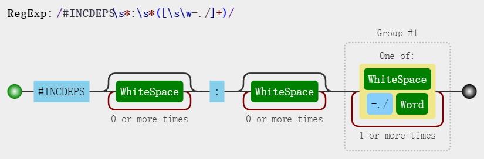

# CBuild 编译系统

## 特点

* Linux 下纯粹的 Makefile 编译，支持 Makefile 封装包已有的 `Makefile` `CMake` `Autotools` 以实现对它们的支持
* 支持交叉编译，支持自动分析头文件和编译脚本文件作为编译依赖，支持分别指定源文件的 CFLAGS
* 一个 Makefile 同时支持 Yocto 编译方式、源码和编译输出分离模式和不分离模式，一个 Makefile 支持生成多个库、可执行文件或外部内核模块
* 提供编译静态库、共享库和可执行文件的模板 `inc.app.mk`，支持 C(`*.c`) C++(`*.cc *.cp *.cxx *.cpp *.CPP *.c++ *.C`) 和 汇编(`*.S *.s *.asm`) 混合编译
* 提供编译外部内核模块的模板 `inc.mod.mk`，支持 C(`*.c`) 和 汇编(`*.S`) 混合编译
* 提供安装编译输出的模板 `inc.ins.mk`
* 提供 Kconfig 配置参数的模板 `inc.conf.mk`
* 提供根据依赖关系自动生成总系统编译链和配置链的脚本 `gen_build_chain.py`
    * 支持通过 make menuconfig 选择是否编译包
    * 支持收集包下的 Kconfig 配置放在包编译开关项目的 menuconfig 菜单下，编译开关和编译参数一起设置
    * 支持非常多的依赖规则
        * 支持自动生成参与编译的实包和不参与编译的虚包的规则，虚包可用于控制管理一组实包
        * 支持普通结构(config)、层次结构(menuconfig)、选择结构(choice) 等自动生成
        * 支持强依赖(depends on)、弱依赖(if...endif)、强选择(select)、弱选择(imply)、或规则(||) 等自动生成
* 提供源码包和预编译包切换机制，可选择预编译包加快编译
* 提供方便的打补丁和去补丁切换的机制，例如动态决定是否打补丁 `exec_patch.sh` `externalpatch.bbclass`
* 支持生成包的依赖关系的图片，并有颜色等属性查看包是否被选中等 `gen_depends_image.sh`
* 支持自动拉取开源包编译，支持从 http git 或 svn 下载包，支持镜像下载 `fetch_package.sh`
* 支持编译缓存镜像，再次编译不需要从代码编译，直接从本地缓存或网络镜像缓存拉取 `process_cache.sh` `inc.cache.mk`
* 开源代码 OSS 层开发中，需要大家的贡献

## 笔记

* 如果对 Shell 语法不了解，可以查看 [Shell 笔记](./notes/shell.md)
* 如果对 Makefile 语法不了解，可以查看 [Makefile 笔记](./notes/makefile.md)
* 如果对 Kconfig 语法不了解，可以查看 [Kconfig 笔记](./notes/kconfig.md)

## 开源贡献

本工程目前已向 Linux 内核社区贡献了2次提交，已合并到 Linux 内核主线

* [kconfig: fix failing to generate auto.conf](https://git.kernel.org/pub/scm/linux/kernel/git/masahiroy/linux-kbuild.git/commit/?h=fixes&id=1b9e740a81f91ae338b29ed70455719804957b80)

    ```sh
    commit 1b9e740a81f91ae338b29ed70455719804957b80
    Author: Jing Leng <jleng@ambarella.com>
    Date:   Fri Feb 11 17:27:36 2022 +0800

        kconfig: fix failing to generate auto.conf

        When the KCONFIG_AUTOCONFIG is specified (e.g. export \
        KCONFIG_AUTOCONFIG=output/config/auto.conf), the directory of
        include/config/ will not be created, so kconfig can't create deps
        files in it and auto.conf can't be generated.
    ```

* [kbuild: Fix include path in scripts/Makefile.modpost](https://git.kernel.org/pub/scm/linux/kernel/git/masahiroy/linux-kbuild.git/commit/?h=fixes&id=23a0cb8e3225122496bfa79172005c587c2d64bf)

    ```sh
    commit 23a0cb8e3225122496bfa79172005c587c2d64bf
    Author: Jing Leng <jleng@ambarella.com>
    Date:   Tue May 17 18:51:28 2022 +0800

        kbuild: Fix include path in scripts/Makefile.modpost

        When building an external module, if users don't need to separate the
        compilation output and source code, they run the following command:
        "make -C $(LINUX_SRC_DIR) M=$(PWD)". At this point, "$(KBUILD_EXTMOD)"
        and "$(src)" are the same.

        If they need to separate them, they run "make -C $(KERNEL_SRC_DIR)
        O=$(KERNEL_OUT_DIR) M=$(OUT_DIR) src=$(PWD)". Before running the
        command, they need to copy "Kbuild" or "Makefile" to "$(OUT_DIR)" to
        prevent compilation failure.

        So the kernel should change the included path to avoid the copy operation.
    ```

## 设置编译环境 build.env

### 设置编译环境命令

* 初始化编译环境运行如下命令

    ```sh
    lengjing@lengjing:~/cbuild$ source scripts/build.env
    ============================================================
    ENV_BUILD_MODE   : external
    ENV_BUILD_ARCH   :
    ENV_BUILD_TOOL   :
    ENV_BUILD_GRADE  : v1 v2 v3
    ENV_BUILD_JOBS   : -j8
    ENV_TOP_DIR      : /home/lengjing/cbuild
    ENV_MAKE_DIR     : /home/lengjing/cbuild/scripts/core
    ENV_TOOL_DIR     : /home/lengjing/cbuild/scripts/bin
    ENV_DOWN_DIR     : /home/lengjing/cbuild/output/mirror-cache/downloads
    ENV_CACHE_DIR    : /home/lengjing/cbuild/output/mirror-cache/build-cache
    ENV_MIRROR_URL   : http://127.0.0.1:8888
    ENV_TOP_OUT      : /home/lengjing/cbuild/output
    ENV_OUT_ROOT     : /home/lengjing/cbuild/output/objects
    ENV_INS_ROOT     : /home/lengjing/cbuild/output/sysroot
    ENV_DEP_ROOT     : /home/lengjing/cbuild/output/sysroot
    ENV_CFG_ROOT     : /home/lengjing/cbuild/output/config
    ============================================================
    ```

* 还可以指定 ARCH 和交叉编译器

    ```sh
    lengjing@lengjing:~/cbuild$ source scripts/build.env arm64 arm-linux-gnueabihf-
    ============================================================
    ENV_BUILD_MODE   : external
    ENV_BUILD_ARCH   : arm64
    ENV_BUILD_TOOL   : arm-linux-gnueabihf-
    ...
    ============================================================
    ```

### 环境变量说明

* ENV_BUILD_MODE: 设置编译模式: external, 源码和编译输出分离; internal, 编译输出到源码; yocto, Yocto 编译方式
    * external 时，编译输出目录是把包的源码目录的 ENV_TOP_DIR 部分换成了 ENV_OUT_ROOT
* ENV_BUILD_ARCH: 指定交叉编译 linux 模块的 ARCH
* ENV_BUILD_TOOL: 指定交叉编译器前缀
* ENV_BUILD_GRADE: 指定编译缓存级别数组，比如我有一颗 acortex-a55 的 soc，那这个值可设置为 `socname cortex-a55 armv8-a`
* ENV_BUILD_JOBS: 指定编译线程数
<br>

* ENV_TOP_DIR: 工程的根目录
* ENV_MAKE_DIR: 工程的编译模板目录
* ENV_TOOL_DIR: 工程的脚本工具目录
* ENV_DOWN_DIR: 下载包的保存路径
* ENV_CACHE_DIR: 包的编译缓存保存路径
* ENV_MIRROR_URL: 下载包的 http 镜像，可用命令 `python -m http.server 端口号` 快速创建 http 服务器
<br>

* ENV_TOP_OUT: 工程的输出根目录，编译输出、安装文件、生成镜像等都在此目录下定义
* ENV_OUT_ROOT: 源码和编译输出分离时的编译输出根目录
* ENV_INS_ROOT: 工程安装文件的根目录
* ENV_DEP_ROOT: 工程搜索库和头文件的根目录
* ENV_CFG_ROOT: 工程自动生成文件的保存路径，例如全局 Kconfig 和 Makefile，各种统计文件等

注: Yocto 编译时，由于 BitBake 任务无法直接使用当前 shell 的环境变量，所以自定义环境变量应由配方文件导出，不需要 source 这个环境脚本

### 编译环境模板 inc.env.mk

* 编译环境被应用编译和内核模块编译共用
* 普通编译时此模板作用是设置编译输出目录 `OUT_PATH`，设置并导出交叉编译环境
* Yocto 编译时编译输出目录和交叉编译环境由 `bitbake` 设置并导出，此模板没有做任何操作

## 安装模板 inc.ins.mk

安装模板被应用编译和内核模块编译共用

### 安装模板的目标和变量说明

* install_libs: 安装库文件集
    * 用户需要设置被安装的库文件集变量 INSTALL_LIBRARIES
    * 编译应用时 `inc.app.mk`，编译生成的库文件会加入到 `LIB_TARGETS` 变量，INSTALL_LIBRARIES 已默认赋值为 `$(LIB_TARGETS)`
    * 安装目录是 `$(ENV_INS_ROOT)/usr/lib`
* install_base_libs: 安装库文件集
    * 用户需要设置被安装的库文件集变量 INSTALL_BASE_LIBRARIES，该变量默认取 INSTALL_LIBRARIES 的值
    * 安装目录是 `$(ENV_INS_ROOT)/lib`
* install_bins: 安装可执行文件集
    * 用户需要设置被安装的可执行文件集变量 INSTALL_BINARIES
    * 编译应用时 `inc.app.mk`，编译生成的可执行文件会加入到 `BIN_TARGETS` 变量，INSTALL_BINARIES 已默认赋值为 `$(BIN_TARGETS)`
    * 安装目录是 `$(ENV_INS_ROOT)/usr/bin`
* install_base_bins: 安装可执行文件集
    * 用户需要设置被安装的可执行文件集变量 INSTALL_BASE_BINARIES，该变量默认取 INSTALL_BINARIES 的值
    * 安装目录是 `$(ENV_INS_ROOT)/bin`
* install_hdrs: 安装头文件集
    * 用户需要设置被安装的头文件集变量 INSTALL_HEADERS
    * 安装目录是 `$(ENV_INS_ROOT)/usr/include/$(PACKAGE_NAME)`
* install_datas: 安装数据文件集
    * 用户需要设置被安装的数据文件集变量 INSTALL_DATAS
    * 安装目录是 `$(ENV_INS_ROOT)/usr/share/$(PACKAGE_NAME)`
* install_datas_xxx / install_todir_xxx / install_tofile_xxx: 安装文件集到特定文件夹
    * 要安装的文件集分别由 INSTALL_DATAS_xxx / INSTALL_TODIR_xxx / INSTALL_TOFILE_xxx 定义
    * 定义的值前面部分是要安装的文件集，最后一项是以斜杆 `/` 开头的安装目标路径
    * install_datas_xxx 安装到目录 `$(ENV_INS_ROOT)/usr/share$(INSTALL_DATAS_xxx最后一项)`
    * install_todir_xxx 安装到目录`$(ENV_INS_ROOT)$(INSTALL_TODIR_xxx最后一项)`
    * install_tofile_xxx 安装到文件`$(ENV_INS_ROOT)$(INSTALL_TOFILE_xxx最后一项)` ，INSTALL_TOFILE_xxx 的值有且只有两项
    * 例子:
        * 创建2个空白文件 testa 和 testb，Makefile 内容如下:

            ```makefile
            INSTALL_DATAS_test = testa testb /testa/testb
            INSTALL_TODIR_test = testa testb /usr/local/bin
            INSTALL_TOFILE_testa = testa /etc/a.conf
            INSTALL_TOFILE_testb = testa /etc/b.conf

            all: install_datas_test install_todir_test install_tofile_testa install_tofile_testb
            include $(ENV_MAKE_DIR)/inc.ins.mk
            ```

        * 运行 make 安装后的文件树

            ```
            output/
            └── sysroot
                ├── etc
                │   ├── a.conf
                │   └── b.conf
                └── usr
                    ├── local
                    │   └── bin
                    │       ├── testa
                    │       └── testb
                    └── share
                        └── testa
                            └── testb
                                ├── testa
                                └── testb
            ```

### 安装模板的函数说明

* `$(call safe_cp,cp选项,源和目标)`: 非 yocto 编译时使用加文件锁的 cp，防止多个目标多进程同时安装目录时报错

## 应用模板 inc.app.mk

### 测试编译应用

* 测试用例1位于 `test-app`
* 测试用例2位于 `test-app2` (`test-app2` 依赖 `test-app`)，
* 测试用例3位于 `test-app3` (`test-app3` 一个 Makefile 生成多个库)，如下测试

```sh
lengjing@lengjing:~/cbuild$ cd examples/test-app
lengjing@lengjing:~/cbuild/examples/test-app$ make
gcc	add.c
gcc	sub.c
gcc	main.c
lib:	/home/lengjing/cbuild/output/objects/examples/test-app/libtest.a
lib:	/home/lengjing/cbuild/output/objects/examples/test-app/libtest.so
bin:	/home/lengjing/cbuild/output/objects/examples/test-app/test
Build test-app Done.
lengjing@lengjing:~/cbuild/examples/test-app$ vi include/sub.h  # 在此文件加上一个空行保存
lengjing@lengjing:~/cbuild/examples/test-app$ make  # 此时依赖此头文件的 C 源码会重新编译
gcc	sub.c
gcc	main.c
lib:	/home/lengjing/cbuild/output/objects/examples/test-app/libtest.a
lib:	/home/lengjing/cbuild/output/objects/examples/test-app/libtest.so.1.2.3
bin:	/home/lengjing/cbuild/output/objects/examples/test-app/test
Build test-app Done.
lengjing@lengjing:~/cbuild/examples/test-app$ make install  # 安装文件
lengjing@lengjing:~/cbuild/examples/test-app$ cd ../test-app2
lengjing@lengjing:~/cbuild/examples/test-app2$ make
gcc	main.c
bin:	/home/lengjing/cbuild/output/objects/examples/test-app2/test2
Build test-app2  Done.
lengjing@lengjing:~/cbuild/examples/test-app2$ make install
lengjing@lengjing:~/cbuild/examples/test-app2$ cd ../test-app3/
lengjing@lengjing:~/cbuild/examples/test-app3$ make
gcc	add.c
lib:	/home/lengjing/cbuild/output/objects/examples/test-app3/libadd.a
lib:	/home/lengjing/cbuild/output/objects/examples/test-app3/libadd.so.1.2.3
gcc	sub.c
lib:	/home/lengjing/cbuild/output/objects/examples/test-app3/libsub.a
lib:	/home/lengjing/cbuild/output/objects/examples/test-app3/libsub.so.1.2
gcc	mul.c
lib:	/home/lengjing/cbuild/output/objects/examples/test-app3/libmul.a
lib:	/home/lengjing/cbuild/output/objects/examples/test-app3/libmul.so.1
gcc	div.c
lib:	/home/lengjing/cbuild/output/objects/examples/test-app3/libdiv.a
lib:	/home/lengjing/cbuild/output/objects/examples/test-app3/libdiv.so
lib:	/home/lengjing/cbuild/output/objects/examples/test-app3/libadd2.so.1.2.3
Build test-app3 Done.
lengjing@lengjing:~/cbuild/examples/test-app3$ make install
```

### 应用模板的目标说明

* LIBA_NAME: 编译静态库时需要设置静态库名
    * 编译生成的静态库文件路径会加入到 `LIB_TARGETS` 变量
* LIBSO_NAME: 编译动态库时需要设置动态库名
    * LIBSO_NAME 可以设置为 `库名 主版本号 次版本号 补丁版本号` 格式，例如
        * `LIBSO_NAME = libtest.so 1 2 3` 编译生成动态库 libtest.so.1.2.3，并创建符号链接 libtest.so 和 libtest.so.1
        * `LIBSO_NAME = libtest.so 1 2`   编译生成动态库 libtest.so.1.2  ，并创建符号链接 libtest.so 和 libtest.so.1
        * `LIBSO_NAME = libtest.so 1`     编译生成动态库 libtest.so.1    ，并创建符号链接 libtest.so
        * `LIBSO_NAME = libtest.so`       编译生成动态库 libtest.so
    * 如果 LIBSO_NAME 带版本号，默认指定的 soname 是 `libxxxx.so.x`，可以通过 LDFLAGS 覆盖默认值
        * 例如 `LDFLAGS += -Wl,-soname=libxxxx.so`
    * 编译生成的动态库文件路径和符号链接路径会加入到 `LIB_TARGETS` 变量
* BIN_NAME: 编译可执行文件时需要设置可执行文件名
    * 编译生成的可执行文件会加入到 `BIN_TARGETS` 变量

### 应用模板的函数说明

* `$(eval $(call add-liba-build,静态库名,源文件列表))`: 创建编译静态库规则
* `$(eval $(call add-libso-build,动态库名,源文件列表))`: 创建编译动态库规则
    * 动态库名可以设置为 `库名 主版本号 次版本号 补丁版本号` 格式，参考 LIBSO_NAME 的说明
* `$(eval $(call add-libso-build,动态库名,源文件列表,链接参数))`: 创建编译动态库规则
    * 注意函数中有逗号要用变量覆盖: `$(eval $(call add-libso-build,动态库名,源文件列表,-Wl$(comma)-soname=libxxxx.so))`
* `$(eval $(call add-bin-build,可执行文件名,源文件列表))`: 创建编译可执行文件规则
* `$(eval $(call add-bin-build,可执行文件名,源文件列表,链接参数))`: 创建编译可执行文件规则
* `$(call set_flags,标记名称,源文件列表,标记值)`: 单独为指定源码集设置编译标记
    * 例如 `$(call set_flags,CFLAGS,main.c src/read.c src/write.c,-D_FILE_OFFSET_BITS=64 -D_LARGEFILE_SOURCE -D_LARGEFILE64_SOURCE)`

注: 提供上述函数的原因是可以在一个 Makefile 中编译出多个库或可执行文件

### 应用模板的可设置变量说明

* PACKAGE_NAME: 包的名称，决定头文件等的安装路径(inc.ins.mk 的此变量意义相同)
* PACKAGE_DEPS: 包的依赖(多个依赖空格隔开)，决定头文件的搜索路径等
    * 默认将包依赖对应的路径加到当前包的头文件的搜索路径
* SRC_PATH: 包中源码所在的目录，默认是包的根目录，也有的包将源码放在 src 下
    * 也可以指定包下多个(不交叉)目录的源码，例如 `SRC_PATH = src1 src2 src3`
* IGNORE_PATH: 查找源码文件时，忽略搜索的目录名集合，默认已忽略 `.git scripts output` 文件夹
* REG_SUFFIX: 支持查找的源码文件的后缀名，默认查找以 `c cpp S` 为后缀的源码文件
    * 可以修改为其它类型的文件，从 c 和 CPP_SUFFIX / ASM_SUFFIX 定义的类型中选择
    * 如果支持非 CPP_SUFFIX / ASM_SUFFIX 默认定义类型的文件，只需要修改 REG_SUFFIX 和 CPP_SUFFIX / ASM_SUFFIX ，并定义函数
        * CPP_SUFFIX: C++类型的文件后缀名，默认定义为 `cc cp cxx cpp CPP c++ C`
        * ASM_SUFFIX: 汇编类型的文件后缀名，默认定义为 `S s asm`
    * 例如增加 cxx 类型的支持(CPP_SUFFIX 已有定义 cxx)：
        ```makefile
        REG_SUFFIX = c cpp S cxx
        include $(ENV_MAKE_DIR)/inc.app.mk
        ```
    * 例如增加 CXX 类型的支持(CPP_SUFFIX 还未定义 CXX)：
        ```makefile
        REG_SUFFIX = c cpp S CXX
        CPP_SUFFIX = cc cp cxx cpp CPP c++ C CXX
        include $(ENV_MAKE_DIR)/inc.app.mk
        $(eval $(call compile_obj,CXX,$$(CXX)))
        ```
* USING_CXX_BUILD_C: 设置为 y 时 `*.c` 文件也用 CXX 编译
* SRCS: 所有的 C 源码文件，默认是 SRC_PATH 下的所有的 `*.c *.cpp *.S` 文件
    * 如果用户指定了 SRCS，也可以设置 SRC_PATH 将 SRC_PATH 和 SRC_PATH 下的 include 加入到头文件搜索的目录
    * 如果用户指定了 SRCS，忽略 IGNORE_PATH 的值
* CFLAGS: 用户可以设置包自己的一些全局编译标记(用于 `gcc g++` 命令)
* AFLAGS: 用户可以设置包自己的一些全局汇编标记(用于 `as` 命令)
* LDFLAGS: 用户可以设置包自己的一些全局链接标记
* CFLAGS_xxx.o: 用户可以单独为指定源码 `xxx.c / xxx.cpp / ... / xxx.S` 设置编译标记
* AFLAGS_xxx.o: 用户可以单独为指定源码 `xxx.s / xxx.asm` 设置编译标记
* DEBUG: 设置为y时使用 `-O0 -g -ggdb` 编译

## Kconfig 模板 inc.conf.mk

### 测试 Kconfig 使用

* 测试用例位于 `test-conf`，如下测试

```sh
lengjing@lengjing:~/cbuild/examples/test-app3$ cd ../test-conf/
lengjing@lengjing:~/cbuild/examples/test-conf$ ls config/
def_config
lengjing@lengjing:~/cbuild/examples/test-conf$ make def_config  # 加载配置
bison	/home/lengjing/cbuild/output/objects/scripts/kconfig/autogen/parser.tab.c
gcc	/home/lengjing/cbuild/output/objects/scripts/kconfig/autogen/parser.tab.c
flex	/home/lengjing/cbuild/output/objects/scripts/kconfig/autogen/lexer.lex.c
gcc	/home/lengjing/cbuild/output/objects/scripts/kconfig/autogen/lexer.lex.c
gcc	parser/confdata.c
gcc	parser/menu.c
gcc	parser/util.c
gcc	parser/preprocess.c
gcc	parser/expr.c
gcc	parser/symbol.c
gcc	conf.c
gcc	/home/lengjing/cbuild/output/objects/scripts/kconfig/conf
gcc	lxdialog/checklist.c
gcc	lxdialog/inputbox.c
gcc	lxdialog/util.c
gcc	lxdialog/textbox.c
gcc	lxdialog/yesno.c
gcc	lxdialog/menubox.c
gcc	mconf.c
gcc	/home/lengjing/cbuild/output/objects/scripts/kconfig/mconf
#
# No change to /home/lengjing/cbuild/output/objects/examples/test-conf/.config
#
lengjing@lengjing:~/cbuild/examples/test-conf$ ls -a ${ENV_OUT_ROOT}/examples/test-conf
.  ..  .config  autoconfig  config.h
lengjing@lengjing:~/cbuild/examples/test-conf$ make menuconfig # 图形化界面修改配置
configuration written to /home/lengjing/cbuild/output/objects/examples/test-conf/.config

*** End of the configuration.
*** Execute 'make' to start the build or try 'make help'.

lengjing@lengjing:~/cbuild/examples/test-conf$ make def2_saveconfig  # 保存新配置
Save .config to config/def2_config
lengjing@lengjing:~/cbuild/examples/test-conf$ ls config/
def2_config  def_config
```

### Kconfig 模板的目标说明

* loadconfig: 加载默认配置
    * 如果 .config 不存在，加载 DEF_CONFIG 指定的配置
* menuconfig: 图形化配置工具
* syncconfig: 手动更改 .config 后更新 config.h
* cleanconfig: 清理配置文件
* xxx_config: 将 CONF_SAVE_PATH 下的 xxx_config 作为当前配置
* xxx_saveconfig: 将当前配置保存到 CONF_SAVE_PATH 下的 xxx_config
* xxx_defonfig: 将 CONF_SAVE_PATH 下的 xxx_defconfig 作为当前配置
* xxx_savedefconfig: 将当前配置保存到 CONF_SAVE_PATH 下的 xxx_defconfig

### Kconfig 模板的可设置变量说明

* OUT_PATH: 编译输出目录，保持默认即可
* CONF_SRC: kconfig 工具的源码目录，目前是在 `scripts/kconfig`，和实际一致即可
* CONF_PATH: kconfig 工具的编译输出目录，和实际一致即可
* CONF_PREFIX: 设置 conf 运行的变量，主要是下面两个设置
    * `srctree=path_name`: Kconfig 文件中 source 其它配置参数文件的相对的目录是 srctree 指定的目录，如果不指定，默认是运行 `conf/mconf` 命令的目录
    * `CONFIG_=""` : 设置生成的 .config 和 config.h 文件中的选项名称(对比 Kconfig 对应的选项名称)的前缀，不设置时，默认值是 `CONFIG_`，本例的设置是无前缀
* CONF_HEADER: 设置生成的 config.h 中使用的包含宏，默认值是 `__大写包名_CONFIG_H__`
    * kconfig 生成的头文件默认不包含宏 `#ifndef xxx ... #define xxx ... #endif`，本模板使用 sed 命令添加了宏
* KCONFIG: 配置参数文件，默认是包下的 Kconfig 文件
* CONF_SAVE_PATH: 配置文件的获取和保存目录，默认是包下的 config 目录
* CONF_APPEND_CMD: config 改变时追加运行的命令

注: 目录下的 [Kconfig](./examples/test-conf/Kconfig) 文件也说明了如何写配置参数

### scripts/kconfig 工程说明

* 源码完全来自 linux-5.18 内核的 `scripts/kconfig`
* 在原始代码的基础上增加了命令传入参数 `CONFIG_PATH` `AUTOCONFIG_PATH` `AUTOHEADER_PATH`，原先这些参数要作为环境变量传入
* Makefile 是完全重新编写的

## 内核模块模板 inc.mod.mk

### 测试编译内核模块

* 测试用例1位于 `test-mod` (其中 test_hello 依赖于 test_hello_add 和 test_hello_sub)，其中 test_hello_sub 采用 Makefile 和 Kbuild 分离的模式
* 测试用例2位于 `test-mod2` (一个 Makefile 同时编译出两个模块 hello_op 和 hello)，如下测试

```sh
lengjing@lengjing:~/cbuild/examples/test-conf$ cd ../test-mod
lengjing@lengjing:~/cbuild/examples/test-mod$ make deps
Generate Kconfig OK.
Generate auto.mk OK.
lengjing@lengjing:~/cbuild/examples/test-mod$ make menuconfig
configuration written to /home/lengjing/cbuild/output/objects/examples/test-mod/.config

*** End of the configuration.
*** Execute 'make' to start the build or try 'make help'.

lengjing@lengjing:~/cbuild/examples/test-mod$ make all
KERNELRELEASE= pwd=/home/lengjing/cbuild/examples/test-mod/test-hello-add PWD=/home/lengjing/cbuild/examples/test-mod
KERNELRELEASE=5.13.0-44-generic pwd=/usr/src/linux-headers-5.13.0-44-generic PWD=/home/lengjing/cbuild/examples/test-mod
KERNELRELEASE=5.13.0-44-generic pwd=/usr/src/linux-headers-5.13.0-44-generic PWD=/home/lengjing/cbuild/examples/test-mod
Skipping BTF generation for /home/lengjing/cbuild/output/objects/examples/test-mod/test-hello-add/hello_add.ko due to unavailability of vmlinux
Build test-hello-add Done.
KERNELRELEASE= pwd=/home/lengjing/cbuild/examples/test-mod/test-hello-add PWD=/home/lengjing/cbuild/examples/test-mod
arch/x86/Makefile:148: CONFIG_X86_X32 enabled but no binutils support
At main.c:160:
- SSL error:02001002:system library:fopen:No such file or directory: ../crypto/bio/bss_file.c:69
- SSL error:2006D080:BIO routines:BIO_new_file:no such file: ../crypto/bio/bss_file.c:76
sign-file: certs/signing_key.pem: No such file or directory
Warning: modules_install: missing 'System.map' file. Skipping depmod.
KERNELRELEASE= pwd=/home/lengjing/cbuild/examples/test-mod/test-hello-sub PWD=/home/lengjing/cbuild/examples/test-mod
KERNELRELEASE=5.13.0-44-generic pwd=/usr/src/linux-headers-5.13.0-44-generic PWD=/home/lengjing/cbuild/examples/test-mod
KERNELRELEASE=5.13.0-44-generic pwd=/usr/src/linux-headers-5.13.0-44-generic PWD=/home/lengjing/cbuild/examples/test-mod
Skipping BTF generation for /home/lengjing/cbuild/output/objects/examples/test-mod/test-hello-sub/hello_sub.ko due to unavailability of vmlinux
Build test-hello-sub Done.
KERNELRELEASE= pwd=/home/lengjing/cbuild/examples/test-mod/test-hello-sub PWD=/home/lengjing/cbuild/examples/test-mod
arch/x86/Makefile:148: CONFIG_X86_X32 enabled but no binutils support
At main.c:160:
- SSL error:02001002:system library:fopen:No such file or directory: ../crypto/bio/bss_file.c:69
- SSL error:2006D080:BIO routines:BIO_new_file:no such file: ../crypto/bio/bss_file.c:76
sign-file: certs/signing_key.pem: No such file or directory
Warning: modules_install: missing 'System.map' file. Skipping depmod.
KERNELRELEASE= pwd=/home/lengjing/cbuild/examples/test-mod/test-hello PWD=/home/lengjing/cbuild/examples/test-mod
KERNELRELEASE=5.13.0-44-generic pwd=/usr/src/linux-headers-5.13.0-44-generic PWD=/home/lengjing/cbuild/examples/test-mod/test-hello
KERNELRELEASE=5.13.0-44-generic pwd=/usr/src/linux-headers-5.13.0-44-generic PWD=/home/lengjing/cbuild/examples/test-mod/test-hello
Skipping BTF generation for /home/lengjing/cbuild/output/objects/examples/test-mod/test-hello/hello_dep.ko due to unavailability of vmlinux
Build test-hello Done.
KERNELRELEASE= pwd=/home/lengjing/cbuild/examples/test-mod/test-hello PWD=/home/lengjing/cbuild/examples/test-mod
arch/x86/Makefile:148: CONFIG_X86_X32 enabled but no binutils support
At main.c:160:
- SSL error:02001002:system library:fopen:No such file or directory: ../crypto/bio/bss_file.c:69
- SSL error:2006D080:BIO routines:BIO_new_file:no such file: ../crypto/bio/bss_file.c:76
sign-file: certs/signing_key.pem: No such file or directory
Warning: modules_install: missing 'System.map' file. Skipping depmod.
lengjing@lengjing:~/cbuild/examples/test-mod$
lengjing@lengjing:~/cbuild/examples/test-mod$
lengjing@lengjing:~/cbuild/examples/test-mod$ cd ../test-mod2
lengjing@lengjing:~/cbuild/examples/test-mod2$ make
KERNELRELEASE= pwd=/home/lengjing/cbuild/examples/test-mod2 PWD=/home/lengjing/cbuild/examples/test-mod2
KERNELRELEASE=5.13.0-44-generic pwd=/usr/src/linux-headers-5.13.0-44-generic PWD=/home/lengjing/cbuild/examples/test-mod2
KERNELRELEASE=5.13.0-44-generic pwd=/usr/src/linux-headers-5.13.0-44-generic PWD=/home/lengjing/cbuild/examples/test-mod2
Skipping BTF generation for /home/lengjing/cbuild/output/objects/examples/test-mod2/hello_op.ko due to unavailability of vmlinux
Skipping BTF generation for /home/lengjing/cbuild/output/objects/examples/test-mod2/hello_sec.ko due to unavailability of vmlinux
Build test-mod2 Done.
```

### 内核模块模板的 Makefile 部分说明 (KERNELRELEASE 为空时)

* 支持的目标
    * modules: 编译外部内核模块
    * modules_clean: 清理内核模块的编译输出
    * modules_install: 安装内核模块
        * 外部内核模块默认的安装路径为 `$(ENV_INS_ROOT)/lib/modules/<kernel_release>/extra/`
    * symvers_install: 安装 Module.symvers 符号文件到指定位置(已设置此目标为 `install_hdrs` 目标的依赖)

* 可设置的变量
    * PACKAGE_NAME: 包的名称
    * PACKAGE_DEPS: 包的依赖(多个依赖空格隔开)
        * 默认将包依赖对应的路径加到当前包的头文件的搜索路径
    * MOD_MAKES: 用户指定一些模块自己的信息，例如 XXXX=xxxx
    * KERNEL_SRC: Linux 内核源码目录 (必须）
    * KERNEL_OUT: Linux 内核编译输出目录 （`make -O $(KERNEL_OUT)` 编译内核的情况下必须）

### 内核模块模板的 Kbuild 部分说明 (KERNELRELEASE 有值时)

* 支持的目标
    * MOD_NAME: 模块名称，可以是多个模块名称使用空格隔开

* 可设置的变量
    * IGNORE_PATH: 查找源码文件时，忽略搜索的目录名集合，默认已忽略 `.git scripts output` 文件夹
    * SRCS: 所有的 C 和汇编源码文件，默认是当前目录下的所有的 `*.c *.S` 文件
    * `ccflags-y` `asflags-y` `ldflags-y`: 分别对应内核模块编译、汇编、链接时的参数

* 提供的函数
    * `$(call translate_obj,源码文件集)`: 将源码文件集名字转换为KBUILD需要的 `*.o` 格式，不管源码是不是以 `$(src)/` 开头
    * `$(call set_flags,标记名称,源文件列表,标记值)`: 单独为指定源码集设置编译标记，参考 inc.app.mk 的说明

* 其它说明
    * 如果 MOD_NAME 含有多个模块名称，需要用户自己填写各个模块下的对象，例如

        ```makefile
        MOD_NAME = mod1 mod2
        mod1-y = a1.o b1.o c1.o
        mod2-y = a2.o b2.o c2.o
        ```

    * 使用源码和编译输出分离时， 需要先将 Kbuild 或 Makefile 复制到 OUT_PATH 目录下，如果不想复制，需要修改内核源码的 `scripts/Makefile.modpost`，linux-5.19 内核和最新版本的 LTS 内核已合并此补丁

    ```makefile
    -include $(if $(wildcard $(KBUILD_EXTMOD)/Kbuild), \
    -             $(KBUILD_EXTMOD)/Kbuild, $(KBUILD_EXTMOD)/Makefile)
    +include $(if $(wildcard $(src)/Kbuild), $(src)/Kbuild, $(src)/Makefile)
    ```

## 系统编译链和配置链工具 gen_build_chain.py

### 测试生成总系统编译链和配置链

* 测试用例位于 `test-deps`，如下测试

```sh
lengjing@lengjing:~/cbuild/examples/test-mod2$ cd ../test-deps
lengjing@lengjing:~/cbuild/examples/test-deps$ make deps
Generate Kconfig OK.
Generate auto.mk OK.
lengjing@lengjing:~/cbuild/examples/test-deps$ make menuconfig
configuration written to /home/lengjing/cbuild/output/objects/examples/test-deps/.config

*** End of the configuration.
*** Execute 'make' to start the build or try 'make help'.

engjing@lengjing:~/cbuild/examples/test-deps$ make d
target=all path=/home/lengjing/cbuild/examples/test-deps/pe/pe
target=install path=/home/lengjing/cbuild/examples/test-deps/pe/pe
target=all path=/home/lengjing/cbuild/examples/test-deps/pd/pd
target=install path=/home/lengjing/cbuild/examples/test-deps/pd/pd
lengjing@lengjing:~/cbuild/examples/test-deps$ make d_single
target=all path=/home/lengjing/cbuild/examples/test-deps/pd/pd
target=install path=/home/lengjing/cbuild/examples/test-deps/pd/pd
lengjing@lengjing:~/cbuild/examples/test-deps$ make
ext.mk
target=all path=/home/lengjing/cbuild/examples/test-deps/pe/pe
target=all path=/home/lengjing/cbuild/examples/test-deps/pc/pc
target=install path=/home/lengjing/cbuild/examples/test-deps/pe/pe
ext.mk
target=all path=/home/lengjing/cbuild/examples/test-deps/pd/pd
target=install path=/home/lengjing/cbuild/examples/test-deps/pc/pc
target=install path=/home/lengjing/cbuild/examples/test-deps/pd/pd
target=all path=/home/lengjing/cbuild/examples/test-deps/pb/pb
target=install path=/home/lengjing/cbuild/examples/test-deps/pb/pb
target=all path=/home/lengjing/cbuild/examples/test-deps/pa/pa
target=install path=/home/lengjing/cbuild/examples/test-deps/pa/pa
target=all path=/home/lengjing/cbuild/examples/test-deps/pf/pf
target=install path=/home/lengjing/cbuild/examples/test-deps/pf/pf
target=all path=/home/lengjing/cbuild/examples/test-deps/pf/pf
target=install path=/home/lengjing/cbuild/examples/test-deps/pf/pf
lengjing@lengjing:~/cbuild/examples/test-deps$ make a-deps  # 生成包a的依赖关系图
Note: a.dot a.svg and a.png are generated in the depends folder.
lengjing@lengjing:~/cbuild/examples/test-deps$ make clean
ext.mk
target=clean path=/home/lengjing/cbuild/examples/test-deps/pc/pc
target=clean path=/home/lengjing/cbuild/examples/test-deps/pe/pe
target=clean path=/home/lengjing/cbuild/examples/test-deps/pd/pd
target=clean path=/home/lengjing/cbuild/examples/test-deps/pb/pb
target=clean path=/home/lengjing/cbuild/examples/test-deps/pa/pa
target=clean path=/home/lengjing/cbuild/examples/test-deps/pf/pf
target=clean path=/home/lengjing/cbuild/examples/test-deps/pf/pf
rm -f auto.mk Kconfig Target
```

### gen_build_chain.py 工具参数说明

```sh
# 带中括号表示是可选项，否则是必选项
# 普通编译只需要一步自动生成 Kconfig 和 Makefike

gen_build_chain.py -m MAKEFILE_OUT -k KCONFIG_OUT [-t TARGET_OUT] [-a DEPENDS_OUT] -d DEP_NAME [-v VIR_NAME] [-c CONF_NAME] -s SEARCH_DIRS [-i IGNORE_DIRS] [-g GO_ON_DIRS] [-l MAX_LAYER_DEPTH] [-w KEYWORDS] [-p PREPEND_FLAG]

# Yocto 编译需要两步分别自动生成 Kconfig 和 Image 配方，会自动分析 `conf/local.conf` `conf/bblayers.conf` 和层下的配方文件和配方附加文件

gen_build_chain.py -k KCONFIG_OUT -t TARGET_OUT [-v VIR_NAME] [-c CONF_NAME] [-i IGNORE_DIRS] [-l MAX_LAYER_DEPTH] [-w KEYWORDS] [-p PREPEND_FLAG] [-u USER_METAS]

gen_build_chain.py -t TARGET_PATH -c DOT_CONFIG_NAME -o RECIPE_IMAGE_NAME [-p $PATCH_PKG_PATH] [-i IGNORE_RECIPES]
```

* `-m <Makefile Path>`: 普通编译中自动生成的 Makefile 文件名
    * 可以使用一个顶层 Makefile 包含自动生成的 Makefile，all 目标调用 `make $(ENV_BUILD_JOBS) -s MAKEFLAGS= all_targets` 多线程编译所有包
    * 如果某个包的内部需要启用多线程编译，需要在此包的其它目标中指定 `jobserver`，见下面说明
    * 普通编译时可以统计各个包的编译时间，Makefile 示例如下:
        ```makefile
        TIME_PATH := $(OUT_PATH)/time_statistics
        TIME_FORMAT := /usr/bin/time -a -o $(TIME_PATH) -f \"%e\\t\\t%U\\t\\t%S\\t\\t\$$@\"
        time_statistics:
        	@mkdir -p $(shell dirname $(TIME_PATH))
        	@$(if $(findstring dash,$(shell readlink /bin/sh)),echo,echo -e) "real\t\tuser\t\tsys\t\tpackage" > $(TIME_PATH)
        	@/usr/bin/time -a -o $(TIME_PATH) -f "%e\\t\\t%U\\t\\t%S\\t\\ttotal_time" make -s all_targets PRECMD="$(TIME_FORMAT) "
        ```
* `-k <Kconfig Path>`: 指定存储 Kconfig 的所有项目的文件路径
* `-t <Target Path>`: 指定存储所有包的文件路径、包名列表的文件路径
* `-a <Depends Path>`: 指定存储所有包的包名和依赖的文件路径
* `-o <Image Path>`: Yocto 编译中指定存储打包到 rootfs 的软件列表文件
* `-d <Search Depend Name>`: 普通编译中要搜索的依赖文件名(含有依赖规则语句)，依赖文件中可以包含多条依赖信息
* `-c <Search Kconfig Name>`: 要搜索的 Kconfig 配置文件名(含有配置信息)
    * 在普通编译中，查找依赖文件同目录的配置文件，先查找配置文件同后缀的文件名为包名的文件，找不到才查找指定配置文件
    * 在 Yocto 编译中， Kconfig 配置文件优先查找当前目录下的 `配方名.bbconfig` 文件，找不到才在 bbappend 文件中 EXTERNALSRC 变量指定的路径下查找配置文件，先查找和配置文件同后缀的文件名为包名的文件，找不到才查找指定配置文件
    * 在 Yocto 编译生成 image 配方的命令中指定的是 .config 的路径名
* `-v <Search Virtual Depend Name>`: 要搜索的虚拟依赖文件名(含有虚拟依赖规则语句)
* `-s <Search Directories>`: 普通编译中搜索的目录文件路径名，多个目录使用冒号隔开，Yocto 编译从 `conf/bblayers.conf` 获取搜索路径
* `-i <Ignore Directories or Recipes>`: 忽略的目录名，不会搜索指定目录名下的依赖文件，多个目录使用冒号隔开，在生成 image 配方的命令中指定的是忽略的配方名
* `-g <Go On Directories>`: 继续搜索的的目录文件路径名，多个目录使用冒号隔开
    * 如果在当前目录下搜索到 `<Search Depend Name>`，`<Go On Directories>` 没有指定或当前目录不在它里面，不会再继续搜索当前目录的子目录
* `-l <Max Layer Depth>`: 设置 menuconfig 菜单的最大层数，0 表示菜单平铺，1表示2层菜单，...
* `-w <Keyword Directories>`: 用于 menuconfig 菜单，如果路径中的目录匹配设置值，则这个路径的层数减1，设置的多个目录使用冒号隔开
* `-p <Prepend Flag>`: 用于 menuconfig，如果用户运行 conf / mconf 时设置了无前缀 `CONFIG_=""`，则运行此脚本需要设置此 flag 为 1
    * 在 Yocto 第2步时指定存储使能的 patch/unpatch 包的文件路径
* `-u <User Metas>`: Yocto 编译中指定用户层，多个层使用冒号隔开，只有用户层的包才会: 分析依赖关系，默认选中，托管Kconfig，支持 `EXTRADEPS` 特殊依赖和虚拟依赖

### 实依赖格式

* 普通编译实依赖格式 `#DEPS(Makefile_Name) Target_Name(Other_Target_Names): Depend_Names`

    

* 普通编译包含子路径格式 `#INCDEPS: Subdir_Names`

    

* 普通编译实依赖格式说明
    * Makefile_Name: make 运行的 Makefile 的名称 (可以为空)，不为空时 make 会运行指定的 Makefile (`-f Makefile_Name`)
        * Makefile 中必须包含 all clean install 三个目标，默认会加入 all install 和 clean 目标的规则
        * Makefile 名称可以包含路径(即斜杠 `/`)，支持直接查找子文件夹下的子包，例如 `test1/` or `test2/wrapper.mk`
        * 也可以用一行语句 `#INCDEPS` 继续查找子文件夹下的依赖文件，支持递归
            * 例如 `#INCDEPS: test1 test2`，通过子文件夹下的依赖文件找到子包
            * Subdir_Names 支持环境变量替换，例如 `${ARCH}` 会替换为环境变量 ARCH 的值
    * Target_Name: 当前包的名称ID
        * `ignore` 关键字是特殊的ID，表示此包不是一个包，用来屏蔽当前目录的搜索，一般写为 `#DEPS() ignore():`
    * Other_Target_Names: 当前包的其它目标，多个目标使用空格隔开 (可以为空)
        * 忽略 Other_Target_Names 中的 all install clean 目标
        * `prepare` 关键字是特殊的实目标，表示 make 前运行 make prepare，一般用于当 .config 不存在时加载默认配置到 .config
        * `union` 关键字是特殊的虚拟目标，用于多个包共享一个 Makefile
            * 此时 `prepare all install clean` 目标的名字变为 `Target_Name-prepare Target_Name-all Target_Name-install Target_Name-clean`
        * `jobserver` 关键字是特殊的虚拟目标，表示 make 后加上 `$(ENV_BUILD_JOBS)`，用户需要 `export ENV_BUILD_JOBS=-j8` 才会启动多线程编译
            * 某些包的 Makefile 包含 make 指令时不要加上 jobserver 目标，例如编译外部内核模块
        * `subtarget1:subtarget2:...::dep1:dep2:...` 是特殊语法格式，用来显示指定子目标的依赖
            * 双冒号分开子目标列表和依赖列表，子目标之间和依赖之间使用单冒号分隔，依赖列表可以为空
    * Depend_Names: 当前包依赖的其它包的名称ID，多个依赖使用空格隔开 (可以为空)
        * 如果有循环依赖或未定义依赖，解析将会失败，会打印出未解析成功的条目
            * 出现循环依赖，打印 "ERROR: circular deps!"
            * 出现未定义依赖，打印 "ERROR: deps (%s) are not found!"

注:  包的名称ID (Target_Name Depend_Names) 是由 **小写字母、数字、短划线** 组成；Other_Target_Names 无此要求，还可以使用 `%` 作为通配符
<br>

* 普通编译命令说明
    * 可以 `make 包名` 先编译某个包的依赖包(有依赖时)再编译这个包
    * 可以 `make 包名_single` 有依赖时才有这类目标，仅仅编译这个包
    * 可以 `make 包名_目标名` 先编译某个包的依赖包(有依赖时)再编译这个包的特定目标(特定目标需要在 Other_Target_Names 中定义)
    * 可以 `make 包名_目标名_single` 有依赖时才有这类目标，仅仅编译这个包的特定目标(特定目标需要在 Other_Target_Names 中定义)

* Yocto 编译实依赖格式
    * Yocto 编译实依赖格式按照 Yocto 要求填写 `DEPENDS` 和 `RDEPENDS:${PN}` 变量

### 虚依赖格式

* 虚依赖格式 `#VDEPS(Virtual_Type) Target_Name(Other_Infos): Depend_Names`

    

* Virtual_Type      : 必选，表示虚拟包的类型，目前有 4 种类型
    * `menuconfig`  : 表示生成 `menuconfig` 虚拟包，当前目录(含子目录)下的所有的包强依赖此包，且处于该包的菜单目录下
    * `config`      : 表示生成 `config` 虚拟包
    * `menuchoice`  : 表示生成 `choice` 虚拟包，当前目录(含子目录)下的所有的包会成为 choice 下的子选项
    * `choice`      : 表示生成 `choice` 虚拟包，Other_Infos 下的包列表会成为 choice 下的子选项
* Virtual_Name      : 必选，虚拟包的名称
* Other_Infos       : choice 类型必选，其它类型可选
    * 对所有类型来说，可以出现一个以 `/` 开头的路径名项(可选)，表示作用于指定的子目录而不是当前目录
        * 对 config choice 类型来说，路径名项可以指定一个虚拟路径，例如 `/virtual` (virtual 可以是任意单词)，此时虚拟项目在当前目录(而不是上层目录)下显示
    * 对 choice 类型来说，空格分开的包列表会成为 choice 下的子选项，其中第一个包为默认选择的包
    * 对 menuchoice 类型来说，可以指定默认选择的包
* Depend_Names      : 可选，依赖项列表，和 `#DEPS` 语句用法基本相同，例如可以设置 `unselect`，choice 和 menuchoice 类型不支持 select 和 imply

注: 虚依赖是指该包不是实际的包，不会参与编译，只是用来组织管理实际包，普通编译和 Yocto 编译虚拟包的写法和使用规则相同

### 特殊依赖说明

* 特殊依赖(虚拟包)
    * `*depname`    : 表示此依赖包是虚拟包 depname，去掉 `*` 后 depname 还可以有特殊符，会继续解析，例如 `*&&depname`
* 特殊依赖(关键字)
    * `finally`     : 表示此包编译顺序在所有其它包之后，一般用于最后生成文件系统和系统镜像，只用在普通编译的强依赖中
    * `unselect`    : 表示此包默认不编译，即 `default n`，否则此包默认编译，即 `default y`
    * `nokconfig`   : 表示此包不含 Kconfig 配置。同一目录有多个包时，此包无需设置 `nokconfig`，而其它包也有配置可以将配置的文件名设为 **包名.配置的后缀** ，否则需要设置 nokconfig
* 特殊依赖(特殊符)
    * `!depname`                    : 表示此包和 depname 包冲突，无法同时开启，即 `depends on !depname`
    * `&depname` or `&&depname`     : 表示此包弱/强选中 depname 包，即 `imply depname` / `select depname`
        * 单与号表示此包选中后，imply 的 depname 也被自动选中，此时 depname 也可以手动取消选中
        * 双与号表示此包选中后，select 的 depname 也被自动选中，此时 depname 不可以取消选中
    * `?depname` or `??depname`     : 表示此包弱依赖 depname 包
        * 弱依赖是指即使 depname 包未选中或不存在，依赖它的包也可以选中和编译成功
        * 单问号表示编译时依赖(依赖包没有安装动态库等)
        * 双问号表示编译时和运行时依赖(依赖包安装了动态库等)
    * `depa|depb` or `depa||depb`   : 表示此包弱依赖 depa depb ...
        * 弱依赖列表中的包至少需要一个 depx 包选中，依赖它的包才可以选中和编译成功
        * 单竖线表示编译时依赖
        * 双竖线表示编译时和运行时依赖
        * 省略 `|` `||` 前面的单词会被隐式推导使用预编译包或源码包中选一，例如 `||libtest` 被隐式推导为 `prebuild-libtest||libtest`
    * `& ?`                         : `&` 可以和 `?` 组合使用，不要求组合顺序，表示选中并弱依赖
        * 例如： `&&??depname` 或 `??&&depname` 等表示强选中弱依赖，`??&depname` 或 `&??depname` 等表示弱依赖弱选中
    * `& |`                         : `&` 可以和 `|` 组合使用，表示选中其中一个包并弱依赖所有实包
        * 适合强选中并弱依赖预编译包和源码包选择其一
        * 省略最后一个 `|` `||` 前面的字符直到 `&`被隐式推导为 `*build-包名 prebuild-包名 包名` 三元组
        * 例如： `&&||libtest` 被隐式推导为 `&&*build-libtest||prebuild-libtest||libtest`
        * 例如： `&&*build-libtest||prebuild-libtest||libtest` 表示强选中这三个包中第一个存在的包，并弱依赖后面两个实包
    * 其它说明:
        * 对普通编译来说，`?` `??` 没有区别，`|` `||` 没有区别
        * 对 Yocto 编译来说，`?` `|` 中的弱依赖只会设置 `DEPENDS`，`??` `||` 中的弱依赖会同时设置 `DEPENDS` 和 `RDEPENDS:${PN}`
* 特殊依赖(环境变量)
    * ENVNAME=val1,val2 : 表示此包依赖环境变量 ENVNAME 的值等于 val1 或等于 val2
    * ENVNAME!=val1,val2: 表示此包依赖环境变量 ENVNAME 的值不等于 val1 且不等于 val2

* 注: 特殊依赖普通编译时设置的是 `#DEPS` 语句的 `Depend_Names` 元素，Yocto 中是赋值给配方文件的 `EXTRADEPS` 变量，且如果 EXTRADEPS 中含有弱依赖，需要继承类 `inherit weakdep`
    * `weakdep` 类会解析输出根目录的 `config/.config` 文件，根据是否选中此项来设置 `DEPENDS` 和 `RDEPENDS:${PN}`
    * 可以设置 `conf/bblayers.conf` 中的 `BBFILES` 变量，指定查找自动生成的 image 配方的路径，例如 `BBFILES ?= "${TOPDIR}/config/*.bb"`

### 生成依赖关系图 gen_depends_image.sh

* `scripts/bin/gen_depends_image.sh` 命令参数
    * 参数1: 包名
    * 参数2: 存储图片的文件夹路径
    * 参数3: 包名列表等
        * 普通编译是存储包名和依赖列表的文件路径(gen_build_chain.py 的 `-a` 指定的路径)
        * Yocto 编译是存储包名和源码路径的文件路径(gen_build_chain.py 的 `-t` 指定的路径)
    * 参数4: 配置文件 .config 的路径
<br>

* 生成图片说明
    * 使用方法 `make 包名-deps`
    * 普通编译
        * 实线：强依赖
        * 虚线：弱依赖
        * 双线：prebuild 和 srcbuild 选其一，或 patch 和 unpatch 选其一
        * 绿线：配置文件 .config 中该包已经被选中
        * 红线：配置文件 .config 中该包没有被选中
        * 顶层包框颜色
            * 绿框：配置文件 .config 中该包已经被选中
            * 红框：配置文件 .config 中该包没有被选中
    * Yocto 编译
        * 绿框：用户包，配置文件 .config 中该包已经被选中
        * 红框：用户包，配置文件 .config 中该包没有被选中
        * 篮框：Yocto 等社区的包 (没有在 gen_build_chain.py 的 `-u` 指定的层中)


## 网络下载包并打补丁编译

### 测试网络下载包并打补丁编译

* 测试用例位于 `test-lua`，如下测试

```sh
# 测试下载 lua 并打补丁编译
lengjing@lengjing:~/cbuild/examples/test-lua$ make
curl http://www.lua.org/ftp/lua-5.4.4.tar.gz to /home/lengjing/cbuild/output/mirror-cache/downloads/lua-5.4.4.tar.gz
untar /home/lengjing/cbuild/output/mirror-cache/downloads/lua-5.4.4.tar.gz to /home/lengjing/cbuild/output/objects/examples/test-lua
patching file Makefile
patching file src/Makefile
Patch /home/lengjing/cbuild/examples/test-lua/patch/0001-lua-Support-dynamic-library-compilation.patch to /home/lengjing/cbuild/output/objects/examples/test-lua/lua-5.4.4 Done.
patching file src/lparser.c
Patch /home/lengjing/cbuild/examples/test-lua/patch/CVE-2022-28805.patch to /home/lengjing/cbuild/output/objects/examples/test-lua/lua-5.4.4 Done.
Guessing Linux
Build lua Done.

# 另起一个终端，将 ~/cbuild/downloads 重命名为 ~/cbuild/mirror 并启用 http 服务器
lengjing@lengjing:~/cbuild/mirror$ python3 -m http.server 8888

# 原先的终端继续运行命令
lengjing@lengjing:~/cbuild/examples/test-lua$ export FETCH_SCRIPT=${ENV_TOOL_DIR}/fetch_package.sh
lengjing@lengjing:~/cbuild/examples/test-lua$ export COPY_TO_PATH=${ENV_TOP_DIR}/output/oss

# 测试 tar 类型的包
lengjing@lengjing:~/cbuild/examples/test-lua$ ${FETCH_SCRIPT} tar http://www.lua.org/ftp/lua-5.4.3.tar.gz lua-5.4.3.tar.gz ${COPY_TO_PATH} lua-5.4.3
curl http://www.lua.org/ftp/lua-5.4.3.tar.gz to /home/lengjing/cbuild/downloads/lua-5.4.3.tar.gz
untar /home/lengjing/cbuild/downloads/lua-5.4.3.tar.gz to /home/lengjing/cbuild/output/oss

# 测试 tar 类型的包，可以发现从镜像 http://127.0.0.1:8888 下载了
lengjing@lengjing:~/cbuild/examples/test-lua$ ${FETCH_SCRIPT} tar http://www.lua.org/ftp/lua-5.4.4.tar.gz lua-5.4.4.tar.gz ${COPY_TO_PATH} lua-5.4.4
curl http://127.0.0.1:8888/lua-5.4.4.tar.gz to /home/lengjing/cbuild/downloads/lua-5.4.4.tar.gz
untar /home/lengjing/cbuild/downloads/lua-5.4.4.tar.gz to /home/lengjing/cbuild/output/oss

# 测试 zip 类型的包
lengjing@lengjing:~/cbuild/examples/test-lua$ ${FETCH_SCRIPT} zip https://github.com/curl/curl/releases/download/curl-7_86_0/curl-7.86.0.zip curl-7.86.0.zip ${COPY_TO_PATH} curl-7.86.0
curl https://github.com/curl/curl/releases/download/curl-7_86_0/curl-7.86.0.zip to /home/lengjing/cbuild/downloads/curl-7.86.0.zip
unzip /home/lengjing/cbuild/downloads/curl-7.86.0.zip to /home/lengjing/cbuild/output/oss

# 测试 git 类型的包
lengjing@lengjing:~/cbuild/examples/test-lua$ ${FETCH_SCRIPT} git https://github.com/lengjingzju/json.git json ${COPY_TO_PATH} json
git clone https://github.com/lengjingzju/json.git to /home/lengjing/cbuild/downloads/json
Cloning into '/home/lengjing/cbuild/downloads/json'...
remote: Enumerating objects: 39, done.
remote: Counting objects: 100% (2/2), done.
remote: Compressing objects: 100% (2/2), done.
remote: Total 39 (delta 1), reused 0 (delta 0), pack-reused 37
Unpacking objects: 100% (39/39), 450.82 KiB | 891.00 KiB/s, done.
copy /home/lengjing/cbuild/downloads/json to /home/lengjing/cbuild/output/oss

# 测试 svn 类型的包
lengjing@lengjing:~/cbuild/examples/test-lua$ ${FETCH_SCRIPT} svn https://github.com/lengjingzju/mem mem ${COPY_TO_PATH} mem
svn checkout https://github.com/lengjingzju/mem to /home/lengjing/cbuild/downloads/mem
copy /home/lengjing/cbuild/downloads/mem to /home/lengjing/cbuild/output/oss
```

### 网络下载包 fetch_package.sh

* 用法 `fetch_package.sh method url package outdir outname`
    * method:  包下载方式，目前支持 4 种方式
        * tar: 可用 tar 命令解压的包，使用 curl 下载包，后缀名为 `tar.gz` `tar.bz2` `tar.xz` `tar` 等
        * zip: 使用 unzip 命令解压的包，使用 curl 下载包，后缀名为 `gz` `zip` 等
        * git: 优先从镜像使用 curl 下载包 `$package-git.tar.gz` 再运行 `git pull`，否则 `git clone`下载包
        * svn: 优先从镜像使用 curl 下载包 `$package-svn.tar.gz` 再运行 `svn up`，否则使用 `svn checkout` 下载包
        * 注: 使用 curl 下载包优先尝试 `ENV_MIRROR_URL` 指定的镜像 URL
        * 注: outdir outname 不指定时只下载包，不复制或解压到输出
    * url: 下载链接
    * package: tar zip 是保存的文件名，git svn 是保存的文件夹名，保存的目录是 `ENV_DOWN_DIR`
    * outdir: 解压或复制到的目录，用于编译
    * outname: outdir 中包的文件夹名称
* 用法 `fetch_package.sh sync` 更新 ENV_DOWN_DIR 下的所有 git 和 svn 包

### 普通编译打补丁 exec_patch.sh

* 每类补丁建立两个包，打补丁包和去补丁包，包名格式必须为 `源码包名-patch-补丁ID名` 和 `源码包名-unpatch-补丁ID名`
* 源码包弱依赖这两个包，源码包的 `#DEPS` 语句的 Depend_Names 加上 `xxx-patch-xxx|xxx-unpatch-xxx`
* 建立虚依赖规则文件 `#VDEPS(choice) xxx-patch-xxx-choice(xxx-unpatch-xxx xxx-patch-xxx):`
* 源码包的所有补丁包共用一个 Makefile，示例如下:
    * PATCH_PACKAGE : 源码包名
    * PATCH_TOPATH  : 源码路径
    * PATCH_FOLDER  : 补丁存放路径
    * PATCH_NAME_补丁ID名 : 补丁名，可以是多个补丁

```makefile
PATCH_SCRIPT        := $(ENV_TOOL_DIR)/exec_patch.sh
PATCH_PACKAGE       := xxx
PATCH_TOPATH        := xxx

PATCH_FOLDER        := xxx
PATCH_NAME_xxx      := 0001-xxx.patch
PATCH_NAME_yyy      := 0001-yyy.patch 0002-yyy.patch

$(PATCH_PACKAGE)-unpatch-all:
	@$(PATCH_SCRIPT) unpatch $(PATCH_FOLDER) $(PATCH_TOPATH)
	@echo "Unpatch $(PATCH_TOPATH) Done."

$(PATCH_PACKAGE)-patch-%-all:
	@$(PATCH_SCRIPT) patch "$(patsubst %,$(PATCH_FOLDER)/%,$(PATCH_NAME_$(patsubst $(PATCH_PACKAGE)-patch-%-all,%,$@)))" $(PATCH_TOPATH)
	@echo "Build $(patsubst %-all,%,$@) Done."

$(PATCH_PACKAGE)-unpatch-%-all:
	@$(PATCH_SCRIPT) unpatch "$(patsubst %,$(PATCH_FOLDER)/%,$(PATCH_NAME_$(patsubst $(PATCH_PACKAGE)-unpatch-%-all,%,$@)))" $(PATCH_TOPATH)
	@echo "Build $(patsubst %-all,%,$@) Done."

%-clean:
	@

%-install:
	@
```

### Yocto 编译打补丁 externalpatch.bbclass

* Yocto 官方打补丁
    * 方法
        * 配方文件的当前目录新建名为 `配方名` 或 `files` 的文件夹，补丁放在此文件夹内
            * 注：查找补丁文件的文件夹不止上面这些，但我们一般使用名为 `配方名` 的文件夹
        * 配方中加上补丁文件名声明，无需文件夹路径 `SRC_URI += "file://0001-xxx.patch"`
        * 如果配方继承了 `externalsrc` 类，还要设置变量 `RCTREECOVEREDTASKS = "do_unpack do_fetch"`
            * 注：`externalsrc` 类默认会把 `do_patch` 任务删除，所以要设置 `RCTREECOVEREDTASKS`
    * 优点
        * 实现简单
    * 缺点
        * 无法选择补丁是否打上
        * 打补丁默认只会运行一次，如果其它方法去掉了补丁，重新编译，补丁不会被打上
        * 会在源码目录生成临时文件夹，污染源码目录，例如生成了 `.pc/` `patches/`
<br>

* 自定义打补丁
    * 方法
        * 每类补丁建立两个包，打补丁包和去补丁包，配方名格式必须为 `xxx-patch-xxx` 和 `xxx-unpatch-xxx`
        * 源码包弱依赖这两个包 `EXTRADEPS = "xxx-patch-xxx|xxx-unpatch-xxx"` `inherit weakdep`
        * 建立虚依赖规则文件 `#VDEPS(choice) xxx-patch-xxx-choice(xxx-unpatch-xxx xxx-patch-xxx):`
        * 补丁包设置变量并继承外部补丁类 `inherit externalpatch`
            * `externalpatch` 类的作用是检查补丁是否打上，从而决定是否打补丁或去补丁强制运行
            ```sh
            EXTERNALPATCH_SRC = "带路径的补丁文件名，可以是多个文件或目录"
            EXTERNALPATCH_DST = "要打补丁的源码目录"
            EXTERNALPATCH_OPT = "patch 或 unpatch"
            inherit externalpatch
            ```
    * 缺点
        * 实现稍显复杂
        * 因为动态修改了配方，补丁选项改变时需要重新编译打/去补丁包两次
    * 优点
        * 可以选择补丁是否打上
        * 可以保证打补丁或去补丁正确运行，无论是否在其它地方做了打补丁或去补丁的操作
        * 源码目录只有补丁的修改，无临时文件或文件夹
        * 补丁可以放在任意目录

## 测试 Yocto 编译

### Yocto 快速开始

* 安装编译环境

    ```sh
    lengjing@lengjing:~/cbuild$ sudo apt install gawk wget git diffstat unzip \
        texinfo gcc build-essential chrpath socat cpio \
        python3 python3-pip python3-pexpect xz-utils \
        debianutils iputils-ping python3-git python3-jinja2 \
        libegl1-mesa libsdl1.2-dev pylint3 xterm \
        python3-subunit mesa-common-dev zstd liblz4-tool qemu
    ```

* 拉取 Poky 工程

    ```sh
    lengjing@lengjing:~/cbuild$ git clone git://git.yoctoproject.org/poky
    lengjing@lengjing:~/cbuild$ cd poky
    lengjing@lengjing:~/cbuild/poky$ git branch -a
    lengjing@lengjing:~/cbuild/poky$ git checkout -t origin/kirkstone -b my-kirkstone
    lengjing@lengjing:~/cbuild/poky$ cd ..
    ```

注：通过 [Yocto Releases Wiki](https://wiki.yoctoproject.org/wiki/Releases) 界面获取版本代号，上述命令拉取了4.0版本。

* 构建镜像

    ```shell
    lengjing@lengjing:~/cbuild$ source poky/oe-init-build-env               # 初始化环境
    lengjing@lengjing:~/cbuild/build$ bitbake core-image-minimal            # 构建最小镜像
    lengjing@lengjing:~/cbuild/build$ ls -al tmp/deploy/images/qemux86-64/  # 输出目录
    lengjing@lengjing:~/cbuild/build$ runqemu qemux86-64                    # 运行仿真器
    ```

注: `source oe-init-build-env <dirname>`功能: 初始化环境，并将工具目录(`bitbake/bin/` 和 `scripts/`)加入到环境变量; 在当前目录自动创建并切换到工作目录(不指定时默认为 build)。

### Yocto 配方模板

* 编写类文件 (xxx.bbclass)
    * 可以在类文件中 `meta-xxx/classes/xxx.bbclass` 定义环境变量，在配方文件中继承 `inherit xxx`
    * 例如 testenv.bbclass

        ```sh
        export CONF_PATH = "${STAGING_BINDIR_NATIVE}"
        export OUT_PATH = "${WORKDIR}/build"
        export ENV_INS_ROOT = "${WORKDIR}/image"
        export ENV_DEP_ROOT = "${WORKDIR}/recipe-sysroot"
        export ENV_BUILD_MODE
        ```

    * 例如 kconfig.bbclass

        ```py
        inherit terminal
        KCONFIG_CONFIG_COMMAND ??= "menuconfig"
        KCONFIG_CONFIG_PATH ??= "${B}/.config"

        python do_setrecompile () {
            if hasattr(bb.build, 'write_taint'):
                bb.build.write_taint('do_compile', d)
        }

        do_setrecompile[nostamp] = "1"
        addtask setrecompile

        python do_menuconfig() {
            config = d.getVar('KCONFIG_CONFIG_PATH')

            try:
                mtime = os.path.getmtime(config)
            except OSError:
                mtime = 0

            oe_terminal("sh -c \"make %s; if [ \\$? -ne 0 ]; then echo 'Command failed.'; printf 'Press any key to continue... '; read r; fi\"" % d.getVar('KCONFIG_CONFIG_COMMAND'),
                d.getVar('PN') + ' Configuration', d)

            if hasattr(bb.build, 'write_taint'):
                try:
                    newmtime = os.path.getmtime(config)
                except OSError:
                    newmtime = 0

                if newmtime != mtime:
                    bb.build.write_taint('do_compile', d)
        }

        do_menuconfig[depends] += "kconfig-native:do_populate_sysroot"
        do_menuconfig[nostamp] = "1"
        do_menuconfig[dirs] = "${B}"
        addtask menuconfig after do_configure
        ```

* 编写配方文件 (xxx.bb)
    * `recipetool create -o <xxx.bb> <package_src_dir>` 创建一个基本配方，例子中手动增加的条目说明如下
    * 包依赖
        * 包依赖其他包时需要使用 `DEPENDS += "package1 package2"` 说明
        * 链接其它包时 (`LDFLAGS += -lname1 -lname2`) 需要增加 `RDEPENDS:${PN} += "package1 package2"` 说明
    * 编译继承类
        * 使用 menuconfig 需要继承 `inherit kconfig`
            * 如果是 `make -f wrapper.mk menuconfig`，需要设置 `KCONFIG_CONFIG_COMMAND = "-f wrapper.mk menuconfig"`
            * 如果 .config 输出目录是编译输出目录，需要设置 `KCONFIG_CONFIG_PATH = "${OUT_PATH}/.config"`
        * 使用 Makefile 编译应用继承 `inherit sanity`，使用 cmake 编译应用继承 `inherit cmake`
        * 编译外部内核模块继承 `inherit module`
        * 编译主机本地工具继承 `inherit native`
    * 安装和打包
        * 设置的变量
            * includedir 指 xxx/usr/include
            * base_libdir 指 xxx/lib;  libdir指 xxx/usr/lib;  bindir指 xxx/usr/bin; datadir 指 xxx/usr/share
            * 有时候需要精确指定打包的文件而不是目录，防止多个打包的目录有重合导致打包出错
            * 更多目录信息参考poky工程的 `meta/conf/bitbake.conf` 文件
            ```
            FILES:${PN}-dev = "${includedir}"
            FILES:${PN} = "${base_libdir} ${libdir} ${bindir} ${datadir}"
            ```
        * 继承 `inherit sanity` 或 `inherit cmake` 时需要按实际情况指定打包的目录，否则 do_package 任务出错
        * 继承 `inherit module` 不需要指定头文件和模块文件的打包的目录，但如果安装其它文件时，需要指定这个文件的打包目录
        * 忽略某些警告和错误
            * `ALLOW_EMPTY:${PN} = "1"` 忽略包安装的文件只有头文件或为空，生成镜像时 do_rootfs 错误
            * `INSANE_SKIP:${PN} += "dev-so"` 忽略安装的文件是符号链接的错误
                * 更多信息参考 [insane.bbclass](https://docs.yoctoproject.org/ref-manual/classes.html?highlight=sanity#insane-bbclass)

    ```
    LICENSE = "CLOSED"
    LIC_FILES_CHKSUM = ""

    # No information for SRC_URI yet (only an external source tree was specified)
    SRC_URI = ""

    #DEPENDS += "package1 package2"
    #RDEPENDS:${PN} += "package1 package2"

    inherit testenv
    #KCONFIG_CONFIG_COMMAND = "-f wrapper.mk menuconfig"
    #KCONFIG_CONFIG_PATH = "${OUT_PATH}/.config"
    #inherit kconfig
    inherit sanity
    #inherit cmake
    #inherit module
    #inherit native


    # NOTE: this is a Makefile-only piece of software, so we cannot generate much of the
    # recipe automatically - you will need to examine the Makefile yourself and ensure
    # that the appropriate arguments are passed in.

    do_configure () {
     # Specify any needed configure commands here
     :
    }

    do_compile () {
     # You will almost certainly need to add additional arguments here
     oe_runmake
    }

    do_install () {
     # NOTE: unable to determine what to put here - there is a Makefile but no
     # target named "install", so you will need to define this yourself
     oe_runmake install
    }

    ALLOW_EMPTY:${PN} = "1"
    INSANE_SKIP:${PN} += "dev-so"
    FILES:${PN}-dev = "${includedir}"
    FILES:${PN} = "${base_libdir} ${libdir} ${bindir} ${datadir}"
    ```

* 编写配方附加文件 (xxx.bbappend)
    * 配方附加文件在 cbuild 的实现中，主要作用是指示包的源码路径和 Makefile 路径，一般这两个路径一样
    * EXTERNALSRC: 源码目录，编译会对这个目录做校验决定是否重新编译
        * 如果源码不全在 EXTERNALSRC 目录内，我们需要追加文件或目录做校验，追加任务的 `file-checksums` 标记，否则源码修改后没有重新编译
        * 用户可以继承类 `extrasrc.bbclass` 来做追加，可设置的变量
            * EXTRASRC_CONFIGURE: 追加做 do_configure 任务校验的文件或目录
            * EXTRASRC_COMPILE: 追加做 do_compile 任务校验的文件或目录
            * EXTRASRC_INSTALL: 追加做 do_install 任务校验的文件或目录

            ```py
            python () {
                tasks = ['configure', 'compile', 'install']

                for task in tasks:
                    task_name = 'do_%s' % (task)
                    src_name = 'EXTRASRC_%s' % (task.upper())
                    src_str = d.getVar(src_name)

                    if src_str:
                        srcs = src_str.split()
                        for src in srcs:
                            if os.path.exists(src):
                                if os.path.isdir(src):
                                    d.appendVarFlag(task_name, 'file-checksums', ' %s/*:True' % (src))
                                else:
                                    d.appendVarFlag(task_name, 'file-checksums', ' %s:True' % (src))
                                #bb.warn('%s is appended in %s of %s\n' % (d.getVarFlag(task_name, 'file-checksums'), task_name, d.getVar('PN')))
                            else:
                                bb.warn('%s is not existed in %s of %s\n' % (src, task_name, d.getVar('PN')))
            }
            ```

    * EXTERNALSRC_BUILD: 运行 make 命令的目录，可以和 EXTERNALSRC 不同

    ```
    inherit externalsrc
    EXTERNALSRC = "${ENV_TOP_DIR}/<package_src>"
    EXTERNALSRC_BUILD = "${ENV_TOP_DIR}/<package_src>"
    ```

注: [从3.4版本开始，对变量的覆盖样式语法由下滑线 `_` 变成了冒号 `:`](https://docs.yoctoproject.org/migration-guides/migration-3.4.html#override-syntax-changes)

### 测试 Yocto 编译

* `build/conf/local.conf` 配置文件中增加如下变量定义

    ```
    ENV_TOP_DIR = "/home/lengjing/cbuild"
    ENV_BUILD_MODE = "yocto"
    ```

* 增加测试的层

    ```sh
    lengjing@lengjing:~/cbuild/build$ bitbake-layers add-layer ../examples/meta-cbuild
    ```

* bitbake 编译

    ```sh
    lengjing@lengjing:~/cbuild/build$ bitbake test-app2  # 编译应用
    lengjing@lengjing:~/cbuild/build$ bitbake test-app3  # 编译应用
    lengjing@lengjing:~/cbuild/build$ bitbake test-hello # 编译内核模块
    lengjing@lengjing:~/cbuild/build$ bitbake test-mod2  # 编译内核模块
    lengjing@lengjing:~/cbuild/build$ bitbake test-conf  # 编译 kconfig 测试程序
    lengjing@lengjing:~/cbuild/build$ bitbake test-conf -c menuconfig # 修改配置
    ```

常见 Yocto 问题可以查看 [Yocto 笔记](./notes/yoctoqa.md)

## OSS 层和编译缓存 process_cache.sh

### 测试 OSS 层和编译缓存

OSS 层正在开发中，目前仅有几个包，需要大家的贡献完善<br>

编译缓存演示demo [cache_demo](./notes/cbuild-cache.mp4)

* 第一次编译，并统计各个包的编译时间
    * `make time_statistics` 是一个一个包编译过去(包内可能是多线程编译)，获取每个包的编译时间
    * `make` 是不仅是包内可能是多线程编译，多个包也是同时编译，不统计编译时间

```sh
lengjing@lengjing:~/cbuild$ make time_statistics
Install Clean Done.
Generate /home/lengjing/cbuild/output/config/Kconfig OK.
Generate /home/lengjing/cbuild/output/config/auto.mk OK.
Generate /home/lengjing/cbuild/output/config/DEPS OK.
.....
#
# No change to /home/lengjing/cbuild/output/config/.config
#
curl https://www.busybox.net/downloads/busybox-1.35.0.tar.bz2 to /home/lengjing/cbuild/output/mirror-cache/downloads/busybox-1.35.0.tar.bz2
untar /home/lengjing/cbuild/output/mirror-cache/downloads/busybox-1.35.0.tar.bz2 to /home/lengjing/cbuild/output/objects/oss/busybox
......
*
* Busybox Configuration
*
*
* Settings
*
......
  GEN     /home/lengjing/cbuild/output/objects/oss/busybox/objects/Makefile
  Using /home/lengjing/cbuild/output/objects/oss/busybox/busybox-1.35.0 as source for busybox
......
Final link with: m resolv
Push busybox Cache to /home/lengjing/cbuild/output/mirror-cache/build-cache.
Build busybox Done.
curl https://github.com/DaveGamble/cJSON/archive/refs/tags/v1.7.15.tar.gz to /home/lengjing/cbuild/output/mirror-cache/downloads/cJSON-1.7.15.tar.gz
untar /home/lengjing/cbuild/output/mirror-cache/downloads/cJSON-1.7.15.tar.gz to /home/lengjing/cbuild/output/objects/oss/cjson
......
-- Build files have been written to: /home/lengjing/cbuild/output/objects/oss/cjson/objects
Scanning dependencies of target cjson
[ 25%] Building C object CMakeFiles/cjson.dir/cJSON.c.o
[ 50%] Linking C shared library libcjson.so
[ 50%] Built target cjson
Scanning dependencies of target cjson_utils
[ 75%] Building C object CMakeFiles/cjson_utils.dir/cJSON_Utils.c.o
[100%] Linking C shared library libcjson_utils.so
[100%] Built target cjson_utils
[ 50%] Built target cjson
[100%] Built target cjson_utils
Install the project...
......
Push cjson Cache to /home/lengjing/cbuild/output/mirror-cache/build-cache.
Build cjson Done.
正克隆到 '/home/lengjing/cbuild/output/mirror-cache/downloads/ljson'...
remote: Enumerating objects: 39, done.
remote: Counting objects: 100% (2/2), done.
remote: Compressing objects: 100% (2/2), done.
remote: Total 39 (delta 1), reused 0 (delta 0), pack-reused 37
展开对象中: 100% (39/39), 450.82 KiB | 926.00 KiB/s, 完成.
git clone https://github.com/lengjingzju/json.git to /home/lengjing/cbuild/output/mirror-cache/downloads/ljson
copy /home/lengjing/cbuild/output/mirror-cache/downloads/ljson to /home/lengjing/cbuild/output/objects/oss/ljson
gcc	json.c
gcc	json_test.c
lib:	/home/lengjing/cbuild/output/objects/oss/ljson/objects/libljson.so
lib:	/home/lengjing/cbuild/output/objects/oss/ljson/objects/libljson.a
bin:	/home/lengjing/cbuild/output/objects/oss/ljson/objects/ljson_test
Build ljson Done.
Push ljson Cache to /home/lengjing/cbuild/output/mirror-cache/build-cache.
Build ljson Done.
curl http://www.lua.org/ftp/lua-5.4.4.tar.gz to /home/lengjing/cbuild/output/mirror-cache/downloads/lua-5.4.4.tar.gz
untar /home/lengjing/cbuild/output/mirror-cache/downloads/lua-5.4.4.tar.gz to /home/lengjing/cbuild/output/objects/oss/lua
patching file Makefile
patching file src/Makefile
Patch /home/lengjing/cbuild/oss/lua/patch/0001-lua-Support-dynamic-library-compilation.patch to /home/lengjing/cbuild/output/objects/oss/lua/lua-5.4.4 Done.
patching file src/lparser.c
Patch /home/lengjing/cbuild/oss/lua/patch/CVE-2022-28805.patch to /home/lengjing/cbuild/output/objects/oss/lua/lua-5.4.4 Done.
Guessing Linux
Push lua Cache to /home/lengjing/cbuild/output/mirror-cache/build-cache.
Build lua Done.
Build done!

lengjing@lengjing:~/cbuild$ cat output/config/time_statistics
real		user		sys		package
0.00		0.00		0.00		insclean
0.11		0.09		0.02		deps
29.80		101.74		24.61		busybox
0.06		0.02		0.03		busybox
5.56		2.69		1.22		cjson
0.02		0.01		0.00		cjson
3.38		1.84		0.33		ljson
0.02		0.02		0.00		ljson
5.76		8.39		0.93		lua
0.04		0.03		0.01		lua
44.71		114.80		27.17		total_time
```

* 再次编译，直接从本地缓存取了，没有重新从代码编译

```sh
lengjing@lengjing:~/cbuild$ make
Install Clean Done.
Generate /home/lengjing/cbuild/output/config/Kconfig OK.
Generate /home/lengjing/cbuild/output/config/auto.mk OK.
Generate /home/lengjing/cbuild/output/config/DEPS OK.
Use cjson Cache in /home/lengjing/cbuild/output/mirror-cache/build-cache.
Build cjson Done.
Use ljson Cache in /home/lengjing/cbuild/output/mirror-cache/build-cache.
Build ljson Done.
Use busybox Cache in /home/lengjing/cbuild/output/mirror-cache/build-cache.
Build busybox Done.
Use lua Cache in /home/lengjing/cbuild/output/mirror-cache/build-cache.
Build lua Done.
Build done!
```
* 另启一个终端，启动镜像服务器

```sh
lengjing@lengjing:~/cbuild$ mv output/mirror-cache/ .
lengjing@lengjing:~/cbuild$ cd mirror-cache/
lengjing@lengjing:~/cbuild/mirror-cache$
lengjing@lengjing:~/cbuild/mirror-cache$
lengjing@lengjing:~/cbuild/mirror-cache$ tree
.
├── build-cache
│   ├── v2--busybox--c0a8ff5196b1964b6105fb68035d5917.tar.gz
│   ├── v2--cjson--eae1fa8046747993820ca17f11c11f06.tar.gz
│   ├── v2--ljson--79f7d36ce038303d08c07abfa77f0611.tar.gz
│   └── v2--lua--049af0a78d0305b6fb31b211723ab005.tar.gz
└── downloads
    ├── busybox-1.35.0.tar.bz2
    ├── busybox-1.35.0.tar.bz2.src.hash
    ├── cJSON-1.7.15.tar.gz
    ├── cJSON-1.7.15.tar.gz.src.hash
    ├── ljson
    │   ├── json.c
    │   ├── json.h
    │   ├── json_test.c
    │   ├── json_test.png
    │   ├── LICENSE
    │   └── README.md
    ├── ljson-git.tar.gz
    ├── ljson.src.hash
    ├── lua-5.4.4.tar.gz
    └── lua-5.4.4.tar.gz.src.hash

3 directories, 18 files
lengjing@lengjing:~/cbuild/mirror-cache$ python3 -m http.server 8888
Serving HTTP on 0.0.0.0 port 8888 (http://0.0.0.0:8888/) ...
```

* 原先终端删除所有编译输出和缓存，开始全新编译，直接从网络缓存取了，没有重新从代码编译

```sh
lengjing@lengjing:~/cbuild$ rm -rf output
lengjing@lengjing:~/cbuild$ make
Install Clean Done.
Generate /home/lengjing/cbuild/output/config/Kconfig OK.
Generate /home/lengjing/cbuild/output/config/auto.mk OK.
Generate /home/lengjing/cbuild/output/config/DEPS OK.
......
#
# No change to /home/lengjing/cbuild/output/config/.config
#
curl http://127.0.0.1:8888/downloads/cJSON-1.7.15.tar.gz to /home/lengjing/cbuild/output/mirror-cache/downloads/cJSON-1.7.15.tar.gz
curl http://127.0.0.1:8888/downloads/lua-5.4.4.tar.gz to /home/lengjing/cbuild/output/mirror-cache/downloads/lua-5.4.4.tar.gz
curl http://127.0.0.1:8888/downloads/busybox-1.35.0.tar.bz2 to /home/lengjing/cbuild/output/mirror-cache/downloads/busybox-1.35.0.tar.bz2
Use cjson Cache in /home/lengjing/cbuild/output/mirror-cache/build-cache.
Build cjson Done.
Use lua Cache in /home/lengjing/cbuild/output/mirror-cache/build-cache.
Build lua Done.
Use busybox Cache in /home/lengjing/cbuild/output/mirror-cache/build-cache.
Build busybox Done.
curl http://127.0.0.1:8888/downloads/ljson-git.tar.gz to /home/lengjing/cbuild/output/mirror-cache/downloads/ljson-git.tar.gz
git pull in /home/lengjing/cbuild/output/mirror-cache/downloads/ljson
Use ljson Cache in /home/lengjing/cbuild/output/mirror-cache/build-cache.
Build ljson Done.
Build done!
lengjing@lengjing:~/cbuild$
```

* 设置强制编译，总是从代码编译；取消强制编译，(没有网络缓存时需要重新从代码编译一次)，再次编译直接从缓存取了，没有重新从代码编译
    * 可用于代码开发

```sh
engjing@lengjing:~/cbuild$ make lua_setforce
Set lua Force Build.
lengjing@lengjing:~/cbuild$ make lua
WARNING: Force Build lua.
untar /home/lengjing/cbuild/output/mirror-cache/downloads/lua-5.4.4.tar.gz to /home/lengjing/cbuild/output/objects/oss/lua
patching file Makefile
patching file src/Makefile
Patch /home/lengjing/cbuild/oss/lua/patch/0001-lua-Support-dynamic-library-compilation.patch to /home/lengjing/cbuild/output/objects/oss/lua/lua-5.4.4 Done.
patching file src/lparser.c
Patch /home/lengjing/cbuild/oss/lua/patch/CVE-2022-28805.patch to /home/lengjing/cbuild/output/objects/oss/lua/lua-5.4.4 Done.
Guessing Linux
Push lua Cache to /home/lengjing/cbuild/output/mirror-cache/build-cache.
Build lua Done.
lengjing@lengjing:~/cbuild$ make lua
WARNING: Force Build lua.
Guessing Linux
Push lua Cache to /home/lengjing/cbuild/output/mirror-cache/build-cache.
Build lua Done.
lengjing@lengjing:~/cbuild$ make lua
WARNING: Force Build lua.
Guessing Linux
Push lua Cache to /home/lengjing/cbuild/output/mirror-cache/build-cache.
Build lua Done.
lengjing@lengjing:~/cbuild$ make lua_unsetforce
Unset lua Force Build.
lengjing@lengjing:~/cbuild$ make lua
Use lua Cache in /home/lengjing/cbuild/output/mirror-cache/build-cache.
Build lua Done.
lengjing@lengjing:~/cbuild$ make lua
Use lua Cache in /home/lengjing/cbuild/output/mirror-cache/build-cache.
Build lua Done.
lengjing@lengjing:~/cbuild$
```

* 修改加入到校验的文件，从代码编译了一次

```
lengjing@lengjing:~/cbuild$ echo >> oss/ljson/patch/Makefile
lengjing@lengjing:~/cbuild$ make ljson
gcc	json_test.c
gcc	json.c
lib:	/home/lengjing/cbuild/output/objects/oss/ljson/objects/libljson.a
lib:	/home/lengjing/cbuild/output/objects/oss/ljson/objects/libljson.so
bin:	/home/lengjing/cbuild/output/objects/oss/ljson/objects/ljson_test
Build ljson Done.
Push ljson Cache to /home/lengjing/cbuild/output/mirror-cache/build-cache.
Build ljson Done.
lengjing@lengjing:~/cbuild$ make ljson
Use ljson Cache in /home/lengjing/cbuild/output/mirror-cache/build-cache.
Build ljson Done.
lengjing@lengjing:~/cbuild$ make ljson
Use ljson Cache in /home/lengjing/cbuild/output/mirror-cache/build-cache.
Build ljson Done.
```

* 修改代码的 config，设置了强制编译，总是从代码编译

```sh
lengjing@lengjing:~/cbuild$ make busybox_menuconfig
untar /home/lengjing/cbuild/output/mirror-cache/downloads/busybox-1.35.0.tar.bz2 to /home/lengjing/cbuild/output/objects/oss/busybox
......
#
# using defaults found in .config
#
......
Final link with: m resolv
Push busybox Cache to /home/lengjing/cbuild/output/mirror-cache/build-cache.
Build busybox Done.
lengjing@lengjing:~/cbuild$ make busybox
WARNING: Force Build busybox.
  GEN     /home/lengjing/cbuild/output/objects/oss/busybox/objects/Makefile
  Using /home/lengjing/cbuild/output/objects/oss/busybox/busybox-1.35.0 as source for busybox
Push busybox Cache to /home/lengjing/cbuild/output/mirror-cache/build-cache.
Build busybox Done.
```

* 还原代码的默认 config，取消设置了强制编译，直接从缓存取了，没有重新从代码编译

```sh
lengjing@lengjing:~/cbuild$ make busybox_defconfig
......
Unset busybox Force Build.
lengjing@lengjing:~/cbuild$ make busybox
Use busybox Cache in /home/lengjing/cbuild/output/mirror-cache/build-cache.
Build busybox Done.
lengjing@lengjing:~/cbuild$ make busybox
Use busybox Cache in /home/lengjing/cbuild/output/mirror-cache/build-cache.
Build busybox Done.
```

### 编译缓存模板说明 inc.cache.mk

* 作用原理
    * 对包编译结果有影响的元素做校验当做缓存文件的名字的一部分
    * 影响包编译的元素有: 编译脚本、补丁、依赖包的输出、包的压缩包文件或本地源码文件
    * 注意绝不要把编译后输出的文件加入到校验
<br>

* 用户要设置的变量
    * CACHE_PACKAGE   : 包的名字，即 DEPS 语句中的包名，默认取值 `PACKAGE_NAME` (PACKAGE_NAME 可能和 DEPS 语句中的包名不对应，此时需要手动设置此变量)
    * CACHE_SRCFILE   : http 下载保存的文件名，默认取变量 `DOWNLOAD_NAME` 设置的值
        * 指定了此变量会自动对下载的文件校验，本地代码不需要指定此变量
    * CACHE_OUTPATH   : 包的输出目录，会在此目录生成校验文件和 log 文件等，默认取变量 `OUT_PATH` 设置的值
    * CACHE_INSPATH   : 包的安装目录，默认取变量 `$(OUT_PATH)/image` 设置的值
    * CACHE_GRADE     : 缓存级别，默认取 2，即缓存压缩包的名字以 `ENV_BUILD_GRADE` 设置的第 2 个字符串开头
    * CACHE_CHECKSUM  : 额外需要校验的文件或目录，多个项目使用空格分开
        * 目录支持如下语法: `搜索的目录路径:搜索的字符串:忽略的文件夹名:忽略的字符串`，其中子项目可以使用竖线 `|` 隔开
            * 例如: `"srca|srcb:*.c|*.h|Makefile:test:*.o|*.d"`, `"src:*.c|*.h|*.cpp|*.hpp"`
    * CACHE_DEPENDS   : 手动指定包的依赖。如果包没有依赖可以设置为 `none`; 如果不指定会自动分析 `${ENV_CFG_ROOT}` 中的 DEPS 和 .config 文件获取依赖
    * CACHE_URL       : 指定网络下载的 URL，格式需要是 `[download_method]url`，例如 `[tar]url` `[zip]url` `[git]url` `[svn]url`
    * CACHE_VERBOSE   : 是否生成 log 文件，默认取 1， 生成 log 文件是 `$(CACHE_OUTPATH)/$(CACHE_PACKAGE)-cache.log`
<br>

* 用户要设置的函数
    * 用户必须设置 do_compile 函数用于编译安装
<br>

* 提供的函数
    * do_setforce: 设置强制编译，用户某些操作后需要重新编译的操作需要调用此函数，例如用户修改 config
    * do_unsetforce: 取消强制编译，例如用户还原默认 config
    * 其它函数用户一般不会在外部调用

