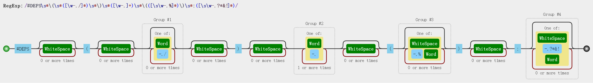
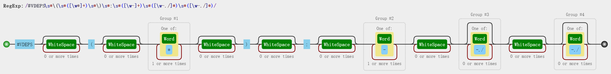

# CBuild 编译系统

## 特点

* Linux 下纯粹的 Makefile 编译
* 支持交叉编译，支持自动分析头文件和编译脚本文件作为编译依赖，支持分别指定源文件的 CFLAGS
* 一个 Makefile 同时支持 Yocto 编译方式、源码和编译输出分离模式和不分离模式
* 一个 Makefile 支持生成多个库、可执行文件或模块
* 提供编译静态库、共享库和可执行文件的模板 `inc.app.mk`
    * 支持 C(`*.c`) C++(`*.cc *.cp *.cxx *.cpp *.CPP *.c++ *.C`) 和 汇编(`*.S *.s *.asm`) 混合编译
    * 实现非常灵活，可以方便地增加其它后缀的源码文件的支持
* 提供编译外部内核模块的模板 `inc.mod.mk`
    * 支持 C(`*.c`) 和 汇编(`*.S`) 混合编译
* 提供安装编译输出的模板 `inc.ins.mk`
* 提供 kconfig 配置参数的模板 `inc.conf.mk`
* 提供根据目标依赖关系自动生成编译顺序的脚本和编译开关参数的总配置脚本 `analyse_deps.py`
    * 支持自动生成参与编译的实包和不参与编译的虚包的规则，虚包可用于控制管理一组实包
    * 支持普通结构(config)、层次结构(menuconfig/menu)、选择结构(choice) 等自动生成
    * 支持强依赖(depends on)、弱依赖(if...endif)、强选择(select)、弱选择(imply) 等自动生成

## 笔记

* 如果对 Shell 语法不了解，可以查看 [Shell 笔记](./notes/shell.md)
* 如果对 Makefile 语法不了解，可以查看 [Makefile 笔记](./notes/makefile.md)
* 如果对 Kconfig 语法不了解，可以查看 [Kconfig 笔记](./notes/kconfig.md)

## 开源贡献

本工程目前已向 Linux 内核社区贡献了2次提交，已合并到 Linux 内核主线

* [kconfig: fix failing to generate auto.conf](https://git.kernel.org/pub/scm/linux/kernel/git/masahiroy/linux-kbuild.git/commit/?h=fixes&id=1b9e740a81f91ae338b29ed70455719804957b80)

```sh
commit 1b9e740a81f91ae338b29ed70455719804957b80
Author: Jing Leng <jleng@ambarella.com>
Date:   Fri Feb 11 17:27:36 2022 +0800

    kconfig: fix failing to generate auto.conf

    When the KCONFIG_AUTOCONFIG is specified (e.g. export \
    KCONFIG_AUTOCONFIG=output/config/auto.conf), the directory of
    include/config/ will not be created, so kconfig can't create deps
    files in it and auto.conf can't be generated.
```

* [kbuild: Fix include path in scripts/Makefile.modpost](https://git.kernel.org/pub/scm/linux/kernel/git/masahiroy/linux-kbuild.git/commit/?h=fixes&id=23a0cb8e3225122496bfa79172005c587c2d64bf)

```sh
commit 23a0cb8e3225122496bfa79172005c587c2d64bf
Author: Jing Leng <jleng@ambarella.com>
Date:   Tue May 17 18:51:28 2022 +0800

    kbuild: Fix include path in scripts/Makefile.modpost

    When building an external module, if users don't need to separate the
    compilation output and source code, they run the following command:
    "make -C $(LINUX_SRC_DIR) M=$(PWD)". At this point, "$(KBUILD_EXTMOD)"
    and "$(src)" are the same.

    If they need to separate them, they run "make -C $(KERNEL_SRC_DIR)
    O=$(KERNEL_OUT_DIR) M=$(OUT_DIR) src=$(PWD)". Before running the
    command, they need to copy "Kbuild" or "Makefile" to "$(OUT_DIR)" to
    prevent compilation failure.

    So the kernel should change the included path to avoid the copy operation.
```

## 初始化编译环境

初始化编译环境运行如下命令

```sh
lengjing@lengjing:~/cbuild$ source scripts/build.env
============================================================
ARCH             :
CROSS_COMPILE    :
ENV_TOP_DIR      : /home/lengjing/cbuild
ENV_TOP_OUT      : /home/lengjing/cbuild/output
ENV_OUT_ROOT     : /home/lengjing/cbuild/output/objects
ENV_INS_ROOT     : /home/lengjing/cbuild/output/sysroot
ENV_DEP_ROOT     : /home/lengjing/cbuild/output/sysroot
ENV_BUILD_MODE   : external
============================================================
```

还可以指定 ARCH 和交叉编译器

```sh
lengjing@lengjing:~/cbuild$ source scripts/build.env arm64 arm-linux-gnueabihf-
============================================================
ARCH             : arm64
CROSS_COMPILE    : arm-linux-gnueabihf-
ENV_TOP_DIR      : /home/lengjing/cbuild
ENV_TOP_OUT      : /home/lengjing/cbuild/output
ENV_OUT_ROOT     : /home/lengjing/cbuild/output/objects
ENV_INS_ROOT     : /home/lengjing/cbuild/output/sysroot
ENV_DEP_ROOT     : /home/lengjing/cbuild/output/sysroot
ENV_BUILD_MODE   : external
============================================================

```

`scripts/build.env` 中，导出的自定义环境变量

```sh
ENV_TOP_DIR=$(pwd | sed 's:/cbuild.*::')/cbuild
ENV_TOP_OUT=${ENV_TOP_DIR}/output
ENV_OUT_ROOT=${ENV_TOP_OUT}/objects
ENV_INS_ROOT=${ENV_TOP_OUT}/sysroot
ENV_DEP_ROOT=${ENV_INS_ROOT}
ENV_BUILD_MODE=external  # external internal yocto
```

* ENV_TOP_DIR: 工程的根目录
* ENV_TOP_OUT: 工程的输出根目录，编译输出、安装文件、生成镜像等都在此目录下定义
* ENV_OUT_ROOT: 源码和编译输出分离时的编译输出根目录
* ENV_INS_ROOT: 工程安装文件的根目录
* ENV_DEP_ROOT: 工程搜索库和头文件的根目录
* ENV_BUILD_MODE: 设置编译模式: external, 源码和编译输出分离; internal, 编译输出到源码; yocto, Yocto 编译方式
    * external 时，编译输出目录是把包的源码目录的 ENV_TOP_DIR 部分换成了 ENV_OUT_ROOT

注: yocto 编译时，由于 BitBake 任务无法直接使用当前 shell 的环境变量，所以自定义环境变量应由配方文件导出，不需要 source 这个环境脚本

## 测试编译应用

测试用例1位于 `test-app`
测试用例2位于 `test-app2` (`test-app2` 依赖 `test-app`)，
测试用例3位于 `test-app3` (`test-app3` 一个 Makefile 生成多个库)，如下测试

```sh
lengjing@lengjing:~/cbuild$ cd examples/test-app
lengjing@lengjing:~/cbuild/examples/test-app$ make
gcc	add.c
gcc	sub.c
gcc	main.c
lib:	/home/lengjing/cbuild/output/objects/examples/test-app/libtest.a
lib:	/home/lengjing/cbuild/output/objects/examples/test-app/libtest.so
bin:	/home/lengjing/cbuild/output/objects/examples/test-app/test
Build test-app Done.
lengjing@lengjing:~/cbuild/examples/test-app$ vi include/sub.h  # 在此文件加上一个空行保存
lengjing@lengjing:~/cbuild/examples/test-app$ make  # 此时依赖此头文件的 C 源码会重新编译
gcc	sub.c
gcc	main.c
lib:	/home/lengjing/cbuild/output/objects/examples/test-app/libtest.a
lib:	/home/lengjing/cbuild/output/objects/examples/test-app/libtest.so.1.2.3
bin:	/home/lengjing/cbuild/output/objects/examples/test-app/test
Build test-app Done.
lengjing@lengjing:~/cbuild/examples/test-app$ make install  # 安装文件
lengjing@lengjing:~/cbuild/examples/test-app$ cd ../test-app2
lengjing@lengjing:~/cbuild/examples/test-app2$ make
gcc	main.c
bin:	/home/lengjing/cbuild/output/objects/examples/test-app2/test2
Build test-app2  Done.
lengjing@lengjing:~/cbuild/examples/test-app2$ make install
lengjing@lengjing:~/cbuild/examples/test-app2$ cd ../test-app3/
lengjing@lengjing:~/cbuild/examples/test-app3$ make
gcc	add.c
lib:	/home/lengjing/cbuild/output/objects/examples/test-app3/libadd.a
lib:	/home/lengjing/cbuild/output/objects/examples/test-app3/libadd.so.1.2.3
gcc	sub.c
lib:	/home/lengjing/cbuild/output/objects/examples/test-app3/libsub.a
lib:	/home/lengjing/cbuild/output/objects/examples/test-app3/libsub.so.1.2
gcc	mul.c
lib:	/home/lengjing/cbuild/output/objects/examples/test-app3/libmul.a
lib:	/home/lengjing/cbuild/output/objects/examples/test-app3/libmul.so.1
gcc	div.c
lib:	/home/lengjing/cbuild/output/objects/examples/test-app3/libdiv.a
lib:	/home/lengjing/cbuild/output/objects/examples/test-app3/libdiv.so
lib:	/home/lengjing/cbuild/output/objects/examples/test-app3/libadd2.so.1.2.3
Build test-app3 Done.
lengjing@lengjing:~/cbuild/examples/test-app3$ make install
```

`scripts/core/inc.ins.mk` 支持的目标
* install_libs: 安装库文件集
    * 用户需要设置被安装的库文件集变量 INSTALL_LIBRARIES
    * 安装目录是 `$(ENV_INS_ROOT)/usr/lib`
* install_base_libs: 安装库文件集
    * 用户需要设置被安装的库文件集变量 INSTALL_BASE_LIBRARIES，该变量默认取 INSTALL_LIBRARIES 的值
    * 安装目录是 `$(ENV_INS_ROOT)/lib`
* install_bins: 安装可执行文件集
    * 用户需要设置被安装的可执行文件集变量 INSTALL_BINARIES
    * 安装目录是 `$(ENV_INS_ROOT)/usr/bin`
* install_base_bins: 安装可执行文件集
    * 用户需要设置被安装的可执行文件集变量 INSTALL_BASE_BINARIES，该变量默认取 INSTALL_BINARIES 的值
    * 安装目录是 `$(ENV_INS_ROOT)/bin`
* install_hdrs: 安装头文件集
    * 用户需要设置被安装的头文件集变量 INSTALL_HEADERS
    * 安装目录是 `$(ENV_INS_ROOT)/usr/include/$(PACKAGE_NAME)`
* install_datas: 安装数据文件集
    * 用户需要设置被安装的数据文件集变量 INSTALL_DATAS
    * 安装目录是 `$(ENV_INS_ROOT)/usr/share/$(PACKAGE_NAME)`
* install_datas_xxx / install_todirs_xxx / install_tofiles_xxx: 安装文件集到特定文件夹
    * 要安装的文件集分别由 INSTALL_DATAS_xxx / INSTALL_TODIRS_xxx / INSTALL_TOFILES_xxx 定义
    * 定义的值前面部分是要安装的文件集，最后一项是以斜杆 `/` 开头的安装目标路径
    * install_datas_xxx 安装到目录 `$(ENV_INS_ROOT)/usr/share$(INSTALL_DATAS_xxx最后一项)`
    * install_todirs_xxx 安装到目录`$(ENV_INS_ROOT)$(INSTALL_TODIRS_xxx最后一项)`
    * install_tofiles_xxx 安装到文件`$(ENV_INS_ROOT)$(INSTALL_TOFILES_xxx最后一项)` ，INSTALL_TOFILES_xxx 的值有且只有两项
    * 例子:
        * 创建2个空白文件 testa 和 testb，Makefile 内容如下:
        ```makefile
        INSTALL_DATAS_test = testa testb /testa/testb
        INSTALL_TODIRS_test = testa testb /usr/local/bin
        INSTALL_TOFILES_testa = testa /etc/a.conf
        INSTALL_TOFILES_testb = testa /etc/b.conf

        all: install_datas_test install_todirs_test install_tofiles_testa install_tofiles_testb
        include $(ENV_TOP_DIR)/scripts/core/inc.ins.mk
        ```
        * 运行 make 安装后的文件树
        ```
        output/
        └── sysroot
            ├── etc
            │   ├── a.conf
            │   └── b.conf
            └── usr
                ├── local
                │   └── bin
                │       ├── testa
                │       └── testb
                └── share
                    └── testa
                        └── testb
                            ├── testa
                            └── testb
        ```

`scripts/core/inc.app.mk` 支持的目标

* LIBA_NAME: 编译静态库时需要设置静态库名
* LIBSO_NAME: 编译动态库时需要设置动态库名
    * LIBSO_NAME 可以设置为 `库名 主版本号 次版本号 补丁版本号` 格式，例如
        * `LIBSO_NAME = libtest.so 1 2 3` 编译生成动态库 libtest.so.1.2.3，并创建符号链接 libtest.so 和 libtest.so.1
        * `LIBSO_NAME = libtest.so 1 2`   编译生成动态库 libtest.so.1.2  ，并创建符号链接 libtest.so 和 libtest.so.1
        * `LIBSO_NAME = libtest.so 1`     编译生成动态库 libtest.so.1    ，并创建符号链接 libtest.so
        * `LIBSO_NAME = libtest.so`       编译生成动态库 libtest.so
    * 如果 LIBSO_NAME 带版本号，默认指定的 soname 是 `libxxxx.so.x`，可以通过 LDFLAGS 覆盖默认值
        * 例如 `LDFLAGS += -Wl,-soname=libxxxx.so`
* BIN_NAME: 编译可执行文件时需要设置可执行文件名

* install_lib: 安装库文件集
    * 用户一般不需要设置被安装的库文件集变量 INSTALL_LIBRARY
    * 编译生成的库文件会加入到 `LIB_TARGETS` 变量，INSTALL_LIBRARY 已默认赋值为 `$(LIB_TARGETS)`
    * 安装目录是 `$(ENV_INS_ROOT)/usr/lib`
* install_base_lib: 安装库文件集
    * 用户一般不需要设置被安装的库文件集变量 INSTALL_BASE_LIBRARY，该变量默认取 INSTALL_LIBRARY 的值
    * 安装目录是 `$(ENV_INS_ROOT)/lib`
* install_bin: 安装可执行文件集
    * 用户一般不需要设置被安装的可执行文件集变量 INSTALL_BINARY
    * 编译生成的可执行文件会加入到 `BIN_TARGETS` 变量，INSTALL_BINARY 已默认赋值为 `$(BIN_TARGETS)`
    * 安装目录是 `$(ENV_INS_ROOT)/usr/bin`
* install_base_bins: 安装可执行文件集
    * 用户一般不需要设置被安装的库文件集变量 INSTALL_BASE_BINARY，该变量默认取 INSTALL_BINARY 的值
    * 安装目录是 `$(ENV_INS_ROOT)/bin`
* install_hdr / install_data / install_data_xxx / install_todir_xxx / install_tofile_xxx:
    * 目标意义同 inc.ins.mk 中对应的目标 install_hdrs / install_datas / install_datas_xxx / install_todirs_xxx / install_tofiles_xxx
    * 且变量名称改为了 INSTALL_HEADER / INSTALL_DATA / INSTALL_DATA_xxx / INSTALL_TODIR_xxx / INSTALL_TOFILE_xxx

`scripts/core/inc.app.mk` 提供的函数

* `$(eval $(call add-liba-build,静态库名,源文件列表))`: 创建编译静态库规则
* `$(eval $(call add-libso-build,动态库名,源文件列表))`: 创建编译动态库规则
    * 动态库名可以设置为 `库名 主版本号 次版本号 补丁版本号` 格式，参考 LIBSO_NAME 的说明
* `$(eval $(call add-libso-build,动态库名,源文件列表,链接参数))`: 创建编译动态库规则
    * 注意函数中有逗号要用变量覆盖: `$(eval $(call add-libso-build,动态库名,源文件列表,-Wl$(comma)-soname=libxxxx.so))`
* `$(eval $(call add-bin-build,可执行文件名,源文件列表))`: 创建编译可执行文件规则
* `$(eval $(call add-bin-build,可执行文件名,源文件列表,链接参数))`: 创建编译可执行文件规则
* `$(call set_flags,标记名称,源文件列表,标记值)`: 单独为指定源码集设置编译标记
    * 例如 `$(call set_flags,CFLAGS,main.c src/read.c src/write.c,-D_FILE_OFFSET_BITS=64 -D_LARGEFILE_SOURCE -D_LARGEFILE64_SOURCE)`

注: 提供上述函数的原因是可以在一个 Makefile 中编译出多个库或可执行文件

`scripts/core/inc.app.mk` 可设置的变量

* PACKAGE_NAME: 包的名称，决定头文件等的安装路径(inc.ins.mk 的此变量意义相同)
* PACKAGE_DEPS: 包的依赖(多个依赖空格隔开)，决定头文件的搜索路径等
    * 默认将包依赖对应的路径加到当前包的头文件的搜索路径
* OUT_PATH: 编译输出目录，保持默认即可
* SRC_PATH: 包中源码所在的目录，默认是包的根目录，也有的包将源码放在 src 下
    * 也可以指定包下多个(不交叉)目录的源码，例如 `SRC_PATH = src1 src2 src3`
* IGNORE_PATH: 查找源码文件时，忽略搜索的目录名集合，默认已忽略 `.git scripts output` 文件夹
* REG_SUFFIX: 支持查找的源码文件的后缀名，默认查找以 `c cpp S` 为后缀的源码文件
    * 可以修改为其它类型的文件，从 c 和 CPP_SUFFIX / ASM_SUFFIX 定义的类型中选择
    * 如果支持非 CPP_SUFFIX / ASM_SUFFIX 默认定义类型的文件，只需要修改 REG_SUFFIX 和 CPP_SUFFIX / ASM_SUFFIX ，并定义函数
        * CPP_SUFFIX: C++类型的文件后缀名，默认定义为 `cc cp cxx cpp CPP c++ C`
        * ASM_SUFFIX: 汇编类型的文件后缀名，默认定义为 `S s asm`
    * 例如增加 cxx 类型的支持(CPP_SUFFIX 已有定义 cxx)：
        ```makefile
        REG_SUFFIX = c cpp S cxx
        include $(ENV_TOP_DIR)/scripts/core/inc.app.mk
        ```
    * 例如增加 CXX 类型的支持(CPP_SUFFIX 还未定义 CXX)：
        ```makefile
        REG_SUFFIX = c cpp S CXX
        CPP_SUFFIX = cc cp cxx cpp CPP c++ C CXX
        include $(ENV_TOP_DIR)/scripts/core/inc.app.mk
        $(eval $(call compile_obj,CXX,$$(CXX)))
        ```
* SRCS: 所有的 C 源码文件，默认是 SRC_PATH 下的所有的 `*.c *.cpp *.S` 文件
    * 如果用户指定了 SRCS，也可以设置 SRC_PATH 将 SRC_PATH 和 SRC_PATH 下的 include 加入到头文件搜索的目录
    * 如果用户指定了 SRCS，忽略 IGNORE_PATH 的值
* CFLAGS: 用户可以设置包自己的一些全局编译标记(用于 `gcc g++` 命令)
* AFLAGS: 用户可以设置包自己的一些全局汇编标记(用于 `as` 命令)
* LDFLAGS: 用户可以设置包自己的一些全局链接标记
* CFLAGS_xxx.o: 用户可以单独为指定源码 `xxx.c / xxx.cpp / ... / xxx.S` 设置编译标记
* AFLAGS_xxx.o: 用户可以单独为指定源码 `xxx.s / xxx.asm` 设置编译标记
* DEBUG: 设置为y时使用 `-O0 -g -ggdb` 编译

## 测试kconfig

测试用例位于 `test-conf`，如下测试

```sh
lengjing@lengjing:~/cbuild/examples/test-app3$ cd ../test-conf/
lengjing@lengjing:~/cbuild/examples/test-conf$ ls config/
def_config
lengjing@lengjing:~/cbuild/examples/test-conf$ make def_config  # 加载配置
bison	/home/lengjing/cbuild/output/objects/scripts/kconfig/autogen/parser.tab.c
gcc	/home/lengjing/cbuild/output/objects/scripts/kconfig/autogen/parser.tab.c
flex	/home/lengjing/cbuild/output/objects/scripts/kconfig/autogen/lexer.lex.c
gcc	/home/lengjing/cbuild/output/objects/scripts/kconfig/autogen/lexer.lex.c
gcc	parser/confdata.c
gcc	parser/menu.c
gcc	parser/util.c
gcc	parser/preprocess.c
gcc	parser/expr.c
gcc	parser/symbol.c
gcc	conf.c
gcc	/home/lengjing/cbuild/output/objects/scripts/kconfig/conf
gcc	lxdialog/checklist.c
gcc	lxdialog/inputbox.c
gcc	lxdialog/util.c
gcc	lxdialog/textbox.c
gcc	lxdialog/yesno.c
gcc	lxdialog/menubox.c
gcc	mconf.c
gcc	/home/lengjing/cbuild/output/objects/scripts/kconfig/mconf
#
# No change to /home/lengjing/cbuild/output/objects/examples/test-conf/.config
#
lengjing@lengjing:~/cbuild/examples/test-conf$ ls -a ${ENV_OUT_ROOT}/examples/test-conf
.  ..  .config  autoconfig  config.h
lengjing@lengjing:~/cbuild/examples/test-conf$ make menuconfig # 图形化界面修改配置
configuration written to /home/lengjing/cbuild/output/objects/examples/test-conf/.config

*** End of the configuration.
*** Execute 'make' to start the build or try 'make help'.

lengjing@lengjing:~/cbuild/examples/test-conf$ make def2_saveconfig  # 保存新配置
Save .config to config/def2_config
lengjing@lengjing:~/cbuild/examples/test-conf$ ls config/
def2_config  def_config
```

`scripts/core/inc.conf.mk` 支持的目标

* loadconfig: 加载默认配置
    * 如果 .config 不存在，加载 DEF_CONFIG 指定的配置
* menuconfig: 图形化配置工具
* cleanconfig: 清理配置文件
* xxx_config: 将 CONF_SAVE_PATH 下的 xxx_config 作为当前配置
* xxx_saveconfig: 将当前配置保存到 CONF_SAVE_PATH 下的 xxx_config
* xxx_defonfig: 将 CONF_SAVE_PATH 下的 xxx_defconfig 作为当前配置
* xxx_savedefconfig: 将当前配置保存到 CONF_SAVE_PATH 下的 xxx_defconfig

`scripts/core/inc.conf.mk` 可设置的变量

* OUT_PATH: 编译输出目录，保持默认即可
* CONF_SRC: kconfig 工具的源码目录，目前是在 `scripts/kconfig`，和实际一致即可
* CONF_PATH: kconfig 工具的编译输出目录，和实际一致即可
* CONF_PREFIX: 设置 conf 运行的变量，主要是下面两个设置
    * `srctree=path_name`: Kconfig 文件中 source 其它配置参数文件的相对的目录是 srctree 指定的目录，如果不指定，默认是运行 `conf/mconf` 命令的目录
    * `CONFIG_=""` : 设置生成的 .config 和 config.h 文件中的选项名称(对比 Kconfig 对应的选项名称)的前缀，不设置时，默认值是 `CONFIG_`，本例的设置是无前缀
* CONF_HEADER: 设置生成的 config.h 中使用的包含宏，默认值是 `__大写包名_CONFIG_H__`
    * kconfig 生成的头文件默认不包含宏 `#ifndef xxx ... #define xxx ... #endif`，本模板使用 sed 命令添加了宏
* KCONFIG: 配置参数文件，默认是包下的 Kconfig 文件
* CONF_SAVE_PATH: 配置文件的获取和保存目录，默认是包下的 config 目录

注: 目录下的 [Kconfig](./examples/test-conf/Kconfig) 文件也说明了如何写配置参数

`scripts/kconfig` 工程说明

* 源码完全来自 linux-5.18 内核的 `scripts/kconfig`
* 在原始代码的基础上增加了命令传入参数 `CONFIG_PATH` `AUTOCONFIG_PATH` `AUTOHEADER_PATH`，原先这些参数要作为环境变量传入
* Makefile 是完全重新编写的

## 测试编译内核模块

测试用例1位于 `test-mod` (其中 test_hello 依赖于 test_hello_add 和 test_hello_sub)，其中 test_hello_sub 采用 Makefile 和 Kbuild 分离的模式
测试用例2位于 `test-mod2` (一个 Makefile 同时编译出两个模块 hello_op 和 hello)，如下测试

```sh
lengjing@lengjing:~/cbuild/examples/test-conf$ cd ../test-mod
lengjing@lengjing:~/cbuild/examples/test-mod$ make deps
Generate Kconfig OK.
Generate auto.mk OK.
lengjing@lengjing:~/cbuild/examples/test-mod$ make menuconfig
configuration written to /home/lengjing/cbuild/output/objects/examples/test-mod/.config

*** End of the configuration.
*** Execute 'make' to start the build or try 'make help'.

lengjing@lengjing:~/cbuild/examples/test-mod$ make all
KERNELRELEASE= pwd=/home/lengjing/cbuild/examples/test-mod/test-hello-add PWD=/home/lengjing/cbuild/examples/test-mod
KERNELRELEASE=5.13.0-44-generic pwd=/usr/src/linux-headers-5.13.0-44-generic PWD=/home/lengjing/cbuild/examples/test-mod
KERNELRELEASE=5.13.0-44-generic pwd=/usr/src/linux-headers-5.13.0-44-generic PWD=/home/lengjing/cbuild/examples/test-mod
Skipping BTF generation for /home/lengjing/cbuild/output/objects/examples/test-mod/test-hello-add/hello_add.ko due to unavailability of vmlinux
Build test-hello-add Done.
KERNELRELEASE= pwd=/home/lengjing/cbuild/examples/test-mod/test-hello-add PWD=/home/lengjing/cbuild/examples/test-mod
arch/x86/Makefile:148: CONFIG_X86_X32 enabled but no binutils support
At main.c:160:
- SSL error:02001002:system library:fopen:No such file or directory: ../crypto/bio/bss_file.c:69
- SSL error:2006D080:BIO routines:BIO_new_file:no such file: ../crypto/bio/bss_file.c:76
sign-file: certs/signing_key.pem: No such file or directory
Warning: modules_install: missing 'System.map' file. Skipping depmod.
KERNELRELEASE= pwd=/home/lengjing/cbuild/examples/test-mod/test-hello-sub PWD=/home/lengjing/cbuild/examples/test-mod
KERNELRELEASE=5.13.0-44-generic pwd=/usr/src/linux-headers-5.13.0-44-generic PWD=/home/lengjing/cbuild/examples/test-mod
KERNELRELEASE=5.13.0-44-generic pwd=/usr/src/linux-headers-5.13.0-44-generic PWD=/home/lengjing/cbuild/examples/test-mod
Skipping BTF generation for /home/lengjing/cbuild/output/objects/examples/test-mod/test-hello-sub/hello_sub.ko due to unavailability of vmlinux
Build test-hello-sub Done.
KERNELRELEASE= pwd=/home/lengjing/cbuild/examples/test-mod/test-hello-sub PWD=/home/lengjing/cbuild/examples/test-mod
arch/x86/Makefile:148: CONFIG_X86_X32 enabled but no binutils support
At main.c:160:
- SSL error:02001002:system library:fopen:No such file or directory: ../crypto/bio/bss_file.c:69
- SSL error:2006D080:BIO routines:BIO_new_file:no such file: ../crypto/bio/bss_file.c:76
sign-file: certs/signing_key.pem: No such file or directory
Warning: modules_install: missing 'System.map' file. Skipping depmod.
KERNELRELEASE= pwd=/home/lengjing/cbuild/examples/test-mod/test-hello PWD=/home/lengjing/cbuild/examples/test-mod
KERNELRELEASE=5.13.0-44-generic pwd=/usr/src/linux-headers-5.13.0-44-generic PWD=/home/lengjing/cbuild/examples/test-mod/test-hello
KERNELRELEASE=5.13.0-44-generic pwd=/usr/src/linux-headers-5.13.0-44-generic PWD=/home/lengjing/cbuild/examples/test-mod/test-hello
Skipping BTF generation for /home/lengjing/cbuild/output/objects/examples/test-mod/test-hello/hello_dep.ko due to unavailability of vmlinux
Build test-hello Done.
KERNELRELEASE= pwd=/home/lengjing/cbuild/examples/test-mod/test-hello PWD=/home/lengjing/cbuild/examples/test-mod
arch/x86/Makefile:148: CONFIG_X86_X32 enabled but no binutils support
At main.c:160:
- SSL error:02001002:system library:fopen:No such file or directory: ../crypto/bio/bss_file.c:69
- SSL error:2006D080:BIO routines:BIO_new_file:no such file: ../crypto/bio/bss_file.c:76
sign-file: certs/signing_key.pem: No such file or directory
Warning: modules_install: missing 'System.map' file. Skipping depmod.
lengjing@lengjing:~/cbuild/examples/test-mod$
lengjing@lengjing:~/cbuild/examples/test-mod$
lengjing@lengjing:~/cbuild/examples/test-mod$ cd ../test-mod2
lengjing@lengjing:~/cbuild/examples/test-mod2$ make
KERNELRELEASE= pwd=/home/lengjing/cbuild/examples/test-mod2 PWD=/home/lengjing/cbuild/examples/test-mod2
KERNELRELEASE=5.13.0-44-generic pwd=/usr/src/linux-headers-5.13.0-44-generic PWD=/home/lengjing/cbuild/examples/test-mod2
KERNELRELEASE=5.13.0-44-generic pwd=/usr/src/linux-headers-5.13.0-44-generic PWD=/home/lengjing/cbuild/examples/test-mod2
Skipping BTF generation for /home/lengjing/cbuild/output/objects/examples/test-mod2/hello_op.ko due to unavailability of vmlinux
Skipping BTF generation for /home/lengjing/cbuild/output/objects/examples/test-mod2/hello_sec.ko due to unavailability of vmlinux
Build test-mod2 Done.
```

`scripts/core/inc.mod.mk` 支持的目标(KERNELRELEASE 为空时)

* modules: 编译外部内核模块
* modules_clean: 清理内核模块的编译输出
* modules_install: 安装内核模块到指定位置
    * 外部内核模块默认的安装路径为 `$(ENV_INS_ROOT)/lib/modules/<kernel_release>/extra/`
* install_hdr / install_data / install_data_xxx / install_todir_xxx / install_tofile_xxx: 和 inc.app.mk 中对应目标、变量和使用方法完全一致

`scripts/core/inc.mod.mk` 可设置的变量(KERNELRELEASE 为空时)

* PACKAGE_NAME: 包的名称
* PACKAGE_DEPS: 包的依赖(多个依赖空格隔开)
    * 默认将包依赖对应的路径加到当前包的头文件的搜索路径
* MOD_MAKES: 用户指定一些模块自己的信息，例如 XXXX=xxxx
* OUT_PATH: 编译输出目录，保持默认即可 (只在源码和编译输出分离时有效)
* KERNEL_SRC: Linux 内核源码目录 (必须）
* KERNEL_OUT: Linux 内核编译输出目录 （`make -O $(KERNEL_OUT)` 编译内核的情况下必须）

`scripts/core/inc.mod.mk` 支持的目标(KERNELRELEASE 有值时)

* MOD_NAME: 模块名称，可以是多个模块名称使用空格隔开

`scripts/core/inc.mod.mk` 可设置的变量(KERNELRELEASE 有值时)

* IGNORE_PATH: 查找源码文件时，忽略搜索的目录名集合，默认已忽略 `.git scripts output` 文件夹
* SRCS: 所有的 C 和汇编源码文件，默认是当前目录下的所有的 `*.c *.S` 文件
* `ccflags-y` `asflags-y` `ldflags-y`: 分别对应内核模块编译、汇编、链接时的参数

`scripts/core/inc.mod.mk` 提供的函数(KERNELRELEASE 有值时)
* `$(call translate_obj,源码文件集)`: 将源码文件集名字转换为KBUILD需要的 `*.o` 格式，不管源码是不是以 `$(src)/` 开头
* `$(call set_flags,标记名称,源文件列表,标记值)`: 单独为指定源码集设置编译标记，参考 inc.app.mk 的说明

注：如果 MOD_NAME 含有多个模块名称，需要用户自己填写各个模块下的对象，例如

```makefile
MOD_NAME = mod1 mod2
mod1-y = a1.o b1.o c1.o
mod2-y = a2.o b2.o c2.o
```

注: 使用源码和编译输出分离时， 需要先将 Kbuild 或 Makefile 复制到 OUT_PATH 目录下，如果不想复制，需要修改内核源码的 `scripts/Makefile.modpost`，linux-5.19 内核和最新版本的 LTS 内核已合并此补丁

```makefile
-include $(if $(wildcard $(KBUILD_EXTMOD)/Kbuild), \
-             $(KBUILD_EXTMOD)/Kbuild, $(KBUILD_EXTMOD)/Makefile)
+include $(if $(wildcard $(src)/Kbuild), $(src)/Kbuild, $(src)/Makefile)
```

## 测试自动生成总编译

测试用例位于 `test-deps`，如下测试

```sh
lengjing@lengjing:~/cbuild/examples/test-mod2$ cd ../test-deps
lengjing@lengjing:~/cbuild/examples/test-deps$ make deps
Generate Kconfig OK.
Generate auto.mk OK.
lengjing@lengjing:~/cbuild/examples/test-deps$ make menuconfig
configuration written to /home/lengjing/cbuild/output/objects/examples/test-deps/.config

*** End of the configuration.
*** Execute 'make' to start the build or try 'make help'.

lengjing@lengjing:~/cbuild/examples/test-deps$ make all
ext.mk
target=all path=/home/lengjing/cbuild/examples/test-deps/pc/pc
ext.mk
target=install path=/home/lengjing/cbuild/examples/test-deps/pc/pc
target=all path=/home/lengjing/cbuild/examples/test-deps/pe/pe
target=install path=/home/lengjing/cbuild/examples/test-deps/pe/pe
target=all path=/home/lengjing/cbuild/examples/test-deps/pd/pd
target=install path=/home/lengjing/cbuild/examples/test-deps/pd/pd
target=all path=/home/lengjing/cbuild/examples/test-deps/pb/pb
target=install path=/home/lengjing/cbuild/examples/test-deps/pb/pb
target=all path=/home/lengjing/cbuild/examples/test-deps/pa/pa
target=install path=/home/lengjing/cbuild/examples/test-deps/pa/pa
lengjing@lengjing:~/cbuild/examples/test-deps$ make clean
ext.mk
target=clean path=/home/lengjing/cbuild/examples/test-deps/pc/pc
target=clean path=/home/lengjing/cbuild/examples/test-deps/pe/pe
target=clean path=/home/lengjing/cbuild/examples/test-deps/pd/pd
target=clean path=/home/lengjing/cbuild/examples/test-deps/pb/pb
target=clean path=/home/lengjing/cbuild/examples/test-deps/pa/pa
rm -f auto.mk Kconfig
```

`scripts/bin/analyse_deps.py` 选项

* `-m <Makefile Name>`: 自动生成的 Makefile 文件名
    * 可以使用一个顶层 Makefile 包含自动生成的 Makefile，all 目标调用 `make $(BUILD_JOBS) -s MAKEFLAGS= all_targets` 多线程编译所有包
    * 如果某个包的内部需要启用多线程编译，需要在此包的其它目标中指定 `jobserver`，见下面说明
* `-k <Kconfig Name>`: 自动生成的 Kconfig 文件名
    * 还会在 Kconfig 同目录生成 Target 文件，列出所有包的文件路径、包名和依赖
* `-d <Search Depend Name>`: 要搜索的依赖文件名(含有依赖规则语句)
* `-c <Search Kconfig Name>`: 要搜索的配置文件名(含有配置信息)
* `-v <Search Virtual Depend Name>`: 要搜索的虚拟依赖文件名(含有虚拟依赖规则语句)
* `-s <Search Directories>`: 搜索的目录名，多个目录使用冒号隔开
* `-i <Ignore Directories>`: 忽略的目录名，不会搜索指定目录名下的依赖文件，多个目录使用冒号隔开
* `-t <Max Tier Depth>`: 设置 menuconfig 菜单的最大层数，0 表示菜单平铺，1表示2层菜单，...
* `-w <Keyword Directories>`: 用于 menuconfig 菜单，如果路径中的目录匹配设置值，则这个路径的层数减1，设置的多个目录使用冒号隔开
* `-p <prepend Flag>`: 用于 menuconfig，如果用户运行 conf / mconf 时设置了无前缀，则运行此脚本需要设置此 flag 为 1

注: 如果在当前目录下搜索到 `<Search Depend Name>`，不会再继续搜索当前目录的子目录; `<Search Depend Name>` 中可以包含多条依赖信息

实依赖信息格式 `#DEPS(Makefile_Name) Target_Name(Other_Target_Names): Depend_Names`



* Makefile_Name: make 运行的 Makefile 的名称 (可以为空)，不为空时 make 会运行指定的 Makefile (`-f Makefile_Name`)
    * Makefile 中必须包含 all clean install 三个目标，默认会加入 all install 和 clean 目标的规则
    * Makefile 名称可以包含路径(即斜杠 `/`)，支持直接查找子文件夹下的子包，例如 `test1/` or `test2/wrapper.mk`
    * 也可以用一行语句 `#INCDEPS: Sub_Dirs` 继续查找子文件夹下的依赖文件，支持递归，例如 `#INCDEPS: test1 test2`，通过子文件夹下的依赖文件找到子包
* Target_Name: 当前包的名称ID
* Other_Target_Names: 当前包的其它目标，多个目标使用空格隔开 (可以为空)
    * 忽略 Other_Target_Names 中的 all install clean 目标
    * `prepare` 关键字是特殊的实目标，表示 make 前运行 make prepare，一般用于当 .config 不存在时加载默认配置到 .config
    * `jobserver` 关键字是特殊的虚拟目标，表示 make 后加上 `$(BUILD_JOBS)`，用户需要 `export BUILD_JOBS=-j8` 才会启动多线程编译
        * 某些包的 Makefile 包含 make 指令时不要加上 jobserver 目标，例如编译外部内核模块
* Depend_Names: 当前包依赖的其它包的名称ID，多个依赖使用空格隔开 (可以为空)
    * 如果有循环依赖或未定义依赖，解析将会失败，会打印出未解析成功的条目
        * 出现循环依赖，打印 "ERROR: circular deps!"
        * 出现未定义依赖，打印 "ERROR: deps (%s) are not found!"

注: 包的名称ID是由 **小写字母、数字、短划线** 组成，Other_Target_Names 中还可以使用 `%` 作为通配符

Depend_Names 中的特殊依赖

* 特殊依赖(关键字类)
    * `finally`     : 表示此包编译顺序在所有其它包之后，一般用于最后生成文件系统和系统镜像
    * `unselect`    : 表示此包默认不编译，即 `default n`，否则此包默认编译，即 `default y`
    * `nokconfig`   : 表示此包不含 Kconfig 配置。同一目录有多个包时，最多只有一个包有 Kconfig，此包无需设置 `nokconfig`，而其它包需要设置
* 特殊依赖(前导符类)
    * `!depname`    : 表示此包和 depname 包冲突，无法同时开启，即 `depends on !depname`
    * `&depname`    : 表示此包弱选中 depname 包，即 `imply depname`，此包选中后，depname 也被自动选中，此时 depname 也可以手动取消选中
    * `&&depname`   : 表示此包强选中 depname 包，即 `select depname`，此包选中后，depname 也被自动选中，此时 depname 不可以取消选中
    * `?depname`    : 表示此包弱依赖(不安装动态库的) depname 包，弱依赖是指即使 depname 包未选中或不存在，依赖它的包也可以选中和编译成功
    * `??depname`   : 表示此包弱依赖(安装动态库的) depname 包
    * `*depname`    : 表示此包会被虚拟包 depname 的作用，不要使用 `*choice` 和 `*depend` 的定义ID，会报警告
* 特殊依赖(环境变量类)
    * ENVNAME=val1,val2 : 表示此包依赖环境变量 ENVNAME 的值等于 val1 或 等于 val2
    * ENVNAME!=val1,val2: 表示此包依赖环境变量 ENVNAME 的值不等于 val1 且不等于 val2

虚依赖信息格式 `#VDEPS(Virtual_Type) Virtual_Name Default_MSG Sub_Path`



* Virtual_Type      : 必选，表示虚拟包的类型，目前有 6 种类型
    * `*choice`     : 表示生成 `choice` 虚拟包，当前目录(含子目录)下的所有的包会成为 choice 下的子选项
    * `choice`      : 表示生成 `choice` 虚拟包，设置了该特殊依赖的实际包会成为 choice 下的子选项
    * `*depend`     : 表示生成 `menuconfig` 虚拟包，当前目录(含子目录)下的所有的包强依赖此包，且处于该包的菜单目录下
    * `depend`      : 表示生成 `config` 虚拟包，此包将成为设置了该特殊依赖的实际包的强依赖
    * `imply`       : 表示生成 `config` 虚拟包，此包选中时会弱选中设置了该特殊依赖的实际包
    * `select`      : 表示生成 `config` 虚拟包，此包选中时会强选中设置了该特殊依赖的实际包
* Virtual_Name      : 必选，虚拟包的名称
* Default_MSG       : 可选，`choice` 虚拟包是默认选中的子项的ID; 其他包是只有一个值 `unselect`， 表示此包默认不选中，否则默认选中
* Sub_Path          : 可选，只有 `*choice` 和 `*depend` 可能含有此参数，必须以 `/` 开头，表示作用于指定的子目录而不是当前目录

注: 虚依赖是指该包不是实际的包，不会参与编译，只是用来组织管理实际包

## 测试 Yocto 编译

### Yocto 快速开始

* 安装编译环境

```sh
lengjing@lengjing:~/cbuild$ sudo apt install gawk wget git diffstat unzip \
    texinfo gcc build-essential chrpath socat cpio \
    python3 python3-pip python3-pexpect xz-utils \
    debianutils iputils-ping python3-git python3-jinja2 \
    libegl1-mesa libsdl1.2-dev pylint3 xterm \
    python3-subunit mesa-common-dev zstd liblz4-tool qemu
```

* 拉取 Poky 工程

```sh
lengjing@lengjing:~/cbuild$ git clone git://git.yoctoproject.org/poky
lengjing@lengjing:~/cbuild$ cd poky
lengjing@lengjing:~/cbuild/poky$ git branch -a
lengjing@lengjing:~/cbuild/poky$ git checkout -t origin/kirkstone -b my-kirkstone
lengjing@lengjing:~/cbuild/poky$ cd ..
```

注：通过 [Yocto Releases Wiki](https://wiki.yoctoproject.org/wiki/Releases) 界面获取版本代号，上述命令拉取了4.0版本。

* 构建镜像

```shell
lengjing@lengjing:~/cbuild$ source poky/oe-init-build-env               # 初始化环境
lengjing@lengjing:~/cbuild/build$ bitbake core-image-minimal            # 构建最小镜像
lengjing@lengjing:~/cbuild/build$ ls -al tmp/deploy/images/qemux86-64/  # 输出目录
lengjing@lengjing:~/cbuild/build$ runqemu qemux86-64                    # 运行仿真器
```

注: `source oe-init-build-env <dirname>`功能: 初始化环境，并将工具目录(`bitbake/bin/` 和 `scripts/`)加入到环境变量; 在当前目录自动创建并切换到工作目录(不指定时默认为 build)。

### Yocto 配方模板

* 编写类文件 (xxx.bbclass)
    * 可以在类文件中 `meta-xxx/classes/xxx.bbclass` 定义环境变量，在配方文件中继承 `inherit xxx`
    * 例如 testenv.bbclass
        ```sh
        export CONF_PATH = "${STAGING_BINDIR_NATIVE}"
        export OUT_PATH = "${WORKDIR}/build"
        export ENV_INS_ROOT = "${WORKDIR}/image"
        export ENV_DEP_ROOT = "${WORKDIR}/recipe-sysroot"
        export ENV_BUILD_MODE
        ```
    * 例如 kconfig.bbclass
        ```py
        inherit terminal
        KCONFIG_CONFIG_COMMAND ??= "menuconfig"
        KCONFIG_CONFIG_PATH ??= "${B}/.config"

        python do_setrecompile () {
            if hasattr(bb.build, 'write_taint'):
                bb.build.write_taint('do_compile', d)
        }

        do_setrecompile[nostamp] = "1"
        addtask setrecompile

        python do_menuconfig() {
            config = d.getVar('KCONFIG_CONFIG_PATH')

            try:
                mtime = os.path.getmtime(config)
            except OSError:
                mtime = 0

            oe_terminal("sh -c \"make %s; if [ \\$? -ne 0 ]; then echo 'Command failed.'; printf 'Press any key to continue... '; read r; fi\"" % d.getVar('KCONFIG_CONFIG_COMMAND'),
                d.getVar('PN') + ' Configuration', d)

            if hasattr(bb.build, 'write_taint'):
                try:
                    newmtime = os.path.getmtime(config)
                except OSError:
                    newmtime = 0

                if newmtime != mtime:
                    bb.build.write_taint('do_compile', d)
        }

        do_menuconfig[depends] += "kconfig-native:do_populate_sysroot"
        do_menuconfig[nostamp] = "1"
        do_menuconfig[dirs] = "${B}"
        addtask menuconfig after do_configure
        ```

* 编写配方文件 (xxx.bb)
    * `recipetool create -o <xxx.bb> <package_src_dir>` 创建一个基本配方，例子中手动增加的条目说明如下
    * 包依赖
        * 包依赖其他包时需要使用 `DEPENDS += "package1 package2"` 说明
        * 链接其它包时 (`LDFLAGS += -lname1 -lname2`) 需要增加 `RDEPENDS:${PN} += "package1 package2"` 说明
    * 编译继承类
        * 使用 menuconfig 需要继承 `inherit kconfig`
            * 如果是 `make -f wrapper.mk menuconfig`，需要设置 `KCONFIG_CONFIG_COMMAND = "-f wrapper.mk menuconfig"`
            * 如果 .congfig 输出目录是编译输出目录，需要设置 `KCONFIG_CONFIG_PATH = "${OUT_PATH}/.config"`
        * 使用 Makefile 编译应用继承 `inherit sanity`，使用 cmake 编译应用继承 `inherit cmake`
        * 编译外部内核模块继承 `inherit module`
        * 编译主机本地工具继承 `inherit native`
    * 安装和打包
        * 继承 `inherit sanity` 或 `inherit cmake` 时需要按实际情况指定打包的目录，否则 do_package 任务出错
            * includedir 指 xxx/usr/include
            * base_libdir 指 xxx/lib;  libdir指 xxx/usr/lib;  bindir指 xxx/usr/bin; datadir 指 xxx/usr/share
            * 更多目录信息参考poky工程的 `meta/conf/bitbake.conf` 文件
            ```
            FILES:${PN}-dev = "${includedir}"
            FILES:${PN} = "${base_libdir} ${libdir} ${bindir} ${datadir}"
            ```
        * 忽略某些警告和错误
            * `ALLOW_EMPTY:${PN} = "1"` 忽略包安装的文件只有头文件或为空，生成镜像时 do_rootfs 错误
            * `INSANE_SKIP:${PN} += "dev-so"` 忽略安装的文件是符号链接的错误
                * 更多信息参考 [insane.bbclass](https://docs.yoctoproject.org/ref-manual/classes.html?highlight=sanity#insane-bbclass)

```
LICENSE = "CLOSED"
LIC_FILES_CHKSUM = ""

# No information for SRC_URI yet (only an external source tree was specified)
SRC_URI = ""

#DEPENDS += "package1 package2"
#RDEPENDS:${PN} += "package1 package2"

inherit testenv
#KCONFIG_CONFIG_COMMAND = "-f wrapper.mk menuconfig"
#KCONFIG_CONFIG_PATH = "${OUT_PATH}/.config"
#inherit kconfig
inherit sanity
#inherit cmake
#inherit module
#inherit native


# NOTE: this is a Makefile-only piece of software, so we cannot generate much of the
# recipe automatically - you will need to examine the Makefile yourself and ensure
# that the appropriate arguments are passed in.

do_configure () {
 # Specify any needed configure commands here
 :
}

do_compile () {
 # You will almost certainly need to add additional arguments here
 oe_runmake
}

do_install () {
 # NOTE: unable to determine what to put here - there is a Makefile but no
 # target named "install", so you will need to define this yourself
 oe_runmake install
}

ALLOW_EMPTY:${PN} = "1"
INSANE_SKIP:${PN} += "dev-so"
FILES:${PN}-dev = "${includedir}"
FILES:${PN} = "${base_libdir} ${libdir} ${bindir} ${datadir}"

```

* 编写配方附加文件 (xxx.bbappend)
    * 配方附加文件指示了包的源码路径和 Makefile 路径

```
inherit externalsrc
EXTERNALSRC = "${ENV_TOP_DIR}/<package_src>"
EXTERNALSRC_BUILD = "${ENV_TOP_DIR}/<package_src>"
```

注: [从3.4版本开始，对变量的覆盖样式语法由下滑线 `_` 变成了冒号 `:`](https://docs.yoctoproject.org/migration-guides/migration-3.4.html#override-syntax-changes)

### 测试 Yocto 编译

* `build/conf/local.conf` 配置文件中增加如下变量定义

```
ENV_TOP_DIR = "/home/lengjing/cbuild"
ENV_BUILD_MODE = "yocto"
```

* 增加测试的层

```sh
lengjing@lengjing:~/cbuild/build$ bitbake-layers add-layer ../examples/meta-cbuild
```

* bitbake 编译

```sh
lengjing@lengjing:~/cbuild/build$ bitbake test-app2  # 编译应用
lengjing@lengjing:~/cbuild/build$ bitbake test-app3  # 编译应用
lengjing@lengjing:~/cbuild/build$ bitbake test-hello # 编译内核模块
lengjing@lengjing:~/cbuild/build$ bitbake test-mod2  # 编译内核模块
lengjing@lengjing:~/cbuild/build$ bitbake test-conf  # 编译 kconfig 测试程序
lengjing@lengjing:~/cbuild/build$ bitbake test-conf -c menuconfig # 修改配置
```

常见 Yocto 问题可以查看 [Yocto 笔记](./notes/yoctoqa.md)

