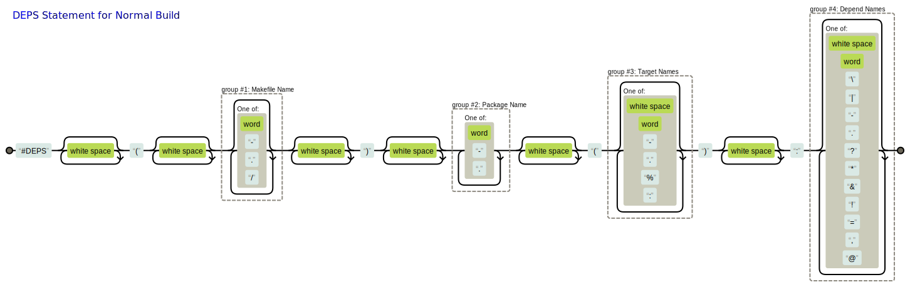
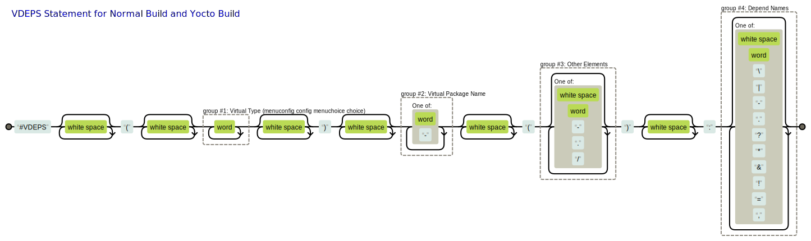

# CBuild Compilation System

[中文版](./README_zh-cn.md)

## Overview

The CBuild compilation system is a more powerful and flexible build system than Buildroot, and faster and succincter than Yocto. It doesn't have a steep learning curve and doesn't re-define a new language, the total code line of the system core is less than 4000 composed of Python / Shell / Makefile scripts. It is easier to understand and use than Buildroot and Yocto.
<br>

The CBuild compilation system is mainly composed of three parts: task analysis and processing tools, Makefile compilation templates, and network and cache processing tools.
<br>

* Task Analysis Processing Tools: Analyzes all tasks and automatically generates system Kconfig and Makefile
    * All tasks are analyzed and assembled by Python script `gen_build_chain.py`
        * Automatically collects rules and parameters for all tasks, selects which tasks to run and configures task parameters through `make menuconfig`
    * Each task rule is declared by a dependency statement, which supports a large number of dependent rules
        * Supports automatic generation of real package rules for task execution and virtual package rules for managing tasks
        * Supports automatic generation of ordinary structure (config), hierarchy structure (menuconfig), choice structure (choice), etc
        * Supports automatic generation of strong dependence (depends on), weak dependence (if... endif), strong selection (select), weak selection (imply), selection (condA||condB), etc
    * The task file is a Makefile script executed by `make`, which supports encapsulating raw scripts of `Makefile, CMake, Autotools, Meson, ...` to support these compilation methods
    * Supports automatic generation of task dependency picture with some useful properties such as color to see whether the task is selected, etc (`gen_depends_image.sh`)
<br>

* Makefile compilation Templates: Provides compilation templates of driver, library and application; users only need to fill in a few variables to complete the compiled script of a project
    * Supports the generation of latest cross-compilation toolchain (`process_machine.sh` `toolchain/Makefile`)
    * Supports both native-compilation and cross-compilation in one Makefile (`inc.env.mk`)
    * Supports the generation of multiple libraries, executables or drivers in one Makefile
    * Supports both Normal Build mode (source code and compilation output separation mode and non-separation mode) and Yocto Build mode
    * Supports automatic analysis of header files as compilation dependencies, and specifies CFLAGS for source files separately
    * Provides a template for compiling static libraries, shared libraries, and executables, and supports mixed compilation of C (`*.c`), C++ (`*.cc *.cp *.cxx *.cpp *.CPP *.c++ *.C`) and assembly (`*.S *.s *.asm`) (`inc.app.mk`)
    * Provides a template for compiling drivers, and supports mixed compilation of C (`*.c`) and assembly (`*.S`) (`inc.mod.mk`)
    * Provides a template for installation (`inc.ins.mk`)
    * Provides a template for configuring parameters with Kbuild (`inc.conf.mk`)
<br>

* Network and Cache Processing Tools: Handles the download, patching, compilation, and installation of network packages, and supports source mirror and cache mirror
    * Provides a convenient and reliable patching mechanism (`exec_patch.sh`)
    * Provides a automatic pull network package tool (`fetch_package.sh`)
        * Supports downloading packages from http (attributes: md5), git (attributes: branch tag rev) and svn (attributes: rev)
        * Supports downloading packages from the mirror server
    * Provides a compilation cache tool, re-compile doesn't need to compile from code, directly fetch the result from the local area or the mirror server  (`process_cache.sh`)
    * Provides a convenient template for caching compilation (`inc.cache.mk`)
    * Provides a rich open source software (OSS) layer, and OSS packages are increasing
<br>

* Test cases can be viewed in [examples.md](./examples/examples.md)


## Open Source Contributions

This project has contributed 2 commits to the Linux Kernel Community so far, which have been merged into the Linux kernel mainline.

* [kconfig: fix failing to generate auto.conf](https://git.kernel.org/pub/scm/linux/kernel/git/masahiroy/linux-kbuild.git/commit/?h=fixes&id=1b9e740a81f91ae338b29ed70455719804957b80)

    ```sh
    commit 1b9e740a81f91ae338b29ed70455719804957b80
    Author: Jing Leng <jleng@ambarella.com>
    Date:   Fri Feb 11 17:27:36 2022 +0800

        kconfig: fix failing to generate auto.conf

        When the KCONFIG_AUTOCONFIG is specified (e.g. export \
        KCONFIG_AUTOCONFIG=output/config/auto.conf), the directory of
        include/config/ will not be created, so kconfig can't create deps
        files in it and auto.conf can't be generated.
    ```

* [kbuild: Fix include path in scripts/Makefile.modpost](https://git.kernel.org/pub/scm/linux/kernel/git/masahiroy/linux-kbuild.git/commit/?h=fixes&id=23a0cb8e3225122496bfa79172005c587c2d64bf)

    ```sh
    commit 23a0cb8e3225122496bfa79172005c587c2d64bf
    Author: Jing Leng <jleng@ambarella.com>
    Date:   Tue May 17 18:51:28 2022 +0800

        kbuild: Fix include path in scripts/Makefile.modpost

        When building an external module, if users don't need to separate the
        compilation output and source code, they run the following command:
        "make -C $(LINUX_SRC_DIR) M=$(PWD)". At this point, "$(KBUILD_EXTMOD)"
        and "$(src)" are the same.

        If they need to separate them, they run "make -C $(KERNEL_SRC_DIR)
        O=$(KERNEL_OUT_DIR) M=$(OUT_DIR) src=$(PWD)". Before running the
        command, they need to copy "Kbuild" or "Makefile" to "$(OUT_DIR)" to
        prevent compilation failure.

        So the kernel should change the included path to avoid the copy operation.
    ```


## Task Analysis Processing gen_build_chain.py

### System Framework

* Normal Build Framework:
    * The compilation scripts of the applications and drivers are composed of `Makefile + DEPS-statement`
    * The build chain is assembled through dependencies defined by DEPS-statement (package-level dependency)
    * DEPS-statement basically only needs to define dependencies, following the assembly rules defined by CBuild
    * The script analyzes the DEPS-statement of all packages and automatically generates the compilation chain of all packages
        * All packages are compiled individually, and users can enter the package folder and enter `make` to compile
    * Supports managed Kconfig or managing Kconfig by itself.
        * The managed Kconfig must be placed in the same directory as the DEPS-statement file.
        * There is no need to manually specify the parent-child inclusion relationship, the script automatically analyzes and assembles it
* Yocto Build Framework:
    * The compilation scripts of the applications and drivers are composed of `Makefile + Recipe`
    * The build chain is assembled through dependencies defined by DEPENDS and RDEPENDS in the recipe (package-level dependency)
    * The custom's recipes basically only need to define dependencies, following the assembly rules defined by Yocto
    * Extends Yocto: the script analyzes the recipe's name of all packages and the DEPENDS variable in the recipe of custom package to automatically generate the compilation chain of all packages
    * Extends Yocto: Supports weak dependencies, and can modify rootfs (add packages, delete packages, modify configuration, etc.) through `make menuconfig`


### Command Options of Build Chain

* Command Description
    * Parentheses indicate that it is optional, otherwise it is required
    * Normal Build automatically generates Kconfig and Makefile in one step
    * Yocto Build requires two steps to automatically generate Kconfig and Image recipes respectively

    ```sh
    # Normal Build
    gen_build_chain.py -m MAKEFILE_OUT -k KCONFIG_OUT [-t TARGET_OUT] [-a DEPENDS_OUT] -d DEP_NAME [-v VIR_NAME] [-c CONF_NAME] -s SEARCH_DIRS [-i IGNORE_DIRS] [-g GO_ON_DIRS] [-l MAX_LAYER_DEPTH] [-w KEYWORDS] [-p PREPEND_FLAG] [-u UNIQUE_PACKAGES]

    # Yocto Build Step1
    gen_build_chain.py -k KCONFIG_OUT -t TARGET_OUT [-v VIR_NAME] [-c CONF_NAME] [-i IGNORE_DIRS] [-l MAX_LAYER_DEPTH] [-w KEYWORDS] [-p PREPEND_FLAG] [-u USER_METAS]

    # Yocto Build Step2
    gen_build_chain.py -t TARGET_PATH -c DOT_CONFIG_NAME -o RECIPE_IMAGE_NAME [-p $PATCH_PKG_PATH] [-i IGNORE_RECIPES]
    ```

* Command Options of Normal Build
    * `-m <Makefile Path>`: Specifies the auto-generated Makefile pathname
        * Users can use a top-level Makefile to contain the auto-generated Makefile, and set all target call `make $(ENV_BUILD_JOBS) $(ENV_MAKE_FLAGS) MAKEFLAGS= all_targets`   to multi-threaded compilation of all packages
        * If a package requires multi-threaded compilation to be enabled internally, `jobserver` needs to be specified in the OTHER_TARGETS of DEPS-statement
        * The compilation time of each package can be counted, and the Makefile example is as follows:
            ```makefile
            TIME_FORMAT    := /usr/bin/time -a -o $(OUT_PATH)/time_statistics -f \"%e\\t\\t%U\\t\\t%S\\t\\t\$$@\"

            total_time: loadconfig
            	@$(PRECMD)make -s all_targets
            	@echo "Build done!"

            time_statistics:
            	@mkdir -p $(OUT_PATH)
            	@$(if $(findstring dash,$(shell readlink /bin/sh)),echo,echo -e) "real\t\tuser\t\tsys\t\tpackage" > $(OUT_PATH)/$@
            	@make -s PRECMD="$(TIME_FORMAT) " total_time
            ```
    * `-k <Kconfig Path>`: Specifies the auto-generated Kconfig pathname
    * `-t <Target Path>`: Specifies the auto-generated target pathname which stores package name and source path list
    * `-a <Depends Path>`: Specifies the auto-generated target pathname which stores package name and dependency list
    * `-d <Search Depend Name>`: Specifies the dependency filename (containing DEPS-statement) to search, the dependency file can contain multiple DEPS-statement
    * `-c <Search Kconfig Name>`: Specifies the Kconfig filename (containing configuration) to search
        * The order to search (in the same directory as the dependency file):
            * The file with the same filename as the package name and the same suffix as the Kconfig file in the same directory as the dependency file
            * The Kconfig filename in the same directory as the dependency file
    * `-v <Search Virtual Depend Name>`: Specifies the virtual dependency filename (containing VDEPS-statement) to search
    * `-s <Search Directories>`: Specifies the searched directory pathnames (containing VDEPS-statement) to search, and multiple directories are separated by colon
    * `-i <Ignore Directories>`: Specifies the ignored directory names, and multiple directories are separated by colon
    * `-g <Go On Directories>`: Specifies the continued directory pathnames, and multiple directories are separated by colon
        * If the current directory contains the dependency filename, and `Go On Directories` is not specified or the current directory is not in it, the script will not continue to search sub-directories of the current directory
    * `-l <Max Layer Depth>`: Sets the maximum number of levels of the menuconfig, 0 for tile, 1 for 2-levels, ...
    * `-w <Keyword Directories>`: Sets the ignored level names of the menuconfig, and the multiple names set are separated by colon
        * If the directory name in the path matches the set value, the levels of this path is subtracted by one
    * `-p <Prepend Flag>`: Set the prefix of the configuration item in the auto-generated Kconfig
        * If users run `conf` / `mconf` without prefix (`CONFIG_=""`), this flag needs to be set to 1
    * `-u <Unique Packages>`: Specify the packages which do not have native-compilation when they are dependencies of native package, and the multiple names set are separated by colon
<br>

* Command Options of Yocto Build Step1
    * `-k <Kconfig Path>`: Specifies the auto-generated Kconfig pathname
    * `-t <Target Path>`: Specifies the auto-generated target pathname which stores package name and source path list
    * `-c <Search Kconfig Name>`: Specifies the Kconfig filename (containing configuration) to search
        * The order to search:
            * The file with the same filename as the package name and the suffix of `.bbconfig` in the same directory as the recipe file
            * The file with the same filename as the package name and the same suffix as the Kconfig file in the directory specified by the `EXTERNALSRC` in the recipe append file
            * The Kconfig filename in the directory specified by the `EXTERNALSRC` in the recipe append file
    * `-v <Search Virtual Depend Name>`: Specifies the virtual dependency filename (containing VDEPS-statement) to search
    * `-i <Ignore Directories>`: Specifies the ignored directory names, and multiple directories are separated by colon
    * `-l <Max Layer Depth>`: Sets the maximum number of levels of the menuconfig, 0 for tile, 1 for 2-levels, ...
    * `-w <Keyword Directories>`: Sets the ignored level names of the menuconfig, and the multiple names set are separated by colon
        * If the directory name in the path matches the set value, the levels of this path is subtracted by one
    * `-p <Prepend Flag>`: Set the prefix of the configuration item in the auto-generated Kconfig
        * If users run `conf` / `mconf` without prefix (option: `CONFIG_=""`), this flag needs to be set to 1
    * `-u <User Metas>`: Specifies the user layers, and the multiple layers set are separated by colon
        *  Only analyze package dependencies,  packages in the user layers will analyze dependencies, be selected by default, support special dependencies and virtual dependencies
<br>

* Command Options of Yocto Build Step2
    * `-t <Target Path>`: Specifies the auto-generated target pathname generated by step1
    * `-c <Search Kconfig Path>`: Specifies the `.config` pathname generated by `make xxx_config`
    * `-o <Output Recipe Path>`: Specifies the recipe inc pathname which stores packages installed to rootfs
    * `-p <Output patch/unpatch Path>`: Specifies the patch inc pathname which stores patch/unpatch packages
    * `-i <Ignore Recipes>`: Specifies the ignored recipes, and multiple recipes are separated by colon


### Dependency of Normal Build

* Dependency Rule: `#DEPS(Makefile_Name) Target_Name(Other_Target_Names): Depend_Names`

    

* Included Dependency Rule: `#INCDEPS: Subdir_Names`

    

* Rule Description
    * Makefile_Name: The Makefile script to compile (can be empty), if it's not empty, make runs the specified makefile (`make -f Makefile_Name`)
        * The Makefile must contain three targets of `all` `clean` and `install`
        * The Makefile name can include a path (i.e. a slash `/`), which supports directly finding subpackages under subfolders
            * For example: `test1/` `test2/wrapper.mk`
        * Users can also use INCDEPS-statement to continue to find dependency files under sub-folders
            * For example: `#INCDEPS: test1 test2/test22`
            * Sub-dirs supports environment variable substitution, for example, `${ENV_BUILD_SOC}` will be replaced with the value of the environment variable `ENV_BUILD_SOC`
    * Target_Name: The package name ID
        * The keyword of `ignore` is a special ID that indicates no package, which is used to ignore the search of the current directory (` #DEPS() ignore():`)
    * Other_Target_Names: Other targets of the current package, multiple targets are separated by space (can be empty)
        * Ignores the targets of `all` `install` `clean` in the Other_Target_Names
        * The keyword of `prepare` is a special real target that indicates running `make prepare` before `make`
            * It is generally used to load the default configuration to .config when .config does not exist
        * The keyword of `psysroot` is a special real target that indicates running `make psysroot` before `make`
            * It will use sysroot under OUT_PATH instead of ENV_TOP_OUT
        * The keyword of `release` is a special real target that indicates running `make release` when installing fakeroot rootfs
            * This target doesn't need to install headers and static libraries
            * When the release target is not present, It will run `make install` when installing to fakeroot rootfs
        * The keyword of `union` is a special virtual target that indicates multiple packages sharing one Makefile
            * At this point, the targets of `prepare` `all` `install` `clean` `release` shound renamed as `package_name-xxx`
        * The keyword of `native` is a special virtual target that indicates both cross-compilation package and native-compilation package are defined at the same time
        * The keyword of `cache` is a special virtual target that indicates package with caching mechanism
        *  The keyword of `jobserver` is a special virtual target that indicates multi-threaded compilation (`ENV_BUILD_JOBS`)
            * Makefile which contains `make` command shouldn't add the target, such as driver Makefile
        * `subtarget1:subtarget2:...::dep1:dep2:...` is a special syntax format that explicitly specifies dependencies for child targets
            * Double colons separate the list of child targets and the list of dependencies
            * Single colon separates the child internal targets and the internal dependencies, and the dependencies list can be empty
    * Depend_Names: The dependency package name ID, and multiple dependencies are separated by space (can be empty)
        * Depend_Names supports multiple lines with using `\` at the end of the line
        * If there are circular dependencies or undefined dependencies, parsing will fail

Note: The IDs (Target_Name / Depend_Names) only can consist of lowercase letters, numbers, dashes; Other_Target_Names doesn't have such requirement, wildcard symbol is accepted (`%`)

* Commands of Normal Build
    * `make <package>`: Compiles the given package with dependency packages compiled first
    * `make <package>_single`: Only compiles the given package without dependency packages compiled
    * `make <package>_<target>`: Compiles the target of the given package with dependency packages compiled first
    * `make <package>_<target>_single`: Only compiles the target of the given package without dependency packages compiled

Note: The single type commands only exist in the packages with dependencies


### Dependency of Yocto Build

* The dependencies of Yocto Build are defined in the recipe (DEPENDS / RDEPENDS / PACKAGECONFIG / ...)
* `DEPENDS`: compilation dependencies
    * Note: Yocto uses some host commands and may also need to specify native dependency (`<package>-native`), for example: `bash-native`
* `RDEPENDS:${PN}`: compilation dependencies
    * The dependency packages which install shared libraries should be set to RDEPENDS, otherwise the compilation will fail or the dependency packages will not added to rootfs
* `PACKAGECONFIG`: Dynamically sets dependency packages which install pkg-config (`xxx/usr/lib/pkgconfig/xxx.pc`)


### Virtual Dependency of Normal/Yocto Build

* Virtual Dependency Rule: `#VDEPS(Virtual_Type) Target_Name(Other_Infos): Depend_Names`

    

* Virtual_Type : Required, the type of thevirtual package, there are 4 types so far
    * `menuconfig`  : Indicates that a virtual `menuconfig` package is generated, all packages in the current directory (including sub-directories) strongly depend on this package
    * `config`      : Indicates that a virtual `config` package is generated
    * `menuchoice`  : Indicates that a virtual `choice` package is generated, all packages in the current directory (including subdirectories) will become sub-options under this package
    * `choice`      : Indicates that a virtual `choice` package is generated, all packages packages listed in the Other_Infos will become sub-options under this package
* Virtual_Name      : Required, the name ID of the virtual package
* Other_Infos       : Optional
    * For all types, an optional pathname which begins with `/` indicates that it acts on the specified sub-directory instead of the current directory
        * The pathname entry can be a virtual path, for example: `/virtual` (virtual can be any word), in this case, the virtual item appears in the current directory  instead of the upper directory
    * For the `choice` type, a space-separated list of packages becomes a sub-options under the choice, and the first package is selected by default
    * For the `menuchoice` type, the specified package is selected by default
* Depend_Names      : Optional, the list of dependencies with the same as the Depend_Names in the DEPS-statement
    * Depend_Names supports multiple lines with using `\` at the end of the line
    * For example, users can set `unselect` for `menuconfig` and `config` types

Note: The virtual packages will not participate in compilation, but is used to organize and manage the actual packages, Normal Build and Yocto Build has the same virtual dependency rules


### Special Dependency

* Virtual Package
    * `*depname`    : Indicates that this dependent package is a virtual package
        * After removing `*`, the remaining depname can also have special characters and will continue to be resolved, for example: `*&&depname`
<br>

* Keyword
    * `finally`     : Indicates that this package compilation is after all other packages, it is generally used to generate rootfs (Normal Build)
    * `unselect`    : Indicates that this package is not compiled by default (`default n`), otherwise it is compiled by default (`default y`)
    * `nokconfig`   : Indicates that this package doesn't contain Kconfig
        * When there are multiple packages in the same directory, and only one package has Kconfig, then this package doesn't need to set `nokconfig`, and other packages should set it
    * `kconfig`     : Indicates that multiple packages share the same Kconfig, generally, the cross/native compilation package of the same software share the same Kconfig
<br>

* Special Character
    * `!depname`                    : Indicates that this package and the depname package are conflict, they cann't be enabled at the same time (`depends on !depname`)
    * `&depname` or `&&depname`     : Indicates that this package weakly / strongly selects the depname package (`imply depname` / `select depname`)
        * `&` indicate that when this package is selected, depname is also automatically selected, and depname can be manually unselected
        * `&&` indicate that when this package is selected, depname is also automatically selected, and depname cann't be manually unselected
    * `?depname` or `??depname`     : Indicates that this package weakly depends on the depname package (`if .. endif`)
        * `?` indicates that the depname package doesn't install shared libraries (compile-time dependencies)
        * `??` indicates that the depname package installs shared libraries or ... (compile-time and run-time dependencies)
        * Weak dependency means that even if the depname package isn’t selected or doesn't exist, current package also can be selected and compiled
    * `depa|depb` or `depa||depb`   : Indicates that this package weakly depends on the depa package or depb packageor ... (`depA||depB`)
        * Weak dependency means that there should be at least one depx package to be enabled, current package can be selected and compiled
        * Omitting the preceding word of `|` is implicitly deduced using either a prebuild package or a source package
            * For example: `||libtest` is implicitly deduced as `prebuild-libtest||libtest`
        * The difference between `|` and `||` refers to `?`

    *  `& ?`                        : `&` can be used in combination with `?` , it doesn't require a combination order, and indicates selection and weak dependency
        * For example: `&&??depname` or `??&&depname` indicates weak dependency and strong selection, `??&depname` or `&??depname` indicates weak dependency and weak selection
    *  `& |`                        : `&` can be used in combination with `|` , it indicates or-selection and weak dependency
        * It is suitable for selecting one of the prebuild package or the source package with weak dependency
        * Omitting the preceding word of last `|` is implicitly deduced using either a prebuild package or a source package
        * For example: `&&||libtest` is implicitly deduced as `&&*build-libtest||prebuild-libtest||libtest`
            * It means that the first virtual packages is strongly selected, and the next two actual packages are weakly dependencies
    * `depname@condition` or `depname@@condition` : If condition is set to y and depname is selected, this package will depend on the depname package
    * Additional Notes              :
        * For Normal Build, there is no difference between `?` and `??`, there is no difference between `|` and `||`, there is no difference between `@` and `@@`
        * For Yocto Build, `?` `|` `@` only set `DEPENDS`, `??` `||` `@@` set both `DEPENDS` and `RDEPENDS:${PN}`
<br>

* Environment Variable
    * ENVNAME=val1,val2             : Indicates that this package depends on the environment variable ENVNAME whose value is equal to val1 or equal to val2
    * ENVNAME!=val1,val2            : Indicates that this package depends on the environment variable ENVNAME whose value is not equal to val1 and not equal to val2

Note: Special dependencies are set to the `Depend_Names` of DEPS-statement in Normal Build, the variable `EXTRADEPS` in the recipe in Yocto Build, and
if EXTRADEPS contains weak dependencies, the recipe should `inherit weakdep` class, and handling weak dependencies depends on `.config` in ENV_CFG_ROOT


### Dependency Diagram gen_depends_image.sh

* Usage
    * Script Parameters: `gen_depends_image.sh <package> <store_path> <package_list_file> <config_file>`
        * package                   : Package name
        * store_path                : The folder path where the generated pictures are stored
        * package_list_file         : Package list file generated by gen_build_chain.py (`-a` of Normal Build, `-t` of Yocto Build)
        * config_file               : The path of `.config`
    * Command: `make <package>-deps`
<br>

* Generated Picture Description
    * Normal Build
        * Solid Line                : Strong dependency
        * Dashed Line               : Weak dependency
        * Double Line               : Prebuild and srcbuild either, or patch and unpatch either
        * Green Line                : The package is selected in .config
        * Red Line                  : The package is not selected in .config
        * The top-level package box color
            * Green Box             : The package is selected in .config
            * Red Box               : The package is not selected in .config
    * Yocto Build
        * Green Box                 : User package, which is selected in .config
        * Red Box                   : User package, which is not selected in .config
        * Basket Box                : Community package (layers not specified in the `-u` option of gen_build_chain.py)


## Environment Configuration

### Initialize Compilation Environment

* Initialize the compilation environment

    ```sh
    lengjing@lengjing:~/data/cbuild$ source scripts/build.env
    ============================================================
    ENV_BUILD_MODE   : external
    ENV_BUILD_JOBS   : -j8
    ENV_MAKE_FLAGS   : -s
    ENV_TOP_DIR      : /home/lengjing/data/cbuild
    ENV_MAKE_DIR     : /home/lengjing/data/cbuild/scripts/core
    ENV_TOOL_DIR     : /home/lengjing/data/cbuild/scripts/bin
    ENV_DOWN_DIR     : /home/lengjing/data/cbuild/output/mirror-cache/downloads
    ENV_CACHE_DIR    : /home/lengjing/data/cbuild/output/mirror-cache/build-cache
    ENV_MIRROR_URL   : http://127.0.0.1:8888
    ENV_TOP_OUT      : /home/lengjing/data/cbuild/output/noarch
    ENV_CFG_ROOT     : /home/lengjing/data/cbuild/output/noarch/config
    ENV_OUT_ROOT     : /home/lengjing/data/cbuild/output/noarch/objects
    ENV_INS_ROOT     : /home/lengjing/data/cbuild/output/noarch/sysroot
    ENV_DEP_ROOT     : /home/lengjing/data/cbuild/output/noarch/sysroot
    ENV_TOP_HOST     : /home/lengjing/data/cbuild/output/x86_64-native
    ENV_OUT_HOST     : /home/lengjing/data/cbuild/output/x86_64-native/objects
    ENV_INS_HOST     : /home/lengjing/data/cbuild/output/x86_64-native/sysroot
    ENV_DEP_HOST     : /home/lengjing/data/cbuild/output/x86_64-native/sysroot
    ============================================================
    ```

* Initialize the cross-compilation environment with SOC

    ```sh
    lengjing@lengjing:~/data/cbuild$ source scripts/build.env cortex-a53
    ============================================================
    ENV_BUILD_MODE   : external
    ENV_BUILD_SOC    : cortex-a53
    ENV_BUILD_ARCH   : arm64
    ENV_BUILD_TOOL   : /output/toolchain/cortex-a53-toolchain-gcc12.2.0-linux5.15/bin/aarch64-linux-gnu-
    ENV_BUILD_JOBS   : -j8
    ENV_MAKE_FLAGS   : -s
    KERNEL_VER       : 5.15.88
    KERNEL_SRC       : /home/lengjing/data/cbuild/output/kernel/linux-5.15.88
    KERNEL_OUT       : /home/lengjing/data/cbuild/output/cortex-a53/objects/linux-5.15.88
    ENV_TOP_DIR      : /home/lengjing/data/cbuild
    ENV_MAKE_DIR     : /home/lengjing/data/cbuild/scripts/core
    ENV_TOOL_DIR     : /home/lengjing/data/cbuild/scripts/bin
    ENV_DOWN_DIR     : /home/lengjing/data/cbuild/output/mirror-cache/downloads
    ENV_CACHE_DIR    : /home/lengjing/data/cbuild/output/mirror-cache/build-cache
    ENV_MIRROR_URL   : http://127.0.0.1:8888
    ENV_TOP_OUT      : /home/lengjing/data/cbuild/output/cortex-a53
    ENV_CFG_ROOT     : /home/lengjing/data/cbuild/output/cortex-a53/config
    ENV_OUT_ROOT     : /home/lengjing/data/cbuild/output/cortex-a53/objects
    ENV_INS_ROOT     : /home/lengjing/data/cbuild/output/cortex-a53/sysroot
    ENV_DEP_ROOT     : /home/lengjing/data/cbuild/output/cortex-a53/sysroot
    ENV_TOP_HOST     : /home/lengjing/data/cbuild/output/x86_64-native
    ENV_OUT_HOST     : /home/lengjing/data/cbuild/output/x86_64-native/objects
    ENV_INS_HOST     : /home/lengjing/data/cbuild/output/x86_64-native/sysroot
    ENV_DEP_HOST     : /home/lengjing/data/cbuild/output/x86_64-native/sysroot
    ============================================================
    ```

* Build cross-compilation toolchain

    ```sh
    lengjing@lengjing:~/data/cbuild$ source scripts/build.env cortex-a53
    lengjing@lengjing:~/data/cbuild$ make -C scripts/toolchain
    ```

Note: Users need to fill in the SOC-related parameters in the `process_machine.sh`. At present, only `cortex-a53` and `cortex-a9` are exemplified in this file.


### Environment Variables Description

* ENV_BUILD_MODE    : Specifies the build mode: external, separate source code and compilation output; internal, compile output to source code; yocto, Yocto Build method
    * When the mode is external, the compilation output directory is to replace the ENV_TOP_DIR part of the package's source directory with ENV_OUT_ROOT / ENV_OUT_HOST
* ENV_BUILD_SOC     : Specifies the cross-compilation SOC, build system obtains a series of parameters related to the SOC through the `process_machine.sh` script
* ENV_BUILD_ARCH    : Specifies the ARCH for cross-compilation of linux modules
* ENV_BUILD_TOOL    : Specifies the cross-compiler prefix
* ENV_BUILD_JOBS    : Specifies the number of compilation threads
* ENV_MAKE_FLAGS    : Global flags for `make` command，its default value is `-s`
    * `export ENV_MAKE_FLAGS=`: When it is set to space, the compilation will output more detailed information
<br>

* KERNEL_VER        : Linux kernel version
* KERNEL_SRC        : Linux kernel source code path
* KERNEL_OUT        : Linux kernel compilation output path
<br>

* ENV_TOP_DIR       : The root directory
* ENV_MAKE_DIR      : The compilation templates directory
* ENV_TOOL_DIR      : The script tools directory
* ENV_DOWN_DIR      : The path where the download package is saved
* ENV_CACHE_DIR     : The path where the compilation cache is saved
* ENV_MIRROR_URL    : The mirror URL for source code and build cache
    * Users can use the command `python -m http.server <port>` to quickly create an HTTP server
<br>

* ENV_TOP_OUT       : The root output directory
* ENV_CFG_ROOT      : The auto-generated files directory, such as global Kconfig and Makefile, various statistical files, etc are saved in it
* ENV_OUT_ROOT      : The root compilation output directory
* ENV_INS_ROOT      : The root global installation directory
* ENV_DEP_ROOT      : The root global dependency directory
<br>

* ENV_TOP_HOST      : The root output directory for native package
* ENV_OUT_HOST      : The root compilation output directory for native package
* ENV_INS_HOST      : The root global installation directory for native package
* ENV_DEP_HOST      : The root global dependency directory for native package

Note: bitbake cann't directly use the environment variables of the current shell in Yocto Build, so the custom environment variables should be exported from the recipe


## Compilation Template

### Environment Template inc.env.mk

* `inc.env.mk` is shared by application compilation and driver compilation
* In Normal Build, it is used to set the compilation output directory, set and export the cross-compilation environment or the local compilation environment
* In Yocto Build, the compilation output directory and cross-compilation environment are set and exported by recipes


#### Functions of Environment Template

* `$(call safe_copy,<options of cp>,<srcs and dst>)` : Uses `cp` with file lock to prevent errors when multiple target processes installation at the same time in Normal Build
* `$(call link_hdrs)`       : Automatically sets CFLAGS that looks for header files based on variable `SEARCH_HDRS`
* `$(call link_libs)`       : Automatically sets CFLAGS that looks for libraries
* `$(call prepare_sysroot)` : Prepare dependency sysroot in the `OUT_PATH` directory in Normal Build


#### Variables of Environment Template

* PACKAGE_NAME              : Package name (consistent with `Target_Name` in the DEPS-statement, without `-native`)
* PACKAGE_ID                : Read-only, the actual package name, its value is equal to `PACKAGE_NAME` of cross-compilation package or `$(PACKAGE_NAME)-native` of native-compilation package
* INSTALL_HDR               : Headers installation sub-folder, its default value is equal to `PACKAGE_NAME`
* PACKAGE_DEPS              : The package's dependency list, which may be removed in the future
* SEARCH_HDRS               : Sub-folders to search headers, its default value is equal to `PACKAGE_DEPS`
<br>

* OUT_PREFIX                : Top-level compilation output directory, its default value is equal to `ENV_OUT_HOST` in the native-compilation or `ENV_OUT_ROOT` in the cross-compilation
* INS_PREFIX                : Top-level installation directory, its default value is equal to `ENV_INS_HOST` in the native-compilation or `ENV_INS_ROOT` in the cross-compilation
* DEP_PREFIX                : Top-level dependency lookup directory, its default value is equal to `ENV_DEP_HOST` in the native-compilation or `ENV_DEP_ROOT` in the cross-compilation
* OUT_PATH                  : Output directory
<br>

* EXPORT_HOST_ENV           : Sets it to y when cross-compilation package depends on native-compilation packages
* EXPORT_PC_ENV             : Sets it to y to export the pkg-config environment variables
* BUILD_FOR_HOST            : When set to y, indicates native-compilation
* PREPARE_SYSROOT           : When set to y, indicates preparing dependency sysroot in `OUT_PATH` instead of `ENV_TOP_OUT`
* LOGOUTPUT                 : When set to empty, more compilation messages will be displayed, its default value is `1>/dev/null`


### Installation Template inc.ins.mk

* `inc.ins.mk` is shared by application compilation and driver compilation
* The Installation directories are basically consistent with the [GNUInstallDirs](https://www.gnu.org/prep/standards/html_node/Directory-Variables.html) standard
    * `base_*dir` and `hdrdir` don't belong to the GNUInstallDirs standard
    * The root installation directory is `$(INS_PREFIX)`


#### Functions and Targets of Installation Template

* `$(eval $(call install_obj,<ID>,<cp options>))`: Generates Makefile rules for installation to the specified directory
    * ID: The directory name with `dir` removed
    * Makefile Target: `install_<lowercase id>s`
    * Variable name to specify files / folders to install: `INSTALL_<uppercase ID>S`

* Defined Makefile Rules
    * Note: The Makefile rule of `install_sysroot` is not defined by `install_obj`
        * `install_sysroot`: Installs all files and folders in the specified directory to the root installation directory

    | Directory Name   | Directory Value               | Files and Folders to Install | Makefile Target        |
    | ---------------- | ----------------------------- | ---------------------------- | ---------------------- |
    | `base_bindir`    | `/bin`                        | `$(INSTALL_BASE_BINS)`       | `install_base_bins`    |
    | `base_sbindir`   | `/sbin`                       | `$(INSTALL_BASE_SBINS)`      | `install_base_sbins`   |
    | `base_libdir`    | `/lib`                        | `$(INSTALL_BASE_LIBS)`       | `install_base_libs`    |
    | `bindir`         | `/usr/bin`                    | `$(INSTALL_BINS)`            | `install_bins`         |
    | `sbindir`        | `/usr/sbin`                   | `$(INSTALL_SBINS)`           | `install_sbins`        |
    | `libdir`         | `/usr/lib`                    | `$(INSTALL_LIBS)`            | `install_libs`         |
    | `libexecdir`     | `/usr/libexec`                | `$(INSTALL_LIBEXECS)`        | `install_libexecs`     |
    | `hdrdir`         | `/usr/include/$(INSTALL_HDR)` | `$(INSTALL_HDRS)`            | `install_hdrs`         |
    | `includedir`     | `/usr/include`                | `$(INSTALL_INCLUDES)`        | `install_includes`     |
    | `datadir`        | `/usr/share`                  | `$(INSTALL_DATAS)`           | `install_datas`        |
    | `infodir`        | `$(datadir)/info`             | `$(INSTALL_INFOS)`           | `install_infos`        |
    | `localedir`      | `$(datadir)/locale`           | `$(INSTALL_LOCALES)`         | `install_locales`      |
    | `mandir`         | `$(datadir)/man`              | `$(INSTALL_MANS)`            | `install_mans`         |
    | `docdir`         | `$(datadir)/doc`              | `$(INSTALL_DOCS)`            | `install_docs`         |
    | `sysconfdir`     | `/etc`                        | `$(INSTALL_SYSCONFS)`        | `install_sysconfs`     |
    | `servicedir`     | `/srv`                        | `$(INSTALL_SERVICES)`        | `install_services`     |
    | `sharedstatedir` | `/com`                        | `$(INSTALL_SHAREDSTATES)`    | `install_sharedstates` |
    | `localstatedir`  | `/var`                        | `$(INSTALL_LOCALSTATES)`     | `install_localstates`  |
    | `runstatedir`    | `/run`                        | `$(INSTALL_RUNSTATES)`       | `install_runstates`    |
    | ` `              | `/`                           | `$(INSTALL_SYSROOT)`         | `install_sysroot`      |

* Default Directories
    * When compiling applications, the compilation-generated executables are added to the variable `BIN_TARGETS`, the default value of `INSTALL_BINARIES` has been assigned to `$(BIN_TARGETS)`
    * When compiling applications, the compilation-generated libraries are added to the variable `LIB_TARGETS`, the default value of `INSTALL_LIBRARIES` has been assigned to `$(LIB_TARGETS)`

    ``` makefile
    INSTALL_BASE_BINARIES  ?= $(INSTALL_BINARIES)
    INSTALL_BASE_BINS      ?= $(INSTALL_BASE_BINARIES)
    INSTALL_BINS           ?= $(INSTALL_BINARIES)
    INSTALL_BASE_LIBRARIES ?= $(INSTALL_LIBRARIES)
    INSTALL_BASE_LIBS      ?= $(INSTALL_BASE_LIBRARIES)
    INSTALL_LIBS           ?= $(INSTALL_LIBRARIES)
    INSTALL_HDRS           ?= $(INSTALL_HEADERS)
    ```

* `$(eval $(call install_ext,<ID>,<cp options>))`: Generates Makefile pattern rules for installation to the specified sub-directory in the specified directory
    * ID: The directory name with `dir` removed
    * Makefile Pattern Target: `install_<lowercase id>s_%`, `%` matches lowercase letters etc
    * Variable Name for Installation: `INSTALL_<uppercase ID>S_<xxx>`, xxx is same as the pattern in the Target
        * The preceded items are the files / folders to install, and the last item (must begins with a slash `/`) is the installation destination

* Defined Makefile Pattern Rules
    * Note: The Makefile pattern rules of `install_todir_xxx` and `install_tofile_xxx` are not defined by `install_ext`
        * `install_todir_xxx`: Installs the specified files and folders to the specified sub-directory in the root installation directory
        * `install_tofile_xxx`: Installs the specified file to the specified file in the root installation directory

    | Directory Name   | Installation Directory            | Variable Name for Installation | Makefile Pattern Target |
    | ---------------- | --------------------------------- | ------------------------------ | ----------------------- |
    | `includedir`     | `/usr/include<specified sub-dir>` | `$(INSTALL_INCLUDES_<xxx>)`    | `install_includes_%`    |
    | `datadir`        | `/usr/share<specified sub-dir>`   | `$(INSTALL_DATAS_<xxx>)`       | `install_datas_%`       |
    | `sysconfdir`     | `/etc<specified sub-dir>`         | `$(INSTALL_SYSCONFS_<xxx>)`    | `install_sysconfs_%`    |
    | ` `              | `<specified sub-dir>`             | `$(INSTALL_TODIR_<xxx>)`       | `install_todir_%`       |
    | ` `              | `<specified file>`                | `$(INSTALL_TOFILE_<xxx>)`      | `install_tofile_%`      |

* Examples of Pattern Rules
    * Create 2 blank files testa and testb, and the content of Makefile is as follows:

        ```makefile
        INSTALL_DATAS_test = testa testb /testa/testb
        INSTALL_TODIR_test = testa testb /usr/local/bin
        INSTALL_TOFILE_testa = testa /etc/a.conf
        INSTALL_TOFILE_testb = testa /etc/b.conf

        all: install_datas_test install_todir_test install_tofile_testa install_tofile_testb
        include $(ENV_MAKE_DIR)/inc.ins.mk
        ```

    *  The installation file tree after `make`:

        ```
        sysroot
        ├── etc
        │   ├── a.conf
        │   └── b.conf
        └── usr
            ├── local
            │   └── bin
            │       ├── testa
            │       └── testb
            └── share
                └── testa
                    └── testb
                        ├── testa
                        └── testb
        ```


### Application Template inc.app.mk

* `inc.app.mk` is used to compile shared libraries, static libraries, and executables

#### Targets of Application Template

* LIBA_NAME: library name when compiling a single static library
    * The compilation-generated library will be added to the variable `LIB_TARGETS`
* LIBSO_NAME: library name when compiling a single shared library
    * `LIBSO_NAME` can be set to the format of  `<library name> <major version> <minor version> <patch version>, for example:
        * `LIBSO_NAME = libtest.so 1 2 3` : the compilation-generated library is `libtest.so.1.2.3`, and the symbolic links are `libtest.so` and `libtest.so.1`
        * `LIBSO_NAME = libtest.so 1 2`   : the compilation-generated library is `libtest.so.1.2`  , and the symbolic links are `libtest.so` and `libtest.so.1`
        * `LIBSO_NAME = libtest.so 1`     : the compilation-generated library is `libtest.so.1`    , and the symbolic link is `libtest.so`
        * `LIBSO_NAME = libtest.so`       : the compilation-generated library is `libtest.so`      , and there is no symbolic link
    * If the `LIBSO_NAME` contains the version numbers, the default soname is `<library name>.<major version>`
        * The soname can be overridden by LDFLAGS, for example: `LDFLAGS += -Wl,-soname=libxxxx.so`
    * The compilation-generated library will be added to the variable `LIB_TARGETS`
* BIN_NAME: executable name when compiling a single executable
    * The compilation-generated executable will be added to the variable `BIN_TARGETS`


#### Functions of Application Template

* `$(eval $(call add-liba-build,<static library name>,<source files>))`: Creates a rule for compiling static library
* `$(eval $(call add-libso-build,<shared library name>,<source files>))`: Creates a rule for compiling shared library
    * `<shared library name>` can be set to the format of `<library name> <major version> <minor version> <patch version>, refer to `LIBSO_NAME`
* `$(eval $(call add-libso-build,<shared library name>,<source files>,<link parameters>))`: Creates a rule for compiling shared library
    * Note that the commas in the function should be overridden with the comma variable, for example: `$(eval $(call add-libso-build,<shared library name>,<source files>,-Wl$(comma)-soname=libxxxx.so))`
* `$(eval $(call add-bin-build,<executable name>,<source files>))`: Creates a rule for compiling executable
* `$(eval $(call add-bin-build,<executable name>,<source files>,<link parameters>))`: Creates a rule for compiling executable
* `$(call set_flags,<Flag Type>,<source files>,<value>)`: Sets the compilation flags for the specified source codes
    * For example: `$(call set_flags,CFLAGS,main.c src/read.c src/write.c,-D_FILE_OFFSET_BITS=64 -D_LARGEFILE_SOURCE -D_LARGEFILE64_SOURCE)`

Note: The reason for providing the above functions is that multiple libraries or executables can be compiled in a single Makefile


#### Variables of Application Template

* SRC_PATH: The directory where the source codes are located in the package, its default value is `.`
    * Users can also specify multiple (non-cross) source code directories in the package, for example: `SRC_PATH = src1 src2 src3`
    * $(SRC_PATH) and $(SRC_PATH)/include are also header folders to search
* IGNORE_PATH: The ignored directory names when searching, its default value is `.git scripts output`
* REG_SUFFIX: The source code suffixes to search, its default value is `c cpp S`
    * The value can be choosen from `c`, `$(CPP_SUFFIX)` and `$(ASM_SUFFIX)`
        * CPP_SUFFIX: File suffixes C++ of type, its default value is `cc cp cxx cpp CPP c++ C`
        * ASM_SUFFIX: File suffixes of assembly type, its default value is `S s asm`
    * Users can add support for other suffixes, for example:
        * Add support for cxx (cxx has been added to CPP_SUFFIX)
            ```makefile
            REG_SUFFIX = c cpp S cxx
            include $(ENV_MAKE_DIR)/inc.app.mk
            ```
        * Add support for CXX (CXX has not been added to CPP_SUFFIX)
            ```makefile
            REG_SUFFIX = c cpp S CXX
            CPP_SUFFIX = cc cp cxx cpp CPP c++ C CXX
            include $(ENV_MAKE_DIR)/inc.app.mk
            $(eval $(call compile_obj,CXX,$$(CXX)))
            ```
* USING_CXX_BUILD_C: When set to y, indicates compiling `*.c` files with CXX compiler
* SRCS: All source code files, its default value is all files with suffix of `REG_SUFFIX` in the `SRC_PATH`
    * If users specifies `SRCS`, they can also set `SRC_PATH`, and `IGNORE_PATH` is ignored
* CFLAGS: Sets global compilation flags for `gcc g++`
* AFLAGS: Sets global assembly flags for `as`
* LDFLAGS: Sets global link flags for `gcc g++`
* DEBUG: When set to y, `-O0 -g -ggdb` are enabled


### Driver Template inc.mod.mk

* `inc.app.mk` is used to compile drivers (external linux modules)

#### Makefile Part of Driver Template (when KERNELRELEASE is empty)

* Targets of Makefile Part
    * modules: Compiles the driver
    * modules_clean: Cleans the compilation output
    * modules_install: Installs the kernel modules (`*.ko`)
        * The installation destination directory is `$(INS_PREFIX)/lib/modules/<kernel_release>/extra/`
    * symvers_install: Installs `Module.symvers` symbol file, this target is set as a dependency of `install_hdrs`
<br>

* Variables of Makefile Part
    * MOD_MAKES: Users can specify some information to compile the module
    * KERNEL_SRC        : Linux kernel source code path (required)
    * KERNEL_OUT        : Linux kernel compilation output path (required when compiling linux kernel with `make -O $(KERNEL_OUT)`)


#### Kbuild Part of Driver Template (when KERNELRELEASE has value)

* Targets of Kbuild Part
    * MOD_NAME: Module names, which can be multiple module names separated by space
<br>

* Variables of Kbuild Part
    * IGNORE_PATH: The ignored directory names when searching, its default value is `.git scripts output`
    * SRCS: All source code files, its default value is all files with suffix of `REG_SUFFIX` (`*.c` `*.S`) in the `$(src)`
    * `ccflags-y` `asflags-y` `ldflags-y`: The parameters for kernel module compilation, assembly and linking
<br>

* Functions of Kbuild Part
    * `$(call translate_obj,<source files>)`: Converts the source code fileset name to the format required by KBUILD, regardless of whether the source code starts with *.o$(src)/
    * `$(call set_flags,<Flag Type>,<source files>,<value>)`: Sets the compilation flags for the specified source codes
<br>

* Other Notes
    * If `MOD_NAME` contains multiple module names, users need to fill in the objects for each module, for example:

        ```makefile
        MOD_NAME = mod1 mod2
        mod1-y = a1.o b1.o c1.o
        mod2-y = a2.o b2.o c2.o
        ```

    * When using source code and compilation output separation, `inc.mod.mk` needs to copy Kbuild or Makefile to the `OUT_PATH` directory first
        * If the following patch in `scripts/Makefile.modpost` of linux kernel is applied,  copy operation can be skipped ()
            * This patch has been merged with the linux-5.19  and the latest version of the LTS linux
        ```makefile
        -include $(if $(wildcard $(KBUILD_EXTMOD)/Kbuild), \
        -             $(KBUILD_EXTMOD)/Kbuild, $(KBUILD_EXTMOD)/Makefile)
        +include $(if $(wildcard $(src)/Kbuild), $(src)/Kbuild, $(src)/Makefile)
        ```


### Configuration Template inc.conf.mk

* `inc.conf.mk` provides a configuration method with Konfig

#### Targets of Configuration Template

* loadconfig: Loads the default configuration specified by `DEF_CONFIG` if `.config` does not exist
* defconfig: Restores the default configuration specified by `DEF_CONFIG`
* menuconfig: Opens graphical configuration
* cleanconfig: Cleans the configuration and the kconfig output
* xxx_config: Loads the special configuration `xxx_config` in `CONFIG_SAVE_PATH` as the current configuration
* xxx_saveconfig: Saves the current configuration to `xxx_config` in `CONFIG_SAVE_PATH`
* xxx_defonfig: Loads the special configuration `xxx_defconfig` in `CONFIG_SAVE_PATH` as the current configuration
* xxx_savedefconfig: Saves the current configuration to `xxx_defconfig` in `CONFIG_SAVE_PATH`


#### Variables of Configuration Template

* OUT_PATH: Configuration output path, keep it as default
* CONF_SRC: The source directory of the kconfig project, its default value is `$(ENV_TOP_DIR)/scripts/kconfig`
* CONF_PATH: The installation directory of the kconfig tools
* CONF_PREFIX: Sets the variables that `conf`/`mconf` runs, mainly the following two settings:
    * `srctree=<path_name>` : The relative directory of the `source` command in the Kconfig files, if `srctree` is not specified, the default relative directory is the directory where `conf`/`mconf` runs
    * `CONFIG_="<prefix>"`  : The prefix of configuration items in the auto-generated `.config` and `config.h`, if `CONFIG_` is not specified, the default prefix is `CONFIG_`; if is set as `CONFIG_=""`, there is no prefix in the item name.
* CONF_HEADER: Sets the include macro `#ifndef xxx ... #define xxx ... #endif` used in the auto-generated `config.h`, its default value is `__<upper of $(PACKAGE_NAME)>_CONFIG_H__`
    * The `config.h` does not contains include macro by default, it is added by `sed` command
* KCONFIG: The configuration parameter file, its default is `Kconfig`
* CONF_SAVE_PATH: The directory where the configuration file is obtained and saved, its default is `config` directory in the package folder
* CONF_APPEND_CMD:  Appends the commands to run when the configuration is changed


#### scripts/kconfig Project

* The source code comes entirely from the `scripts/kconfig` of linux-5.18
* CBuild adds additional support  `CONFIG_PATH` `AUTOCONFIG_PATH` `AUTOHEADER_PATH` which are originally passed in as environment variables


## Network Cache and OSS Layer

* Only for Normal Build

### Download fetch_package.sh

* Usage: `fetch_package.sh <method> <urls> <package> [outdir] [outname]`
    * When outdir and outname are not specified, It only downloads the package, doesn't copy or decompress the package to the output
    * method: Download method, currently only supports 4 methods:
        * tar: Package downloaded with `curl` and extracted with `tar`, suffix of the package file can be `tar.gz`, `tar.bz2`, `tar.xz`, `tar`, and so on
        * zip: Package downloaded with `curl` and extracted with `unzip`, suffix of the package file can be `gz`, `zip`, and so on
        * git: Package downloaded with `git clone`
        * svn: Package downloaded with `svn checkout`

        * git: Package downloaded with `curl` from `$package-git-xxx.tar.gz` on the mirror server, or downloaded with `git clone`
        * svn: Package downloaded with `curl` from `$package-svn-xxx.tar.gz` on the mirror server, or downloaded with `svn checkout`
    * urls: Download URLs
        * tar/zip: It is better to set `md5` at the same time, for example:
            * `https://xxx/xxx.tar.xz;md5=yyy`
        * git: It is better to set `branch` / `tag` / `rev` (revision) at the same time (`tag` and `rev` should not be set at the same time), for example:
            * `https://xxx/xxx.git;branch=xxx;tag=yyy`
            * `https://xxx/xxx.git;branch=xxx;rev=yyy`
            * `https://xxx/xxx.git;tag=yyy`
            * `https://xxx/xxx.git;rev=yyy`
        * svn: It is better to set `rev` at the same time, for example:
            * `https://xxx/xxx;rev=yyy`
    * package: The saved filename for `tar` / `zip`, or the saved dirname for `git` / `svn`, and the saved path is `ENV_DOWN_DIR`
    * outdir: The path to extract to or copy to
    * outname: The folder name of the package under `outdir`

Note: `fetch_package.sh` preferentially tries to download the package from the mirror URL specified by `ENV_MIRROR_URL` instead of the original URL


### Patch Script exec_patch.sh

* Usage: `exec_patch.sh <method> <patch_srcs> <patch_dst>`
    * method: There are only two values: `patch` for patching, `unpatch` for removing patch
    * patch_srcs: The path of the patch files or directories
    * patch_dst: The path of the source code to be patched
<br>

* Example: Choose whether to patch or not
    * Creates two new packages: patch package (`<package to be patched>-patch-<ID>`) and unpatch package (`<package to be patched>-unpatch-<ID>`)
    * The source package weakly depends on these two packages, Sets `xxx-patch-xxx|xxx-unpatch-xxx` to the `Depend_Names` of DEPS-statement for the source package
    * Creates virtual package `#VDEPS(choice) xxx-patch-xxx-choice(xxx-unpatch-xxx xxx-patch-xxx):`
    * All patch/unpatch packages share the same Makefile as follows:

    ```makefile
    PATCH_SCRIPT        := $(ENV_TOOL_DIR)/exec_patch.sh
    PATCH_PACKAGE       := xxx  # package name to be patched
    PATCH_TOPATH        := xxx  # package folder to be patched

    PATCH_FOLDER        := xxx  # patch folder where store patches
    PATCH_NAME_xxx      := 0001-xxx.patch # patch package ID (xxx)
    PATCH_NAME_yyy      := 0001-yyy.patch 0002-yyy.patch # another patch package ID (xxx)

    $(PATCH_PACKAGE)-unpatch-all:
    	@$(PATCH_SCRIPT) unpatch $(PATCH_FOLDER) $(PATCH_TOPATH)
    	@echo "Unpatch $(PATCH_TOPATH) Done."

    $(PATCH_PACKAGE)-patch-%-all:
    	@$(PATCH_SCRIPT) patch "$(patsubst %,$(PATCH_FOLDER)/%,$(PATCH_NAME_$(patsubst $(PATCH_PACKAGE)-patch-%-all,%,$@)))" $(PATCH_TOPATH)
    	@echo "Build $(patsubst %-all,%,$@) Done."

    $(PATCH_PACKAGE)-unpatch-%-all:
    	@$(PATCH_SCRIPT) unpatch "$(patsubst %,$(PATCH_FOLDER)/%,$(PATCH_NAME_$(patsubst $(PATCH_PACKAGE)-unpatch-%-all,%,$@)))" $(PATCH_TOPATH)
    	@echo "Build $(patsubst %-all,%,$@) Done."

    %-clean:
    	@

    %-install:
    	@
    ```


### Cache Script process_cache.sh

* Usage: Runs `process_cache.sh -h`

* Principle of Cache
    * Validates elements that affect the compilation result, sets the checksum as a part of the cache file name
    * The elements are: compilation scripts, patches, output of dependency packages, package archives or local source files ...
    * Note that never add the output files to the validation

### Cache Template inc.cache.mk

#### Variables of Cache Template

* Variables for Download and Compilation
    * FETCH_METHOD    : Download method choosen from `tar` `zip` `git` `svn`, its default value is `tar`
    * SRC_URLS        : Download URLs, it contains `url` `branch` `rev` `tag` `md5`, its default value is generated according to the following variables:
        * SRC_URL     : pure URL
        * SRC_BRANCH  : branch for `git`
        * SRC_TAG     : tag for `git`
        * SRC_REV     : rev (revision) for `git` or `svn`
        * SRC_MD5     : md5 for `tar` or `zip`
    * SRC_PATH        : Source code path, its default value is `$(OUT_PATH)/$(SRC_DIR)`
    * OBJ_PATH        : Compilation output path, its default value is `$(OUT_PATH)/build`
    * INS_PATH        : Installation root path, its default value is `$(OUT_PATH)/image`
    * INS_SUBDIR      : Installation sub-directory, its default value is `/usr`, so the actual installation path is `$(INS_PATH)$(INS_SUBDIR)`
    * PC_FILES        : pkg-config files which has been installed to `.../lib/pkgconfig/`, and multiple files are separated by space
    * MAKES           : Compilation command, it default value is `ninja $(ENV_BUILD_JOBS) $(MAKES_FLAGS)` for meson, `make $(ENV_BUILD_JOBS) $(ENV_MAKE_FLAGS) $(MAKES_FLAGS)` for others
        * MAKES_FLAGS : Users can set extra compilation flags
<br>

* Variables for Cache Processing
    * CACHE_SRCFILE   : Save filename or dirname for download package, its default value is `$(SRC_NAME)
        * Local package needn't set it
    * CACHE_OUTPATH   : Output root path, its default value is `$(OUT_PATH)`
    * CACHE_INSPATH   : Installation root path, its default value is `$(INS_PATH)`
    * CACHE_GRADE     : Cache grade number, which determines the prefix of the compilation cache file, its default value is 2
        * There are generally four levels of cache grades: `soc_name` `cpu_name` `arch_name` `cpu_family`
            * For example: If the soc is v9 (cortex-a55), then the cache grades are `v9 cortex-a55 armv8-a aarch64`
    * CACHE_CHECKSUM  : Extra files and directories to verify, `mk.deps` file is added to the value by default
        * The directory supports the following syntax: `<search directories>:<search strings>:<ignored dirnames>:<ignored strings>`, sub-items can be separated by a vertical line`|` :
            * For example: `"srca|srcb:*.c|*.h|Makefile:test:*.o|*.d"`, `"src:*.c|*.h|*.cpp|*.hpp"`
    * CACHE_DEPENDS   : Package dependencies, its default value is space (automatically analyzes dependencies)
        * If the package doesn't have any dependencies, it is better to set the value to `none`
    * CACHE_APPENDS   : Extra strings to verify, such as dynamical configurations
    * CACHE_URL       : Download URLs, its default value is `[$(FETCH_METHOD)]$(SRC_URLS)` when downloading package in the script
    * CACHE_VERBOSE   : Whether to generate log file, its default value is `1`(Generates log), the log file is `$(CACHE_OUTPATH)/$(CACHE_PACKAGE)-cache.log`


#### Functions of Cache Template

* do_inspc / do_syspc: Converts the path in the pkg-config files to the virtual / actual path, the variable `PC_FILES` should be set first
* do_fetch: Fetches the package from the internet or mirror server then extracts it to `$(OUT_PATH)`
* do_patch: Patches the package, the variable `PATCH_FOLDER` should be set first
* do_compile: Execute Compilation
    * If the variable `SRC_URL` is set, `do_fetch` task will automatically run
    * If the variable `PATCH_FOLDER` is set, `do_patch` task will automatically run
    * If the function `do_prepend` is set, it will run before `MAKES` command
    * If the variable `COMPILE_TOOL` is set, it provides the following compilation methods:
        * If the value is set to `configure`, `configure` command will run before `MAKES` command
            * CONFIGURE_FLAGS: Users can set extra flags for `configure` command
            * CROSS_CONFIGURE: Read-only, cross-compilation flags for `configure` command
        * If the value is set to `cmake`, `cmake` command will run before `MAKES` command
            * CMAKE_FLAGS: Users can set extra flags for `cmake` command
            * CROSS_CONFIGURE: Read-only, cross-compilation flags for `cmake` command
        * If the value is set to `meson`, `meson` command will run before `MAKES` command
            * MESON_FLAGS: Users can set extra flags for `meson` command
            * do_meson_cfg: Meson uses a ini file to configure cross-compilation, this function will modify the default configuration
            * MESON_WRAP_MODE: Sets the wrap mode, its default value is `--wrap-mode=nodownload` (prevents meson downloads dependency packages)
            * MESON_LIBDIR: Sets the libdir, its default value is `--libdir=$(INS_PATH)$(INS_SUBDIR)/lib` (prevents native-build installs libraries to `xxx/lib/x86_64-linux-gnu/`)
    * If the function `do_prepend` is set, it will run after `MAKES` command
* do_check: Checks whether the cache is matched
    * If the returned string has `MATCH`, it means that the cache is matched
    * If the returned string has `ERROR`, it means that the function runs failed
* do_pull: Pulls the cache to `$(ENV_CACHE_DIR)` and extracts the cache to `$(OUT_PATH)` if `$(INS_PATH)` is not existed
* do_push: Pushes the cache to `$(ENV_CACHE_DIR)`
* do_setforce: Sets force compilation flag
* do_set1force: Sets one-time force compilation flag, the next compilation is normal
* do_unsetforce: Removes force compilation flag


#### Targets of Cache Template
    * all / clean / install: Necessary targets provided by the template
        * If the variable `USER_DEFINED_TARGET` is not set to y, it will uses `all / clean / install` targets provided by the template
        * If the function `do_install_append` is set, it will run at the end of the `install` target
    * psysroot: Prepares the dependency sysroot in `OUT_PATH` instead of `ENV_TOP_OUT`
    * srcbuild: Compiles without cache mechanism
    * cachebuild: Compiles with cache mechanism
    * dofetch: Only download package from internet or mirror server
    * setforce: Sets force compilation flag
    * set1force: Sets one-time force compilation flag
    * unsetforce: Removes force compilation flag

Note: When we compile OSS packages from source code, we usually add `cache` `psysroot` to `Other_Target_Names` of DEPS-statement, which means that the cache mechanism is used to speed up re-compilation, and dependency sysroot is in `OUT_PATH` instead of `ENV_TOP_OUT` to prevent automatically adding undeclared dependency packages


### Compiling OSS Layer


* The number of OSS packages is increasing, and at present there are more than 50 packages
* Compilation Commands:
    * `make time_statistics`: Compiles all packages one by one, and counts the compilation time of each package
        * Each OSS package in the time statistics file has three lines: line 1 is to prepare the sysroot for dependencies, line 2 is to compile, and line 3 is to install to the global sysroot
    * `make`: Multi-threadedly compiles all packages
    * `make all_fetchs`: Only downloads source code of all cache packages one by one
    * `make all_caches`: Downloads and compiles all cache packages one by one
<br>

* Compiles the cross-compilation toolchain, for example cortex-a53

    ```sh
    lengjing@lengjing:~/data/cbuild$ source scripts/build.env cortex-a53
    ...
    lengjing@lengjing:~/data/cbuild$ make -C scripts/toolchain
    make: Entering directory '/home/lengjing/data/cbuild/scripts/toolchain'
    make[1]: Entering directory '/home/lengjing/data/cbuild/scripts/toolchain'
    /home/lengjing/data/cbuild/scripts/bin/fetch_package.sh tar "http://ftp.gnu.org/gnu/gmp/gmp-6.2.1.tar.xz" gmp-6.2.1.tar.xz /home/lengjing/data/cbuild/output/x86_64-native/objects/scripts/toolchain/srcs gmp-6.2.1
    curl http://ftp.gnu.org/gnu/gmp/gmp-6.2.1.tar.xz to /home/lengjing/data/cbuild/output/mirror-cache/downloads/gmp-6.2.1.tar.xz
    untar /home/lengjing/data/cbuild/output/mirror-cache/downloads/gmp-6.2.1.tar.xz to /home/lengjing/data/cbuild/output/x86_64-native/objects/scripts/toolchain/srcs
    /home/lengjing/data/cbuild/scripts/bin/fetch_package.sh tar "http://ftp.gnu.org/gnu/mpfr/mpfr-4.1.1.tar.xz" mpfr-4.1.1.tar.xz /home/lengjing/data/cbuild/output/x86_64-native/objects/scripts/toolchain/srcs mpfr-4.1.1
    curl http://ftp.gnu.org/gnu/mpfr/mpfr-4.1.1.tar.xz to /home/lengjing/data/cbuild/output/mirror-cache/downloads/mpfr-4.1.1.tar.xz
    untar /home/lengjing/data/cbuild/output/mirror-cache/downloads/mpfr-4.1.1.tar.xz to /home/lengjing/data/cbuild/output/x86_64-native/objects/scripts/toolchain/srcs
    /home/lengjing/data/cbuild/scripts/bin/fetch_package.sh tar "http://ftp.gnu.org/gnu/mpc/mpc-1.3.1.tar.gz" mpc-1.3.1.tar.gz /home/lengjing/data/cbuild/output/x86_64-native/objects/scripts/toolchain/srcs mpc-1.3.1
    curl http://ftp.gnu.org/gnu/mpc/mpc-1.3.1.tar.gz to /home/lengjing/data/cbuild/output/mirror-cache/downloads/mpc-1.3.1.tar.gz
    untar /home/lengjing/data/cbuild/output/mirror-cache/downloads/mpc-1.3.1.tar.gz to /home/lengjing/data/cbuild/output/x86_64-native/objects/scripts/toolchain/srcs
    /home/lengjing/data/cbuild/scripts/bin/exec_patch.sh patch patch/mpc /home/lengjing/data/cbuild/output/x86_64-native/objects/scripts/toolchain/srcs/mpc-1.3.1
    patching file src/mpc.h
    Patch patch/mpc/0001-mpc-Fix-configuring-gcc-failed.patch to /home/lengjing/data/cbuild/output/x86_64-native/objects/scripts/toolchain/srcs/mpc-1.3.1 Done.
    /home/lengjing/data/cbuild/scripts/bin/fetch_package.sh tar "http://libisl.sourceforge.io/isl-0.25.tar.xz" isl-0.25.tar.xz /home/lengjing/data/cbuild/output/x86_64-native/objects/scripts/toolchain/srcs isl-0.25
    curl http://libisl.sourceforge.io/isl-0.25.tar.xz to /home/lengjing/data/cbuild/output/mirror-cache/downloads/isl-0.25.tar.xz
    untar /home/lengjing/data/cbuild/output/mirror-cache/downloads/isl-0.25.tar.xz to /home/lengjing/data/cbuild/output/x86_64-native/objects/scripts/toolchain/srcs
    /home/lengjing/data/cbuild/scripts/bin/fetch_package.sh tar "http://cdn.kernel.org/pub/linux/kernel/v5.x/linux-5.15.88.tar.xz" linux-5.15.88.tar.xz /home/lengjing/data/cbuild/output/x86_64-native/objects/scripts/toolchain/srcs linux-5.15.88
    curl http://cdn.kernel.org/pub/linux/kernel/v5.x/linux-5.15.88.tar.xz to /home/lengjing/data/cbuild/output/mirror-cache/downloads/linux-5.15.88.tar.xz
    untar /home/lengjing/data/cbuild/output/mirror-cache/downloads/linux-5.15.88.tar.xz to /home/lengjing/data/cbuild/output/x86_64-native/objects/scripts/toolchain/srcs
    /home/lengjing/data/cbuild/scripts/bin/fetch_package.sh tar "http://ftp.gnu.org/gnu/binutils/binutils-2.40.tar.xz" binutils-2.40.tar.xz /home/lengjing/data/cbuild/output/x86_64-native/objects/scripts/toolchain/srcs binutils-2.40
    curl http://ftp.gnu.org/gnu/binutils/binutils-2.40.tar.xz to /home/lengjing/data/cbuild/output/mirror-cache/downloads/binutils-2.40.tar.xz
    untar /home/lengjing/data/cbuild/output/mirror-cache/downloads/binutils-2.40.tar.xz to /home/lengjing/data/cbuild/output/x86_64-native/objects/scripts/toolchain/srcs
    /home/lengjing/data/cbuild/scripts/bin/fetch_package.sh tar "http://ftp.gnu.org/gnu/gcc/gcc-12.2.0/gcc-12.2.0.tar.xz" gcc-12.2.0.tar.xz /home/lengjing/data/cbuild/output/x86_64-native/objects/scripts/toolchain/srcs gcc-12.2.0
    curl http://ftp.gnu.org/gnu/gcc/gcc-12.2.0/gcc-12.2.0.tar.xz to /home/lengjing/data/cbuild/output/mirror-cache/downloads/gcc-12.2.0.tar.xz
    untar /home/lengjing/data/cbuild/output/mirror-cache/downloads/gcc-12.2.0.tar.xz to /home/lengjing/data/cbuild/output/x86_64-native/objects/scripts/toolchain/srcs
    sed -i 's@print-multi-os-directory@print-multi-directory@g' \
        `find /home/lengjing/data/cbuild/output/x86_64-native/objects/scripts/toolchain/srcs/gcc-12.2.0 -name configure -o -name configure.ac -o -name Makefile.in | xargs`
    /home/lengjing/data/cbuild/scripts/bin/fetch_package.sh tar "http://ftp.gnu.org/gnu/glibc/glibc-2.36.tar.xz" glibc-2.36.tar.xz /home/lengjing/data/cbuild/output/x86_64-native/objects/scripts/toolchain/srcs glibc-2.36
    curl http://ftp.gnu.org/gnu/glibc/glibc-2.36.tar.xz to /home/lengjing/data/cbuild/output/mirror-cache/downloads/glibc-2.36.tar.xz
    untar /home/lengjing/data/cbuild/output/mirror-cache/downloads/glibc-2.36.tar.xz to /home/lengjing/data/cbuild/output/x86_64-native/objects/scripts/toolchain/srcs
    /home/lengjing/data/cbuild/scripts/bin/fetch_package.sh tar "http://ftp.gnu.org/gnu/gdb/gdb-12.1.tar.xz" gdb-12.1.tar.xz /home/lengjing/data/cbuild/output/x86_64-native/objects/scripts/toolchain/srcs gdb-12.1
    curl http://ftp.gnu.org/gnu/gdb/gdb-12.1.tar.xz to /home/lengjing/data/cbuild/output/mirror-cache/downloads/gdb-12.1.tar.xz
    untar /home/lengjing/data/cbuild/output/mirror-cache/downloads/gdb-12.1.tar.xz to /home/lengjing/data/cbuild/output/x86_64-native/objects/scripts/toolchain/srcs

     ./output/toolchain/cortex-a53-toolchain-gcc12.2.0-linux5.15/bin/aarch64-linux-gnu-gcc -v
    Using built-in specs.
    COLLECT_GCC=./output/toolchain/cortex-a53-toolchain-gcc12.2.0-linux5.15/bin/aarch64-linux-gnu-gcc
    COLLECT_LTO_WRAPPER=/home/lengjing/data/cbuild/output/toolchain/cortex-a53-toolchain-gcc12.2.0-linux5.15/libexec/gcc/aarch64-linux-gnu/12.2.0/lto-wrapper
    Target: aarch64-linux-gnu
    Configured with: /home/lengjing/data/cbuild/output/x86_64-native/objects/scripts/toolchain/srcs/gcc-12.2.0/configure --target=aarch64-linux-gnu --prefix=/home/lengjing/data/cbuild/output/toolchain/cortex-a53-toolchain-gcc12.2.0-linux5.15 --with-gmp=/home/lengjing/data/cbuild/output/toolchain/cortex-a53-toolchain-gcc12.2.0-linux5.15/host --with-mpfr=/home/lengjing/data/cbuild/output/toolchain/cortex-a53-toolchain-gcc12.2.0-linux5.15/host --with-mpc=/home/lengjing/data/cbuild/output/toolchain/cortex-a53-toolchain-gcc12.2.0-linux5.15/host --with-isl=/home/lengjing/data/cbuild/output/toolchain/cortex-a53-toolchain-gcc12.2.0-linux5.15/host --with-sysroot=/home/lengjing/data/cbuild/output/toolchain/cortex-a53-toolchain-gcc12.2.0-linux5.15/aarch64-linux-gnu/libc --with-build-sysroot=/home/lengjing/data/cbuild/output/toolchain/cortex-a53-toolchain-gcc12.2.0-linux5.15/aarch64-linux-gnu/libc --with-toolexeclibdir=/home/lengjing/data/cbuild/output/toolchain/cortex-a53-toolchain-gcc12.2.0-linux5.15/aarch64-linux-gnu/libc/lib --enable-languages=c,c++ --enable-shared --enable-threads=posix --enable-checking=release --with-arch=armv8-a --with-cpu=cortex-a53 --disable-bootstrap --disable-multilib --enable-multiarch --enable-nls --without-included-gettext --enable-clocale=gnu --enable-lto --enable-linker-build-id --enable-gnu-unique-object --enable-libstdcxx-debug --enable-libstdcxx-time=yes
    Thread model: posix
    Supported LTO compression algorithms: zlib zstd
    gcc version 12.2.0 (GCC)
    lengjing@lengjing:~/data/cbuild$ ls output/mirror-cache/build-cache/
    x86_64--cortex-a53-toolchain-gcc12.2.0-linux5.15-native--8ec20b3593ccaf0a87712ade12d00de6.tar.gz
    ```

* After cleaning up all download packages, counts the compilation time of each package with the following packages selected
    * busybox: Configures with menuconfig
    * cjson: Compiles with CMake
    * libpcap: Compiles with Autotools
    * ljson: Compiles with user-defined Makefile
    * lua: Compiles with patch patched
    * ncurses: Compiles with dependence of native-compilation package
    * tcpdump: Compiles with dependence of libpcap

    ```sh
    lengjing@lengjing:~/data/cbuild$ rm -rf output/cortex-a53 output/mirror-cache/downloads
    ...
    lengjing@lengjing:~/data/cbuild$ make test_config
    ...
    lengjing@lengjing:~/data/cbuild$ make time_statistics
    Generate /home/lengjing/data/cbuild/output/cortex-a53/config/Kconfig OK.
    Generate /home/lengjing/data/cbuild/output/cortex-a53/config/auto.mk OK.
    Generate /home/lengjing/data/cbuild/output/cortex-a53/config/DEPS OK.
    curl http://www.busybox.net/downloads/busybox-1.35.0.tar.bz2 to /home/lengjing/data/cbuild/output/mirror-cache/downloads/busybox-1.35.0.tar.bz2
    untar /home/lengjing/data/cbuild/output/mirror-cache/downloads/busybox-1.35.0.tar.bz2 to /home/lengjing/data/cbuild/output/cortex-a53/objects/oss/busybox
    /home/lengjing/data/cbuild/output/cortex-a53/objects/oss/busybox/busybox-1.35.0/applets/usage.c: In function 'main':
    /home/lengjing/data/cbuild/output/cortex-a53/objects/oss/busybox/busybox-1.35.0/applets/usage.c:52:3: warning: ignoring return value of 'write', declared with attribute warn_unused_result [-Wunused-result]
    ...
    Push busybox Cache to /home/lengjing/data/cbuild/output/mirror-cache/build-cache.
    Build busybox Done.
    Install busybox Done.
    curl http://github.com/DaveGamble/cJSON/archive/refs/tags/v1.7.15.tar.gz to /home/lengjing/data/cbuild/output/mirror-cache/downloads/cJSON-1.7.15.tar.gz
    untar /home/lengjing/data/cbuild/output/mirror-cache/downloads/cJSON-1.7.15.tar.gz to /home/lengjing/data/cbuild/output/cortex-a53/objects/oss/cjson
    Push cjson Cache to /home/lengjing/data/cbuild/output/mirror-cache/build-cache.
    Build cjson Done.
    Install cjson Done.
    curl http://www.tcpdump.org/release/libpcap-1.10.1.tar.gz to /home/lengjing/data/cbuild/output/mirror-cache/downloads/libpcap-1.10.1.tar.gz
    untar /home/lengjing/data/cbuild/output/mirror-cache/downloads/libpcap-1.10.1.tar.gz to /home/lengjing/data/cbuild/output/cortex-a53/objects/oss/libpcap
    Push libpcap Cache to /home/lengjing/data/cbuild/output/mirror-cache/build-cache.
    Build libpcap Done.
    Install libpcap Done.
    git clone https://github.com/lengjingzju/json.git to /home/lengjing/data/cbuild/output/mirror-cache/downloads/ljson
    Cloning into '/home/lengjing/data/cbuild/output/mirror-cache/downloads/ljson'...
    remote: Enumerating objects: 39, done.
    remote: Counting objects: 100% (2/2), done.
    remote: Compressing objects: 100% (2/2), done.
    remote: Total 39 (delta 1), reused 0 (delta 0), pack-reused 37
    Unpacking objects: 100% (39/39), done.
    copy /home/lengjing/data/cbuild/output/mirror-cache/downloads/ljson to /home/lengjing/data/cbuild/output/cortex-a53/objects/oss/ljson
    Push ljson Cache to /home/lengjing/data/cbuild/output/mirror-cache/build-cache.
    Build ljson Done.
    Install ljson Done.
    curl http://www.lua.org/ftp/lua-5.4.4.tar.gz to /home/lengjing/data/cbuild/output/mirror-cache/downloads/lua-5.4.4.tar.gz
    untar /home/lengjing/data/cbuild/output/mirror-cache/downloads/lua-5.4.4.tar.gz to /home/lengjing/data/cbuild/output/cortex-a53/objects/oss/lua
    patching file Makefile
    patching file src/Makefile
    Patch /home/lengjing/data/cbuild/oss/lua/patch/0001-lua-Support-dynamic-library-compilation.patch to /home/lengjing/data/cbuild/output/cortex-a53/objects/oss/lua/lua-5.4.4 Done.
    patching file src/lparser.c
    Patch /home/lengjing/data/cbuild/oss/lua/patch/CVE-2022-28805.patch to /home/lengjing/data/cbuild/output/cortex-a53/objects/oss/lua/lua-5.4.4 Done.
    Push lua Cache to /home/lengjing/data/cbuild/output/mirror-cache/build-cache.
    Build lua Done.
    Install lua Done.
    curl http://ftp.gnu.org/pub/gnu/ncurses/ncurses-6.3.tar.gz to /home/lengjing/data/cbuild/output/mirror-cache/downloads/ncurses-6.3.tar.gz
    untar /home/lengjing/data/cbuild/output/mirror-cache/downloads/ncurses-6.3.tar.gz to /home/lengjing/data/cbuild/output/x86_64-native/objects/oss/ncurses
    configure: WARNING: This option applies only to wide-character library
    ...
    Push ncurses-native Cache to /home/lengjing/data/cbuild/output/mirror-cache/build-cache.
    Build ncurses-native Done.
    Install ncurses-native Done.
    Install ncurses-native Done.
    untar /home/lengjing/data/cbuild/output/mirror-cache/downloads/ncurses-6.3.tar.gz to /home/lengjing/data/cbuild/output/cortex-a53/objects/oss/ncurses
    configure: WARNING: If you wanted to set the --build type, don't use --host.
    ...
    Push ncurses Cache to /home/lengjing/data/cbuild/output/mirror-cache/build-cache.
    Build ncurses Done.
    Install ncurses Done.
    Install libpcap Done.
    curl http://www.tcpdump.org/release/tcpdump-4.99.1.tar.gz to /home/lengjing/data/cbuild/output/mirror-cache/downloads/tcpdump-4.99.1.tar.gz
    untar /home/lengjing/data/cbuild/output/mirror-cache/downloads/tcpdump-4.99.1.tar.gz to /home/lengjing/data/cbuild/output/cortex-a53/objects/oss/tcpdump
    configure: WARNING: using cross tools not prefixed with host triplet
    configure: WARNING: pcap/pcap-inttypes.h: accepted by the compiler, rejected by the preprocessor!
    configure: WARNING: pcap/pcap-inttypes.h: proceeding with the compiler's result
    Push tcpdump Cache to /home/lengjing/data/cbuild/output/mirror-cache/build-cache.
    Build tcpdump Done.
    Install tcpdump Done.
    Build rootfs Done.
    Install packages from /home/lengjing/data/cbuild/output/cortex-a53/sysroot
    Install busybox Done.
    Install Glibc target from /home/lengjing/data/cbuild/output/toolchain/cortex-a53-toolchain-gcc12.2.0-linux5.15/aarch64-linux-gnu/libc
    Build done!

    lengjing@lengjing:~/data/cbuild$ cat output/cortex-a53/config/time_statistics
    real		user		sys		package
    0.04		0.04		0.00		deps
    0.04		0.04		0.01		busybox
    23.77		77.62		16.90		busybox
    0.01		0.00		0.00		busybox
    0.06		0.05		0.01		cjson
    4.92		1.71		0.47		cjson
    0.00		0.00		0.00		cjson
    0.05		0.04		0.01		libpcap
    14.59		8.47		1.15		libpcap
    0.01		0.00		0.00		libpcap
    0.05		0.05		0.00		ljson
    4.23		1.16		0.09		ljson
    0.00		0.00		0.00		ljson
    0.06		0.05		0.00		lua
    7.93		6.59		0.41		lua
    0.00		0.00		0.00		lua
    0.06		0.05		0.01		ncurses-native
    30.24		65.82		12.07		ncurses-native
    0.08		0.01		0.06		ncurses-native
    0.08		0.00		0.07		ncurses-native_install
    0.17		0.08		0.09		ncurses
    31.85		107.68		18.63		ncurses
    0.08		0.01		0.06		ncurses
    0.01		0.00		0.00		libpcap_install
    0.07		0.06		0.01		tcpdump
    13.14		10.84		3.02		tcpdump
    0.01		0.00		0.00		tcpdump
    0.00		0.00		0.00		rootfs
    1.17		0.53		0.44		rootfs
    132.74		281.01		53.54		total_time
    ```

* Re-compiles, the result is taken directly from the local cache, without re-compiling from the source code

    ```sh
    lengjing@lengjing:~/data/cbuild$ make -C scripts/toolchain
    make: Entering directory '/home/lengjing/data/cbuild/scripts/toolchain'
    Use cortex-a53-toolchain-gcc12.2.0-linux5.15 Cache in /home/lengjing/data/cbuild/output/mirror-cache/build-cache.
    Build cortex-a53-toolchain-gcc12.2.0-linux5.15 Done.
    make: Leaving directory '/home/lengjing/data/cbuild/scripts/toolchain'
    lengjing@lengjing:~/data/cbuild$ make time_statistics
    Generate /home/lengjing/data/cbuild/output/cortex-a53/config/Kconfig OK.
    Generate /home/lengjing/data/cbuild/output/cortex-a53/config/auto.mk OK.
    Generate /home/lengjing/data/cbuild/output/cortex-a53/config/DEPS OK.
    Use busybox Cache in /home/lengjing/data/cbuild/output/mirror-cache/build-cache.
    Build busybox Done.
    Install busybox Done.
    Use cjson Cache in /home/lengjing/data/cbuild/output/mirror-cache/build-cache.
    Build cjson Done.
    Install cjson Done.
    Use libpcap Cache in /home/lengjing/data/cbuild/output/mirror-cache/build-cache.
    Build libpcap Done.
    Install libpcap Done.
    Use ljson Cache in /home/lengjing/data/cbuild/output/mirror-cache/build-cache.
    Build ljson Done.
    Install ljson Done.
    Use lua Cache in /home/lengjing/data/cbuild/output/mirror-cache/build-cache.
    Build lua Done.
    Install lua Done.
    Use ncurses-native Cache in /home/lengjing/data/cbuild/output/mirror-cache/build-cache.
    Build ncurses-native Done.
    Install ncurses-native Done.
    Use ncurses Cache in /home/lengjing/data/cbuild/output/mirror-cache/build-cache.
    Build ncurses Done.
    Install ncurses Done.
    Use tcpdump Cache in /home/lengjing/data/cbuild/output/mirror-cache/build-cache.
    Build tcpdump Done.
    Install tcpdump Done.
    Build rootfs Done.
    Install packages from /home/lengjing/data/cbuild/output/cortex-a53/sysroot
    Install busybox Done.
    Install Glibc target from /home/lengjing/data/cbuild/output/toolchain/cortex-a53-toolchain-gcc12.2.0-linux5.15/aarch64-linux-gnu/libc
    Build done!
    lengjing@lengjing:~/data/cbuild$
    lengjing@lengjing:~/data/cbuild$ cat output/cortex-a53/config/time_statistics
    real		user		sys		package
    0.04		0.03		0.00		deps
    0.04		0.04		0.00		busybox
    0.09		0.08		0.02		busybox
    0.01		0.00		0.00		busybox
    0.05		0.05		0.00		cjson
    0.08		0.07		0.01		cjson
    0.00		0.00		0.00		cjson
    0.04		0.04		0.01		libpcap
    0.08		0.07		0.01		libpcap
    0.03		0.00		0.01		libpcap
    0.04		0.04		0.00		ljson
    0.08		0.07		0.01		ljson
    0.00		0.00		0.00		ljson
    0.05		0.05		0.00		lua
    0.08		0.08		0.01		lua
    0.00		0.00		0.00		lua
    0.05		0.04		0.01		ncurses-native
    0.08		0.08		0.01		ncurses-native
    0.28		0.01		0.19		ncurses-native
    0.06		0.05		0.01		ncurses
    0.09		0.09		0.01		ncurses
    0.25		0.01		0.18		ncurses
    0.05		0.04		0.01		tcpdump
    0.09		0.08		0.01		tcpdump
    0.00		0.00		0.00		tcpdump
    0.03		0.00		0.02		rootfs
    1.14		0.53		0.44		rootfs
    2.96		1.66		1.09		total_time
    ```

* Creates another terminal and starts the mirror server

    ```sh
    lengjing@lengjing:~/data/cbuild$ cd output
    lengjing@lengjing:~/data/cbuild/output$ mv mirror-cache mirror
    lengjing@lengjing:~/data/cbuild/output$ cd mirror
    lengjing@lengjing:~/data/cbuild/output/mirror$ rm -rf downloads/lock
    lengjing@lengjing:~/data/cbuild/output/mirror$ tree
    .
    ├── build-cache
    │   ├── cortex-a53--busybox--b7c40d7a733221bbd8327e487cfee505.tar.gz
    │   ├── cortex-a53--cjson--8167d8f3fd82197b44bb7498b4d97bb0.tar.gz
    │   ├── cortex-a53--libpcap--5db3b7c187d08870a29ee48f725e96bc.tar.gz
    │   ├── cortex-a53--ljson--1cb819ebcb847f1feff24879246c30d5.tar.gz
    │   ├── cortex-a53--lua--370ffcee1a70bc93516df21de9de0634.tar.gz
    │   ├── cortex-a53--ncurses--96424c436be9e0bc02bcdaea10083a8f.tar.gz
    │   ├── cortex-a53--tcpdump--5652e8bf037a2ee5792fcbf02adee2b7.tar.gz
    │   ├── x86_64--cortex-a53-toolchain-gcc12.2.0-linux5.15-native--8ec20b3593ccaf0a87712ade12d00de6.tar.gz
    │   └── x86_64--ncurses-native--54a6ab0af25ad68f24bff08355b59efb.tar.gz
    └── downloads
        ├── busybox-1.35.0.tar.bz2
        ├── busybox-1.35.0.tar.bz2.src.hash
        ├── cJSON-1.7.15.tar.gz
        ├── cJSON-1.7.15.tar.gz.src.hash
        ├── libpcap-1.10.1.tar.gz
        ├── libpcap-1.10.1.tar.gz.src.hash
        ├── ljson
        │   ├── json.c
        │   ├── json.h
        │   ├── json_test.c
        │   ├── json_test.png
        │   ├── LICENSE
        │   └── README.md
        ├── ljson-git-br.-rev.7b2f6ae6cf7011e94682b073669f5ff8f69095cc.tar.gz
        ├── ljson.src.hash
        ├── lua-5.4.4.tar.gz
        ├── lua-5.4.4.tar.gz.src.hash
        ├── ncurses-6.3.tar.gz
        ├── ncurses-6.3.tar.gz.src.hash
        ├── tcpdump-4.99.1.tar.gz
        └── tcpdump-4.99.1.tar.gz.src.hash

    3 directories, 29 files
    lengjing@lengjing:~/data/cbuild/output/mirror$ python3 -m http.server 8888
    Serving HTTP on 0.0.0.0 port 8888 (http://0.0.0.0:8888/) ...
    ```

* The original terminal deletes all compilation output and cache, re-compiles, the result is taken directly from the mirror server cache, without re-compiling from the source code

    ```sh
    lengjing@lengjing:~/data/cbuild$ rm -rf output/cortex-a53 output/mirror-cache output/toolchain
    lengjing@lengjing:~/data/cbuild$ make test_config
    ...
    lengjing@lengjing:~/data/cbuild$ make -C scripts/toolchain
    make: Entering directory '/home/lengjing/data/cbuild/scripts/toolchain'
    curl http://127.0.0.1:8888/build-cache/x86_64--cortex-a53-toolchain-gcc12.2.0-linux5.15-native--8ec20b3593ccaf0a87712ade12d00de6.tar.gz to /home/lengjing/data/cbuild/output/mirror-cache/build-cache/x86_64--cortex-a53-toolchain-gcc12.2.0-linux5.15-native--8ec20b3593ccaf0a87712ade12d00de6.tar.gz
    Use cortex-a53-toolchain-gcc12.2.0-linux5.15 Cache in /home/lengjing/data/cbuild/output/mirror-cache/build-cache.
    Build cortex-a53-toolchain-gcc12.2.0-linux5.15 Done.
    make: Leaving directory '/home/lengjing/data/cbuild/scripts/toolchain'
    lengjing@lengjing:~/data/cbuild$ make time_statistics
    Generate /home/lengjing/data/cbuild/output/cortex-a53/config/Kconfig OK.
    Generate /home/lengjing/data/cbuild/output/cortex-a53/config/auto.mk OK.
    Generate /home/lengjing/data/cbuild/output/cortex-a53/config/DEPS OK.
    curl http://127.0.0.1:8888/build-cache/cortex-a53--busybox--b7c40d7a733221bbd8327e487cfee505.tar.gz to /home/lengjing/data/cbuild/output/mirror-cache/build-cache/cortex-a53--busybox--b7c40d7a733221bbd8327e487cfee505.tar.gz
    Use busybox Cache in /home/lengjing/data/cbuild/output/mirror-cache/build-cache.
    Build busybox Done.
    Install busybox Done.
    curl http://127.0.0.1:8888/build-cache/cortex-a53--cjson--8167d8f3fd82197b44bb7498b4d97bb0.tar.gz to /home/lengjing/data/cbuild/output/mirror-cache/build-cache/cortex-a53--cjson--8167d8f3fd82197b44bb7498b4d97bb0.tar.gz
    Use cjson Cache in /home/lengjing/data/cbuild/output/mirror-cache/build-cache.
    Build cjson Done.
    Install cjson Done.
    curl http://127.0.0.1:8888/build-cache/cortex-a53--libpcap--5db3b7c187d08870a29ee48f725e96bc.tar.gz to /home/lengjing/data/cbuild/output/mirror-cache/build-cache/cortex-a53--libpcap--5db3b7c187d08870a29ee48f725e96bc.tar.gz
    Use libpcap Cache in /home/lengjing/data/cbuild/output/mirror-cache/build-cache.
    Build libpcap Done.
    Install libpcap Done.
    curl http://127.0.0.1:8888/build-cache/cortex-a53--ljson--1cb819ebcb847f1feff24879246c30d5.tar.gz to /home/lengjing/data/cbuild/output/mirror-cache/build-cache/cortex-a53--ljson--1cb819ebcb847f1feff24879246c30d5.tar.gz
    Use ljson Cache in /home/lengjing/data/cbuild/output/mirror-cache/build-cache.
    Build ljson Done.
    Install ljson Done.
    curl http://127.0.0.1:8888/build-cache/cortex-a53--lua--370ffcee1a70bc93516df21de9de0634.tar.gz to /home/lengjing/data/cbuild/output/mirror-cache/build-cache/cortex-a53--lua--370ffcee1a70bc93516df21de9de0634.tar.gz
    Use lua Cache in /home/lengjing/data/cbuild/output/mirror-cache/build-cache.
    Build lua Done.
    Install lua Done.
    curl http://127.0.0.1:8888/build-cache/x86_64--ncurses-native--54a6ab0af25ad68f24bff08355b59efb.tar.gz to /home/lengjing/data/cbuild/output/mirror-cache/build-cache/x86_64--ncurses-native--54a6ab0af25ad68f24bff08355b59efb.tar.gz
    Use ncurses-native Cache in /home/lengjing/data/cbuild/output/mirror-cache/build-cache.
    Build ncurses-native Done.
    Install ncurses-native Done.
    curl http://127.0.0.1:8888/build-cache/cortex-a53--ncurses--96424c436be9e0bc02bcdaea10083a8f.tar.gz to /home/lengjing/data/cbuild/output/mirror-cache/build-cache/cortex-a53--ncurses--96424c436be9e0bc02bcdaea10083a8f.tar.gz
    Use ncurses Cache in /home/lengjing/data/cbuild/output/mirror-cache/build-cache.
    Build ncurses Done.
    Install ncurses Done.
    curl http://127.0.0.1:8888/build-cache/tcpdump--5652e8bf037a2ee5792fcbf02adee2b7.tar.gz to /home/lengjing/data/cbuild/output/mirror-cache/build-cache/tcpdump--5652e8bf037a2ee5792fcbf02adee2b7.tar.gz
    Use tcpdump Cache in /home/lengjing/data/cbuild/output/mirror-cache/build-cache.
    Build tcpdump Done.
    Install tcpdump Done.
    Build rootfs Done.
    Install packages from /home/lengjing/data/cbuild/output/cortex-a53/sysroot
    Install busybox Done.
    Install Glibc target from /home/lengjing/data/cbuild/output/toolchain/cortex-a53-toolchain-gcc12.2.0-linux5.15/aarch64-linux-gnu/libc
    Build done!

    lengjing@lengjing:~/data/cbuild$ cat output/cortex-a53/config/time_statistics
    real		user		sys		package
    0.04		0.03		0.00		deps
    0.06		0.05		0.01		busybox
    0.12		0.10		0.02		busybox
    0.01		0.00		0.00		busybox
    0.07		0.06		0.00		cjson
    0.08		0.07		0.02		cjson
    0.00		0.00		0.00		cjson
    0.07		0.06		0.01		libpcap
    0.12		0.09		0.03		libpcap
    0.01		0.00		0.00		libpcap
    0.06		0.05		0.01		ljson
    0.11		0.09		0.04		ljson
    0.00		0.00		0.00		ljson
    0.07		0.06		0.00		lua
    0.10		0.10		0.01		lua
    0.01		0.01		0.00		lua
    0.08		0.05		0.03		ncurses-native
    0.21		0.15		0.10		ncurses-native
    0.08		0.01		0.07		ncurses-native
    0.09		0.08		0.01		ncurses
    0.21		0.17		0.07		ncurses
    0.09		0.01		0.07		ncurses
    0.08		0.06		0.02		tcpdump
    0.11		0.11		0.01		tcpdump
    0.00		0.00		0.00		tcpdump
    0.00		0.00		0.00		rootfs
    1.00		0.54		0.45		rootfs
    3.00		2.07		1.10		total_time
    ```

* Sets force compilation flag, it always compiles from source code

    ```sh
    lengjing@lengjing:~/data/cbuild$ make lua_setforce
    Set lua Force Build.
    lengjing@lengjing:~/data/cbuild$ make lua
    WARNING: Force Build lua.
    curl http://127.0.0.1:8888/downloads/lua-5.4.4.tar.gz to /home/lengjing/data/cbuild/output/mirror-cache/downloads/lua-5.4.4.tar.gz
    untar /home/lengjing/data/cbuild/output/mirror-cache/downloads/lua-5.4.4.tar.gz to /home/lengjing/data/cbuild/output/cortex-a53/objects/oss/lua
    patching file Makefile
    patching file src/Makefile
    Patch /home/lengjing/data/cbuild/oss/lua/patch/0001-lua-Support-dynamic-library-compilation.patch to /home/lengjing/data/cbuild/output/cortex-a53/objects/oss/lua/lua-5.4.4 Done.
    patching file src/lparser.c
    Patch /home/lengjing/data/cbuild/oss/lua/patch/CVE-2022-28805.patch to /home/lengjing/data/cbuild/output/cortex-a53/objects/oss/lua/lua-5.4.4 Done.
    Push lua Cache to /home/lengjing/data/cbuild/output/mirror-cache/build-cache.
    Build lua Done.
    Install lua Done.
    lengjing@lengjing:~/data/cbuild$ make lua
    WARNING: Force Build lua.
    Push lua Cache to /home/lengjing/data/cbuild/output/mirror-cache/build-cache.
    Build lua Done.
    Install lua Done.
    ```

* Removes force compilation flag, the result is taken directly from the mirror server cache, without re-compiling from the source code

    ```sh
    lengjing@lengjing:~/data/cbuild$ make lua_unsetforce
    Unset lua Force Build.
    lengjing@lengjing:~/data/cbuild$ make lua
    curl http://127.0.0.1:8888/build-cache/cortex-a53--lua--370ffcee1a70bc93516df21de9de0634.tar.gz to /home/lengjing/data/cbuild/output/mirror-cache/build-cache/cortex-a53--lua--370ffcee1a70bc93516df21de9de0634.tar.gz
    Use lua Cache in /home/lengjing/data/cbuild/output/mirror-cache/build-cache.
    Build lua Done.
    Install lua Done.
    lengjing@lengjing:~/data/cbuild$ make lua
    Use lua Cache in /home/lengjing/data/cbuild/output/mirror-cache/build-cache.
    Build lua Done.
    Install lua Done.
    ```

* Modifies the file to verify, it compiles from source code

    ```sh
    lengjing@lengjing:~/data/cbuild$ echo >> oss/ljson/patch/Makefile
    lengjing@lengjing:~/data/cbuild$ make ljson
    curl http://127.0.0.1:8888/downloads/ljson-git-br.-rev.7b2f6ae6cf7011e94682b073669f5ff8f69095cc.tar.gz to /home/lengjing/data/cbuild/output/mirror-cache/downloads/ljson-git-br.-rev.7b2f6ae6cf7011e94682b073669f5ff8f69095cc.tar.gz
    copy /home/lengjing/data/cbuild/output/mirror-cache/downloads/ljson to /home/lengjing/data/cbuild/output/cortex-a53/objects/oss/ljson
    Push ljson Cache to /home/lengjing/data/cbuild/output/mirror-cache/build-cache.
    Build ljson Done.
    Install ljson Done.
    lengjing@lengjing:~/data/cbuild$ make ljson
    Use ljson Cache in /home/lengjing/data/cbuild/output/mirror-cache/build-cache.
    Build ljson Done.
    Install ljson Done.
    ```

* Modifies the configuration, it sets force compilation flag and always compiles from source code

    ```sh
    lengjing@lengjing:~/data/cbuild$ make busybox_menuconfig
    curl http://127.0.0.1:8888/downloads/busybox-1.35.0.tar.bz2 to /home/lengjing/data/cbuild/output/mirror-cache/downloads/busybox-1.35.0.tar.bz2
    untar /home/lengjing/data/cbuild/output/mirror-cache/downloads/busybox-1.35.0.tar.bz2 to /home/lengjing/data/cbuild/output/cortex-a53/objects/oss/busybox
      GEN     /home/lengjing/data/cbuild/output/cortex-a53/objects/oss/busybox/build/Makefile
    #
    # using defaults found in .config
    #

    *** End of configuration.
    *** Execute 'make' to build the project or try 'make help'.

    Set busybox Force Build.
    lengjing@lengjing:~/data/cbuild$ make busybox
    WARNING: Force Build busybox.
    /home/lengjing/data/cbuild/output/cortex-a53/objects/oss/busybox/busybox-1.35.0/applets/usage.c: In function 'main':
    /home/lengjing/data/cbuild/output/cortex-a53/objects/oss/busybox/busybox-1.35.0/applets/usage.c:52:3: warning: ignoring return value of 'write', declared with attribute warn_unused_result [-Wunused-result]
    ...
    Push busybox Cache to /home/lengjing/data/cbuild/output/mirror-cache/build-cache.
    Build busybox Done.
    Install busybox Done.
    lengjing@lengjing:~/data/cbuild$ make busybox
    WARNING: Force Build busybox.
    Push busybox Cache to /home/lengjing/data/cbuild/output/mirror-cache/build-cache.
    Build busybox Done.
    Install busybox Done.
    ```

* Restores the default configuration, it removes force compilation flag, the result is taken directly from the mirror server cache, without re-compiling from the source code

    ```sh
    lengjing@lengjing:~/data/cbuild$ make busybox_defconfig
      GEN     /home/lengjing/data/cbuild/output/cortex-a53/objects/oss/busybox/build/Makefile
    *
    * Busybox Configuration
    *
    *
    * Settings
    *
    ...
    Unset busybox Force Build.
    lengjing@lengjing:~/data/cbuild$ make busybox
    curl http://127.0.0.1:8888/build-cache/cortex-a53--busybox--b7c40d7a733221bbd8327e487cfee505.tar.gz to /home/lengjing/data/cbuild/output/mirror-cache/build-cache/cortex-a53--busybox--b7c40d7a733221bbd8327e487cfee505.tar.gz
    Use busybox Cache in /home/lengjing/data/cbuild/output/mirror-cache/build-cache.
    Build busybox Done.
    Install busybox Done.
    lengjing@lengjing:~/data/cbuild$ make busybox
    Use busybox Cache in /home/lengjing/data/cbuild/output/mirror-cache/build-cache.
    Build busybox Done.
    Install busybox Done.
    ```

* Modifies the file to verify of the dependency, the dependency package and the package compile from source code

    ```sh
    lengjing@lengjing:~/data/cbuild$ echo >> oss/libpcap/mk.deps
    lengjing@lengjing:~/data/cbuild$ make tcpdump
    curl http://127.0.0.1:8888/downloads/libpcap-1.10.1.tar.gz to /home/lengjing/data/cbuild/output/mirror-cache/downloads/libpcap-1.10.1.tar.gz
    untar /home/lengjing/data/cbuild/output/mirror-cache/downloads/libpcap-1.10.1.tar.gz to /home/lengjing/data/cbuild/output/cortex-a53/objects/oss/libpcap
    Push libpcap Cache to /home/lengjing/data/cbuild/output/mirror-cache/build-cache.
    Build libpcap Done.
    Install libpcap Done.
    Install libpcap Done.
    curl http://127.0.0.1:8888/downloads/tcpdump-4.99.1.tar.gz to /home/lengjing/data/cbuild/output/mirror-cache/downloads/tcpdump-4.99.1.tar.gz
    untar /home/lengjing/data/cbuild/output/mirror-cache/downloads/tcpdump-4.99.1.tar.gz to /home/lengjing/data/cbuild/output/cortex-a53/objects/oss/tcpdump
    configure: WARNING: using cross tools not prefixed with host triplet
    configure: WARNING: pcap/pcap-inttypes.h: accepted by the compiler, rejected by the preprocessor!
    configure: WARNING: pcap/pcap-inttypes.h: proceeding with the compiler's result
    Push tcpdump Cache to /home/lengjing/data/cbuild/output/mirror-cache/build-cache.
    Build tcpdump Done.
    Install tcpdump Done.
    ```

